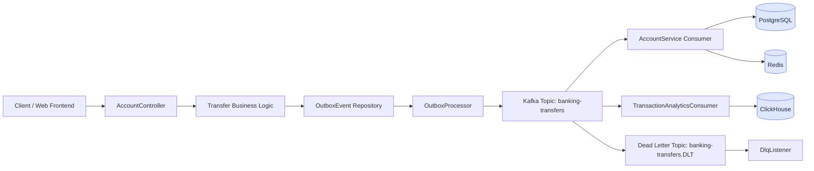
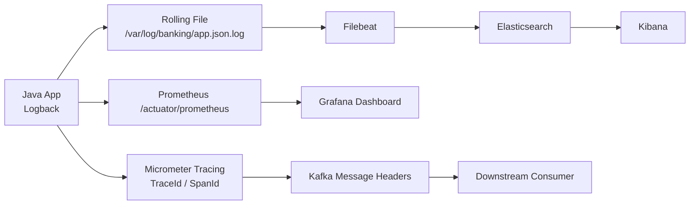

# Digital Banking Platform

This project is a high-throughput digital banking backend built with Java 21, Spring Boot 4, PostgreSQL, Redis, Kafka, ClickHouse, Prometheus, Grafana, Elasticsearch, and Kibana. It is designed to demonstrate distributed-system practices, transactional consistency, observability, and production-like architecture patterns.

## Project Highlights

- Banking transfer processing with Outbox pattern
- Kafka-based asynchronous event processing
- Idempotent transaction handling
- Distributed tracing across Kafka and service boundaries
- Prometheus/Grafana monitoring
- JSON log collection via Filebeat and Elasticsearch
- ClickHouse-based transaction audit analytics
- Spring Security and JWT-based authentication
- Docker Compose local environment simulation

---

## 中文版

### 1. 系统架构总览



### 2. 观测性与日志链路



### 3. 核心设计说明

- Outbox 模式：确保数据库事务与 Kafka 发送行为一致，避免消息丢失。
- Kafka 消费者：对转账任务进行异步处理，并支持重试与死信队列。
- 幂等处理：通过数据库唯一约束和状态表防止重复转账。
- 追踪链路：通过 `traceId` 和 `spanId` 让请求链路跨 Kafka、数据库和异步任务保持可观察性。
- 可观测性：日志、指标、链路追踪分层管理，方便排查线上问题。

### 4. 技术栈

- Java 21
- Spring Boot 4.0.6
- PostgreSQL 15
- Redis 7
- Kafka
- ClickHouse
- Elasticsearch + Kibana
- Prometheus + Grafana
- Micrometer Tracing + OpenTelemetry
- Docker Compose

### 5. 测试与架构验证

- **ArchUnit**：`ArchitectureTest.java` 强制 Controller 不直接依赖 Repository，Service 层访问受限。
- **Swagger / OpenAPI**：访问 `/swagger-ui.html` 查看自动生成的接口文档（`AccountController` 已加 `@Tag`、`@Operation`）。
- **Testcontainers**：`TransferIntegrationTest.java` 使用 PostgreSQL + Kafka 容器进行端到端集成测试。

### 6. 运行命令

```bash
# 编译
./gradlew compileJava

# 运行 ArchUnit 测试
./gradlew test --tests ArchitectureTest

# 运行集成测试（需要 Docker）
./gradlew test --tests TransferIntegrationTest

# 启动应用（含 Swagger）
./gradlew bootRun
```

---

### 7. 项目总结（面试要点）

> 这个项目不仅实现了功能，更把业务流程和系统架构一起设计到了生产级标准。核心亮点包括：
>
> - **事务一致性**：Outbox 模式确保数据库写入与 Kafka 消息发送原子化，避免消息丢失或重复。
> - **异步解耦**：Kafka 消费者异步处理转账，支持重试与死信队列（DLQ），提升系统吞吐与容错能力。
> - **可观测性闭环**：Micrometer Tracing（TraceId/SpanId）贯穿请求链路，结合 Prometheus 指标、Grafana 仪表盘、Filebeat+Elasticsearch 日志链路，实现从代码到生产的全链路监控。
> - **架构约束**：ArchUnit 测试强制 Controller→Service→Repository 分层，防止架构腐化。
> - **安全与认证**：Spring Security + JWT（含角色 claim、Redis 黑名单、刷新机制），配合 `@PreAuthorize` 实现细粒度权限控制。
> - **测试策略**：单元测试（Mock）、集成测试（Testcontainers + PostgreSQL + Kafka）、架构测试（ArchUnit）三层覆盖，确保代码质量与系统稳定性。
>
> 适合展示分布式系统设计、事务一致性、可观测性与工程实践能力。

---

## English Version

### 1. System Architecture Overview


### 2. Observability and Logging Pipeline


### 3. Design Summary

- Outbox Pattern: ensures database transactions and Kafka publishing remain consistent.
- Kafka consumers: handle transfer processing asynchronously and support retries and dead-letter topics.
- Idempotency: prevents duplicate transfers through state tracking and unique constraints.
- Tracing: propagates `traceId` and `spanId` across Kafka, async workers, and database boundaries.
- Observability: logs, metrics, and traces are separated by responsibility and are easier to operate and debug.

### 4. Technology Stack

- Java 21
- Spring Boot 4.0.6
- PostgreSQL 15
- Redis 7
- Kafka
- ClickHouse
- Elasticsearch + Kibana
- Prometheus + Grafana
- Micrometer Tracing + OpenTelemetry
- Docker Compose

### 5. Testing and Architecture Validation

- **ArchUnit**: `ArchitectureTest.java` enforces that controllers do not depend directly on repositories, and service access is restricted.
- **Swagger / OpenAPI**: Visit `/swagger-ui.html` for auto-generated API docs (`AccountController` annotated with `@Tag`, `@Operation`).
- **Testcontainers**: `TransferIntegrationTest.java` runs end-to-end integration tests with PostgreSQL + Kafka containers.

### 6. Run Commands

```bash
# Compile
./gradlew compileJava

# Run ArchUnit tests
./gradlew test --tests ArchitectureTest

# Run integration tests (requires Docker)
./gradlew test --tests TransferIntegrationTest

# Start app (with Swagger)
./gradlew bootRun
```

---

### 7. Project Summary (Interview Highlights)

> This project is not just a feature implementation; it designs business processes and system architecture to production-grade standards. Key highlights include:
>
> - **Transactional Consistency**: Outbox Pattern ensures atomic database writes and Kafka message publishing, preventing message loss or duplication.
> - **Asynchronous Decoupling**: Kafka consumers process transfers asynchronously, supporting retries and dead-letter queues (DLQ) to improve throughput and fault tolerance.
> - **Observability Loop**: Micrometer Tracing (`TraceId`/`SpanId`) propagates across request chains, combined with Prometheus metrics, Grafana dashboards, and Filebeat + Elasticsearch log pipelines, achieving full-chain monitoring from code to production.
> - **Architecture Constraints**: ArchUnit tests enforce Controller→Service→Repository layering, preventing architecture erosion.
> - **Security & Authentication**: Spring Security + JWT (with role claims, Redis blacklist, refresh mechanism), combined with `@PreAuthorize` for fine-grained access control.
> - **Testing Strategy**: Three-layer coverage — unit tests (Mock), integration tests (Testcontainers + PostgreSQL + Kafka), and architecture tests (ArchUnit) — ensuring code quality and system stability.
>
> Suitable for demonstrating distributed system design, transactional consistency, observability, and engineering practices in professional settings.

---

## Deutsche Version

- **ArchUnit**: `ArchitectureTest.java` enforces that controllers do not depend directly on repositories, and service access is restricted.
- **Swagger / OpenAPI**: Visit `/swagger-ui.html` for auto-generated API docs (`AccountController` annotated with `@Tag`, `@Operation`).
- **Testcontainers**: `TransferIntegrationTest.java` runs end-to-end integration tests with PostgreSQL + Kafka containers.

### 7. Run Commands

```bash
# Compile
./gradlew compileJava

# Run ArchUnit tests
./gradlew test --tests ArchitectureTest

# Run integration tests (requires Docker)
./gradlew test --tests TransferIntegrationTest

# Start app (with Swagger)
./gradlew bootRun
```

---

## Deutsche Version

### 1. Gesamtarchitektur


### 2. Observability und Logfluss


### 3. Architekturbeschreibung

- Outbox-Muster: garantiert Konsistenz zwischen Datenbanktransaktion und Kafka-Veröffentlichung.
- Kafka-Consumer: verarbeiten Überweisungen asynchron und unterstützen Retry- und Dead-Letter-Strategien.
- Idempotenz: verhindert doppelte Überweisungen durch Statusmarkierungen und eindeutige Constraints.
- Tracing: propagiert `traceId` und `spanId` über Kafka, asynchrone Worker und Datenbankgrenzen.
- Observability: Logs, Metriken und Traces sind sauber getrennt und sorgen für bessere Betriebsfähigkeit.

### 4. Technologiestack

- Java 21
- Spring Boot 4.0.6
- PostgreSQL 15
- Redis 7
- Kafka
- ClickHouse
- Elasticsearch + Kibana
- Prometheus + Grafana
- Micrometer Tracing + OpenTelemetry
- Docker Compose

### 5. Tests und Architekturvalidierung

- **ArchUnit**: `ArchitectureTest.java` stellt sicher, dass Controller nicht direkt auf Repositories zugreifen und Service-Zugriffe eingeschränkt sind.
- **Swagger / OpenAPI**: Unter `/swagger-ui.html` finden Sie die automatisch generierte API-Dokumentation (`AccountController` mit `@Tag`, `@Operation`).
- **Testcontainers**: `TransferIntegrationTest.java` führt End-to-End-Integrationstests mit PostgreSQL + Kafka-Containern durch.

### 6. Ausführungsbefehle

```bash
# Kompilieren
./gradlew compileJava

# ArchUnit-Tests ausführen
./gradlew test --tests ArchitectureTest

# Integrationstests ausführen (Docker erforderlich)
./gradlew test --tests TransferIntegrationTest

# Anwendung starten (mit Swagger)
./gradlew bootRun
```

---

### 7. Projektzusammenfassung (Interview-Highlights)

> Dieses Projekt zeigt eine realistische, produktionsnahe Banking-Architektur. Es geht nicht nur um CRUD-Funktionen, sondern um verteilte Konsistenz, asynchrone Verarbeitung, Betriebsüberwachung und Beobachtbarkeit auf industriellem Niveau. Kernpunkte:
>
> - **Transaktionskonsistenz**: Outbox-Muster garantiert atomare Datenbanktransaktionen und Kafka-Nachrichten.
> - **Asynchrone Entkopplung**: Kafka-Consumer verarbeiten Überweisungen asynchron mit Retry und DLQ.
> - **Beobachtbarkeit**: Micrometer Tracing (`TraceId`/`SpanId`), Prometheus, Grafana, Filebeat + Elasticsearch.
> - **Architektur-Constraints**: ArchUnit-Tests erzwingen Controller→Service→Repository-Schichtung.
> - **Sicherheit**: Spring Security + JWT (mit Rollen-Claims, Redis-Blacklist, Refresh), `@PreAuthorize`.
> - **Teststrategie**: Unit-Tests (Mock), Integrationstests (Testcontainers + PostgreSQL + Kafka), ArchUnit-Tests.
>
> Ideal zur Demonstration von verteilten Systemen, Transaktionskonsistenz, Beobachtbarkeit und Engineering-Praktiken in professionellen Kontexten.

---

## Final Summary

- **ArchUnit**: `ArchitectureTest.java` stellt sicher, dass Controller nicht direkt auf Repositories zugreifen und Service-Zugriffe eingeschränkt sind.
- **Swagger / OpenAPI**: Unter `/swagger-ui.html` finden Sie die automatisch generierte API-Dokumentation (`AccountController` mit `@Tag`, `@Operation`).
- **Testcontainers**: `TransferIntegrationTest.java` führt End-to-End-Integrationstests mit PostgreSQL + Kafka-Containern durch.

### 7. Ausführungsbefehle

```bash
# Kompilieren
./gradlew compileJava

# ArchUnit-Tests ausführen
./gradlew test --tests ArchitectureTest

# Integrationstests ausführen (Docker erforderlich)
./gradlew test --tests TransferIntegrationTest

# Anwendung starten (mit Swagger)
./gradlew bootRun
```

---

## Final Summary

This repository demonstrates a production-minded banking system architecture with a strong emphasis on reliability, observability, and distributed-system principles. It is suitable for technical interviews focused on backend engineering, event-driven systems, data consistency, and DevOps-style monitoring.
