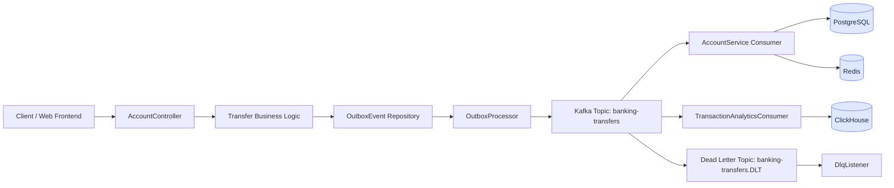
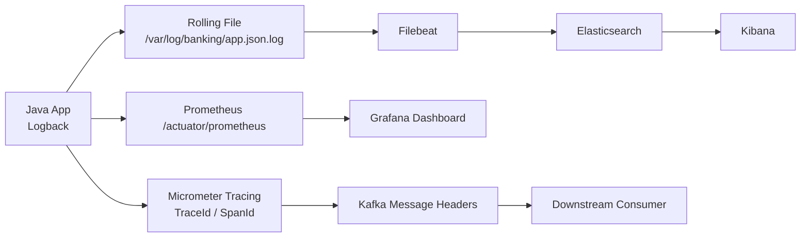

# Digital Banking Platform

This project is a high-throughput digital banking backend built with Java 21, Spring Boot 4, PostgreSQL, Redis, Kafka, ClickHouse, Prometheus, Grafana, Elasticsearch, and Kibana. It is designed to demonstrate distributed-system practices, transactional consistency, observability, and production-like architecture patterns.

## Project Highlights

- Banking transfer processing with Outbox pattern
- Kafka-based asynchronous event processing
- Idempotent transaction handling
- Distributed tracing across Kafka and service boundaries
- Prometheus/Grafana monitoring
- JSON log collection via Filebeat and Elasticsearch
- ClickHouse-based transaction audit analytics
- Spring Security and JWT-based authentication
- Docker Compose local environment simulation

---

## 中文版

### 1. 系统架构总览

### 2. 观测性与日志链路

### 3. 核心设计说明

- Outbox 模式：确保数据库事务与 Kafka 发送行为一致，避免消息丢失。
- Kafka 消费者：对转账任务进行异步处理，并支持重试与死信队列。
- 幂等处理：通过数据库唯一约束和状态表防止重复转账。
- 追踪链路：通过 `traceId` 和 `spanId` 让请求链路跨 Kafka、数据库和异步任务保持可观察性。
- 可观测性：日志、指标、链路追踪分层管理，方便排查线上问题。

### 4. 技术栈

- Java 21
- Spring Boot 4.0.6
- PostgreSQL 15
- Redis 7
- Kafka
- ClickHouse
- Elasticsearch + Kibana
- Prometheus + Grafana
- Micrometer Tracing + OpenTelemetry
- Docker Compose

### 5. 项目总结

> 这个项目体现了真实企业级后端设计：事务一致性、异步解耦、可观测性、稳定性和业务审计闭环。
>
> 它不仅实现了功能，还把业务流程和系统架构一起设计到了生产级标准里，包括 Outbox、重试、DLQ、监控和日志链路。

---

## English Version

### 1. System Architecture Overview

### 2. Observability and Logging Pipeline

### 3. Design Summary

- Outbox Pattern: ensures database transactions and Kafka publishing remain consistent.
- Kafka consumers: handle transfer processing asynchronously and support retries and dead-letter topics.
- Idempotency: prevents duplicate transfers through state tracking and unique constraints.
- Tracing: propagates `traceId` and `spanId` across Kafka, async workers, and database boundaries.
- Observability: logs, metrics, and traces are separated by responsibility and are easier to operate and debug.

### 4. Key Interview Message

> This project simulates a realistic enterprise-grade banking system. It is not only a CRUD demo; it demonstrates distributed consistency, asynchronous processing, operational observability, and production-oriented architecture design.

---

## Deutsche Version

### 1. Gesamtarchitektur

### 2. Observability und Logfluss

### 3. Architekturbeschreibung

- Outbox-Muster: garantiert Konsistenz zwischen Datenbanktransaktion und Kafka-Veröffentlichung.
- Kafka-Consumer: verarbeiten Überweisungen asynchron und unterstützen Retry- und Dead-Letter-Strategien.
- Idempotenz: verhindert doppelte Überweisungen durch Statusmarkierungen und eindeutige Constraints.
- Tracing: propagiert `traceId` und `spanId` über Kafka, asynchrone Worker und Datenbankgrenzen.
- Observability: Logs, Metriken und Traces sind sauber getrennt und sorgen für bessere Betriebsfähigkeit.

### 4. Projektzusammenfassung

> Dieses Projekt zeigt eine realistische, produktionsnahe Banking-Architektur. Es geht nicht nur um CRUD-Funktionen, sondern um verteilte Konsistenz, asynchrone Verarbeitung, Betriebsüberwachung und Beobachtbarkeit auf industriellem Niveau.

---

## Final Summary

This repository demonstrates a production-minded banking system architecture with a strong emphasis on reliability, observability, and distributed-system principles. It is suitable for technical interviews focused on backend engineering, event-driven systems, data consistency, and DevOps-style monitoring.
