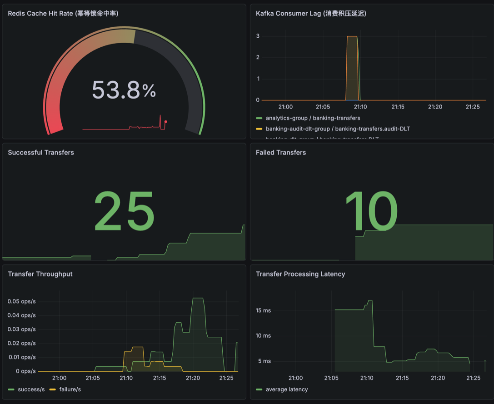
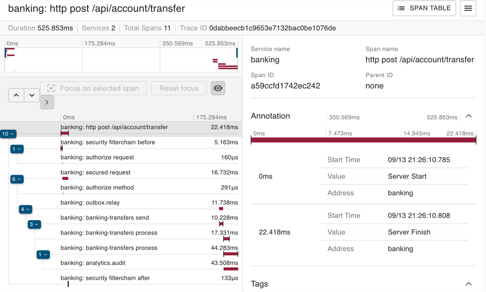
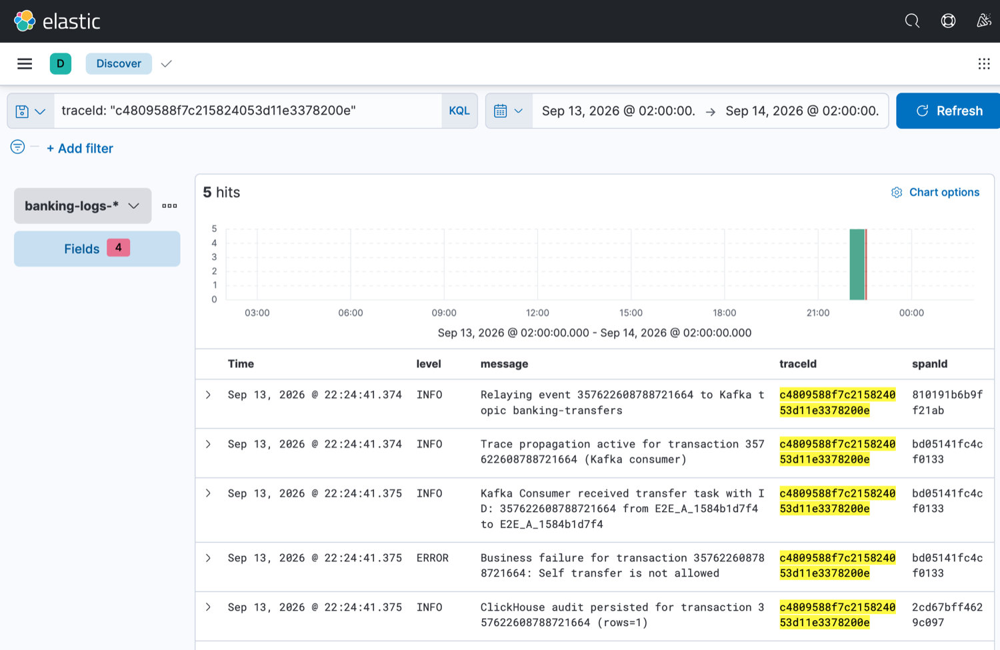
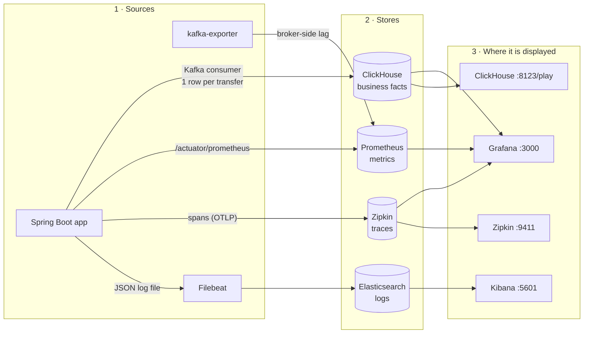
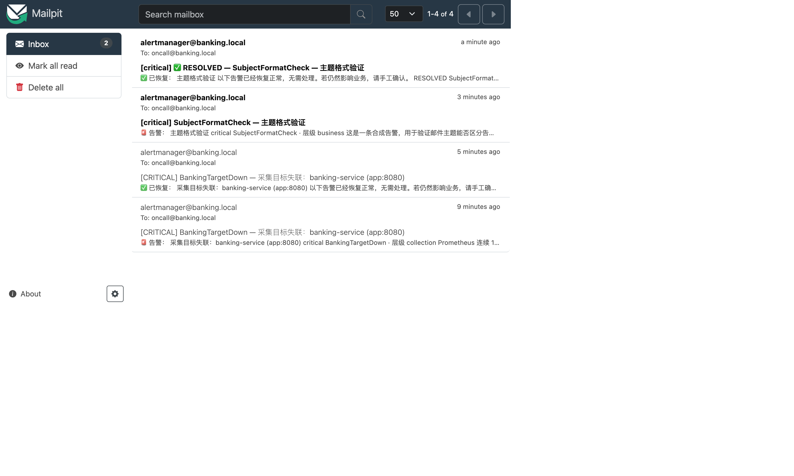
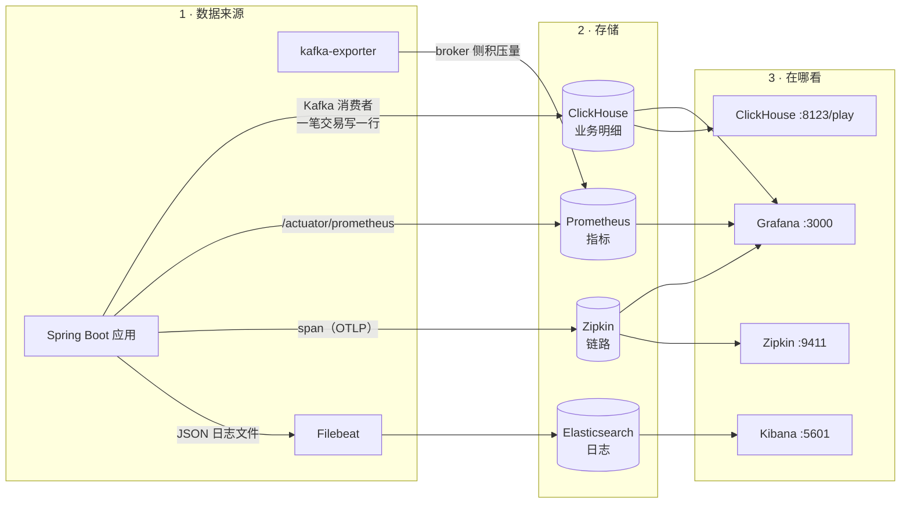
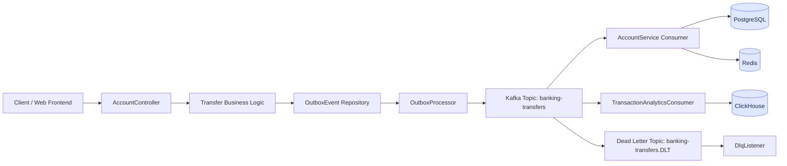
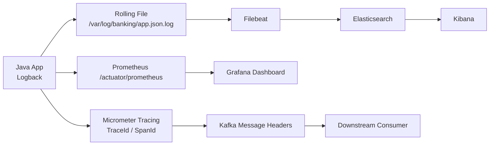
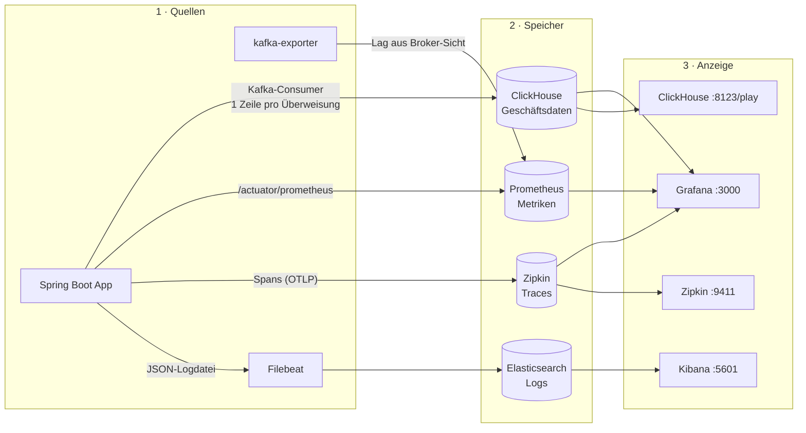

# Digital Banking Platform

[](https://github.com/cjjhust/DIGITAL_BANKING/actions/workflows/ci.yml)

This project is a high-throughput digital banking backend built with Java 21, Spring Boot 4, PostgreSQL, Redis, Kafka, ClickHouse, Prometheus, Grafana, Elasticsearch, and Kibana. It is designed around distributed-system practices, transactional consistency, observability, and production-like architecture patterns.

## Project Highlights

- Banking transfer processing with Outbox pattern (`FOR UPDATE SKIP LOCKED`)
- Kafka-based asynchronous event processing with retry and dead-letter topic (DLT)
- **Per-consumer DLT routing** with an `x-origin-consumer` origin guard; audit failures are isolated to `banking-transfers.audit-DLT` so they can never rewrite ledger state
- **Double-entry ledger** (`ledger_entries`): every transfer writes one DEBIT and one CREDIT entry in the same transaction, reconciled per currency
- Dual-layer idempotency (Redis `SET NX` + unique `client_request_id` + DB `PENDING` claim)
- **Snowflake ID generation** with clock-backwards rejection; **`PENDING` lease** (`lease_owner` / `lease_expires_at`) so multi-instance recovery claims a transaction exactly once
- Distributed tracing across Kafka and service boundaries (Micrometer / OpenTelemetry / Zipkin)
- Prometheus / Grafana monitoring with transfer Counter and Timer metrics
- JSON log collection via Filebeat and Elasticsearch
- ClickHouse-based transaction audit analytics
- Spring Security and JWT-based authentication with `USER` / `ADMIN` and `@PreAuthorize`; logout (Redis blacklist) and refresh rotation
- Flyway schema migrations (`ddl-auto: validate`) — `V1` … `V8`
- **ArchUnit constraints** pinning layering and Kafka listener wiring (`containerFactory` must be explicit, no `topicPattern`)
- **Reproducible verification**: `scripts/verify_e2e.py` (28 checks) plus GitHub Actions CI
- Java 21 virtual threads
- Docker Compose local environment simulation

---

## Observability — real evidence, not slideware

> Everything below is captured from the **running stack**, driven by `scripts/demo_traffic.py`
> (6 successful transfers, business failures and repeated `requestId`s). Reproduce with:
> `python3 scripts/demo_traffic.py` → open `localhost:3000` / `localhost:9411` / `localhost:5601`.

### 1. Grafana — business & infrastructure metrics

`http://localhost:3000` → dashboard **Banking Service Observability**



Six live panels: idempotency hit rate · **Kafka consumer lag (broker-side)** · successful / failed
transfers · throughput · average processing latency. The spike in *Kafka Consumer Lag* is a real
alarm scenario: the consumer was stopped on purpose and the lag was still visible — because it is
scraped from the broker by `kafka-exporter`, not reported by the (dead) application.

### 2. Zipkin — one trace, eleven spans

`http://localhost:9411/zipkin/` — a single transfer, followed end to end:



`http post /api/account/transfer` → security filters → `outbox.relay` → Kafka **PRODUCER** →
2 × Kafka **CONSUMER** (ledger + analytics) → `analytics.audit`. Trace context is propagated through
the outbox table and Kafka headers, so one `TraceId` covers an asynchronous, event-driven flow.

### 3. Kibana — logs correlated by the same TraceId

`http://localhost:5601` → **Discover** → index pattern `banking-logs-*` → KQL `traceId : "..."`



One `traceId`, **5 log lines**, chronological — the full life of a single rejected transfer:

| # | Level | Message | SpanId |
| --- | --- | --- | --- |
| 1 | INFO | `Relaying event 357622608788721664 to Kafka topic banking-transfers` | `810191b6b9ff21ab` |
| 2 | INFO | `Trace propagation active for transaction ... (Kafka consumer)` | `bd05141fc4cf0133` |
| 3 | INFO | `Kafka Consumer received transfer task with ID: 357622608788721664` | `bd05141fc4cf0133` |
| 4 | **ERROR** | `Business failure for transaction ...: Self transfer is not allowed` | `bd05141fc4cf0133` |
| 5 | INFO | `ClickHouse audit persisted for transaction 357622608788721664 (rows=1)` | `2cd67bff4629c097` |

What the five lines prove:

- The **same `traceId` crosses three separate execution contexts** — the `@Scheduled` outbox relay
  thread (`scheduling-2`), the ledger consumer container (`KafkaListenerEndpointContainer#0-0-C-1`)
  and the analytics consumer container (`KafkaListenerEndpointContainer#1-0-C-1`). None of them
  inherits the caller's `ThreadLocal`, so this is exactly where traces normally break.
- **Three distinct `spanId` values under one `traceId`** — the trace context survives the
  asynchronous boundary (restored from the outbox columns and the Kafka headers). `spanId` values
  are independently random, never derived from the parent; `traceId` is the only thing that proves
  the spans belong together.
- The transfer was **rejected**, yet the audit row was still written (`rows=1`). `transaction_audit`
  has no `status` column, so ClickHouse counts *consumed events*, not *successful transfers*. Any
  reconciliation against the ledger must apply the same status filter — see the Limitations section.

**How to query**

```bash
# 1) open Discover with the index pattern and time range already applied
http://localhost:5601/app/kibana#/discover?_g=(time:(from:now-24h,to:now))&_a=(index:'banking-logs',query:(language:kuery,query:''))

# 2) pipe a traceId straight into the URL — no clicking required
#    (the query editor is a Monaco widget, so a URL is the reliable way to reproduce a view)
http://localhost:5601/app/discover#/?_g=(time:(from:'2026-09-13T00:00:00.000Z',to:'2026-09-14T00:00:00.000Z'))&_a=(columns:!(level,message,traceId,spanId),index:banking-logs,query:(language:kuery,query:'traceId%3A%20%22c4809588f7c215824053d11e3378200e%22'),sort:!('@timestamp',asc))
```

Frequently used KQL expressions:

```
level : "ERROR"                          # failures only
level : "ERROR" and not logger : "Web"   # failures, minus web-layer noise
traceId : "c4809588f7c215824053d11e3378200e"   # follow one transaction end to end
message : "insufficient"                 # full-text search
bizId : "demo80a337"                     # group by business batch id
```

Field count: **23 available fields** per document (`@timestamp`, `level`, `logger`, `message`,
`traceId`, `spanId`, `thread_name`, `stack_trace`, …). Expanding a row shows the raw JSON.

### 4. What each middleware is for

Four tools, four different jobs. What they are, in plain terms:

- **ClickHouse** — a column-oriented analytics database. It keeps one row per transaction, so business questions ("how much money moved today?") can be answered **without** running heavy queries on the live transaction database.
- **Elasticsearch + Kibana** — a log store plus a search UI. Every application log line is shipped here, so one request can be traced across all services.
- **Zipkin** — a trace viewer. It shows the timeline of a single request across thread and process boundaries.
- **Prometheus + Grafana** — a metrics database plus dashboards. **10 alerting rules** (collection / pipeline / business / resource) plus **Alertmanager**, which routes notifications to e-mail. Verified end to end: stopping the app produces an alert mail within ~90 s, restarting it produces the resolved mail. Inhibit rules collapse 5 simultaneous alerts into 1 notification.

| Tool | Solves | **The one number to watch** | What it indicates |
| --- | --- | --- | --- |
| **ClickHouse** | **Business analytics** (Postgres is a transaction DB and should not serve analytical queries) | **How many transfers, how much money today** | Volume drop = upstream problem; changing amount structure = changing customer mix |
| **Elasticsearch / Kibana** | Centralised log search | **Number of `level:ERROR`** | A spike = business or system failure |
| **Zipkin** | Finding the bottleneck in an **asynchronous** chain | **Span count of one trace** | Only 1 span = the trace context is broken |
| **Prometheus / Grafana** | Global health + **automatic alerting** | **Kafka consumer lag** | Sustained > 0 = consumers are too slow or dead |

> The four cover **four different layers** of the same question:
> **Prometheus: "is something wrong?"** (alerting) → **Zipkin: "which step is slow?"** (bottleneck) → **Kibana: "what happened in that step?"** (cause) → **ClickHouse: "how is the business doing?"** (volume, trends, customers, anomalies).
> The first three describe the **state of the system**; the fourth describes the **state of the business**.

### 5. Grafana — business analytics on ClickHouse

`http://localhost:3000` → dashboard **Banking Business Analytics (ClickHouse)**


Seven panels, every one of them backed by a fixed SQL statement:

| Panel | Question it answers | Source table |
| --- | --- | --- |
| Today at a glance | How many transfers, how much money, average and largest amount — today | `transaction_audit` |
| Volume per hour | When does the traffic peak? | `transaction_audit` |
| Top 5 payer accounts | Who moves the most money? | `transaction_audit` |
| Amount structure | Small transfers or large ones? | `transaction_audit` |
| Large transactions (≥ 10 000) | Which transfers deserve a risk review? | `transaction_audit` |
| **Settlement outcome** | **What is the success rate, and how many failed?** | `transaction_outcome` |
| **Failure reasons TOP** | **Why did they fail?** | `transaction_outcome` |


The interesting number in the pie chart is the amount structure: **close to 90 % of all money moved
in a handful of transactions ≥ 10 000**, while the small transfers are numerous but carry almost no
value. That is exactly the kind of aggregation that must **not** be run against the live PostgreSQL
ledger.

**Two tables, deliberately not one.** `transaction_audit` records *events consumed* — a rejected
transfer still writes a row there, because the analytics consumer never sees the business outcome.
`transaction_outcome` records the *final settlement state*, written by the ledger consumer at the
terminal transition. The difference between the two row counts is itself a metric: it is the number
of events that entered Kafka but never produced a settlement, i.e. the dead-letter volume.

**How to reproduce**

```bash
docker compose up -d                 # Grafana auto-installs the ClickHouse plugin
python3 scripts/demo_traffic.py      # generate real transfers
# http://localhost:3000 → Dashboards → "Banking Business Analytics (ClickHouse)"
# login: admin / $GRAFANA_ADMIN_PASSWORD from .env
```

Provisioned by `grafana/provisioning/datasources/banking-clickhouse.yml` (datasource) and
`grafana/provisioning/dashboards/banking_business.json` (dashboard) — nothing to click by hand.
The ClickHouse schema is created by `clickhouse-init/001-transaction-audit.sql` and
`clickhouse-init/002-transaction-outcome.sql` on the first container start.

### 6. How the data actually flows

There are **four independent pipelines**, each with its own store and its own front-end.
Grafana is *not* "the log tool" — it is a **display layer with pluggable datasources**, and in this
project it happens to be attached to three of the four stores.



| # | Pipeline | Path | Finally displayed |
| --- | --- | --- | --- |
| 1 | **Business data** | app consumes Kafka → inserts one row into `transaction_audit` → SQL query | **Grafana** → *Banking Business Analytics (ClickHouse)* |
| 2 | **Metrics** | app `/actuator/prometheus` + `kafka-exporter` → Prometheus scrapes every 15 s | **Grafana** → *Banking Service Observability*; also the raw Prometheus UI |
| 3 | **Traces** | app spans → Zipkin (direct + via `otel-collector`) | **Zipkin UI**, and optionally **Grafana** via its Zipkin datasource |
| 4 | **Logs** | app JSON log file → Filebeat → Elasticsearch (`banking-logs-*`) | **Kibana** → Discover (Grafana *could* also read ES, but Kibana is the native front-end) |
| 5 | *ClickHouse self-monitoring* | ClickHouse `system.*` tables | `:8123/dashboard` — ClickHouse's own UI, unrelated to Prometheus |

> Why both Kibana *and* Grafana? Kibana can only read Elasticsearch. Grafana can read almost
> anything. Keeping all four pipelines visible in one Grafana instance is a convenience, not a
> replacement — for deep log search, Kibana is still the better tool.

### 7. Alerting — from detection to an actual inbox

Ten Prometheus rules are not useful if nobody is told. **Alertmanager** closes that loop by routing
alerts to e-mail; for local development they land in **Mailpit** (a fake SMTP server with a web
inbox) — no credentials required, and the configuration is production-shaped: switching to real
SMTP only changes `smtp_smarthost` and the auth credentials.



| Layer | Alert group | What it catches |
| --- | --- | --- |
| Collection | `banking-targets` | `up == 0` — no data at all, every panel turns into *No data* |
| Pipeline | `banking-pipeline` | consumer lag, empty consumer groups, dead letters, audit lag |
| Business | `banking-business` | failure rate > 50 %, no successful transfer for 20 min, latency > 500 ms |
| Resource | `banking-resources` | DB connection-pool queueing, JVM heap > 90 % |

**Verified end to end** (not a slideware claim):

```
docker stop banking-app    →  90 s  →  📧 [CRITICAL] BankingTargetDown ...          (alert)
docker start banking-app   → 180 s  →  📧 [CRITICAL] ✅ RESOLVED — BankingTargetDown (resolved)
```

**Inhibit rules prevent alert storms.** Stopping the app also fires four
`KafkaConsumerGroupEmpty` alerts. All four are automatically suppressed by `BankingTargetDown`
(`inhibitedBy` in the API), so the on-call engineer receives **one** mail instead of five.

The mail body is written for the person on call, not for the author: severity, what happened, and
**the first three commands to run**:

```
第一时间做什么：
  1) docker ps | grep banking-service 看容器在不在
  2) curl app:8080/actuator/health 看应用是否存活
  3) docker logs 看最近报错
```

Files: `prometheus/banking-alerts.yml` (rules) · `alertmanager/alertmanager.yml` (routing +
inhibition) · `alertmanager/templates/banking-email.tmpl` (mail template) ·
`alertrelay/relay.py` (mobile push).

**Mobile push.** Mail is good for reviewing later; 3 a.m. incidents need a phone that rings.
Alertmanager cannot talk to ntfy directly — its webhook sends a fixed JSON shape while ntfy expects
`{topic,title,message,priority,tags}` — so a tiny zero-dependency relay translates between them
(`alertrelay/relay.py`, standard library only). The push body is deliberately short: the summary plus
the **first command to run**.

```
🚨 告警 MobilePushCheck          priority=5  tags=[rotating_light]   ← bypasses Do Not Disturb
消费积压：group=banking-group topic=banking-transfers

👉 看 Grafana Kafka Consumer Lag 面板
```

`critical` maps to priority 5 (wakes the phone), `warning` to 3, resolved to 2. The topic name is
read from `.env` (gitignored) — it acts as the password, since anyone who knows it can subscribe.

### 8. Local reproduction
```bash
python3 scripts/demo_traffic.py     # generates real transfers
```

Endpoints: `localhost:3000` (Grafana) · `localhost:9411` (Zipkin) · `localhost:5601` (Kibana) ·
`localhost:8123/play` (ClickHouse).

---

## 中文版

> 观测性实证截图见上方 **Observability — real evidence** 一节：Grafana 仪表盘 / Zipkin 全链路瀑布图 / Kibana 同 traceId 日志，均由 `scripts/demo_traffic.py` 驱动真实转账产生。

### 中间件各自解决什么

四个工具，四件不同的事。先用大白话说它们是什么：

- **ClickHouse** — 列式分析数据库。它把每笔交易存一行明细，于是「今天走了多少钱」这类业务问题可以**不去打扰线上交易库**就能回答。
- **Elasticsearch + Kibana** — 日志仓库 + 搜索界面。应用的所有日志都送到这里，一次请求就能跨服务搜出来。
- **Zipkin** — 链路查看器。它把「一次请求」跨越线程和进程的每一步画成一条时间线。
- **Prometheus + Grafana** — 指标数据库 + 看板。已配 **10 条告警规则**（分采集/管道/业务/资源四层）+ **Alertmanager** 把通知发到邮件。已实测闭环：停掉应用 → 90 秒内收到告警邮件，重启 → 收到恢复邮件；抑制规则把同时触发的 5 条告警压成 1 封通知。

| 中间件 | 解决什么问题 | **最该盯的一个数** | 这个数说明什么 |
| --- | --- | --- | --- |
| **ClickHouse** | **业务分析**（Postgres 是交易库，不该拿来跑分析查询） | **今天多少笔、多少钱** | 业务量骤降 = 上游出问题；金额结构突变 = 客群变化 |
| **Elasticsearch / Kibana** | 日志集中检索 | **`level:ERROR` 数量** | 突增 = 业务或系统故障 |
| **Zipkin** | 在**异步链路**里找瓶颈 | **一条 trace 的 span 数** | 只有 1 个 = 链路上下文断了 |
| **Prometheus / Grafana** | 全局健康度 + **自动告警** | **Kafka 消费积压** | 持续 > 0 = 消费者跟不上或挂了 |

> 四个中间件回答的是**同一件事的四个不同层面**：
> **Prometheus：「哪里不对劲？」**（告警）→ **Zipkin：「卡在哪一步？」**（瓶颈）→ **Kibana：「那一步发生了什么？」**（原因）→ **ClickHouse：「业务到底怎么样？」**（金额、趋势、客户、异常）。
> 前三个描述的是**系统状态**，第四个描述的是**业务状态**。

### ClickHouse 业务看板

`http://localhost:3000` → 看板 **Banking Business Analytics (ClickHouse)**


七个面板，均为服务端供给，面板背后是固定 SQL，无需在界面输入任何查询：

| 面板 | 回答什么问题 | 数据来源 |
| --- | --- | --- |
| 今日概览 | 今天多少笔、多少钱、单笔均值、最大单笔 | `transaction_audit` |
| 每小时笔数与金额 | 流量高峰出现在几点 | `transaction_audit` |
| Top 5 付款账户 | 谁在搬最多的钱 | `transaction_audit` |
| 金额结构 | 是笔数多的小额，还是笔数少的大额 | `transaction_audit` |
| 大额交易（≥ 10000） | 哪几笔值得人工风控看一眼 | `transaction_audit` |
| **结算结果** | **成功率多少？成功、失败各几笔？** | `transaction_outcome` |
| **失败原因 TOP** | **为什么失败？** | `transaction_outcome` |


饼图里最有意思的是金额结构：**接近 90% 的钱集中在少数几笔 ≥10000 的交易里**，小额交易笔数虽多但金额占比极小。
而这类聚合问题，正是**不应该**压到线上 PostgreSQL 交易库上去跑的。

**两张表是刻意的设计，不是冗余。** `transaction_audit` 记录的是**消费到的事件** —— 被拒绝的转账同样会在里面留一行，
因为分析消费者根本看不到业务结果。`transaction_outcome` 记录的是**最终结算状态**，由账本消费者在状态跃迁时写入。
两张表的行数之差本身就是指标：它等于「事件进了 Kafka 但没有产出结算结果」的数量，也就是死信量。

**复现方法**

```bash
docker compose up -d                 # Grafana 会自动装 ClickHouse 插件
python3 scripts/demo_traffic.py      # 生成真实转账流量
# 打开 http://localhost:3000 → Dashboards → "Banking Business Analytics (ClickHouse)"
# 登录：admin / .env 里的 $GRAFANA_ADMIN_PASSWORD
```

配置全部由文件供给，手工点不了一步：`grafana/provisioning/datasources/banking-clickhouse.yml`（数据源）、
`grafana/provisioning/dashboards/banking_business.json`（看板）。
ClickHouse 建表由 `clickhouse-init/001-transaction-audit.sql` 与 `clickhouse-init/002-transaction-outcome.sql`
在容器首次启动时自动完成。

### 四条数据流分别怎么走

这里一共是**四条互相独立的管道**，每条有自己的存储、自己的展示界面。
**Grafana 不是「日志工具」**，它只是一个**可以插很多数据源的展示层**；本项目里它恰好同时挂了其中三个存储。



| # | 数据流 | 路径 | 最终在哪看 |
| --- | --- | --- | --- |
| 1 | **业务数据** | 应用消费 Kafka → 往 `transaction_audit` 插一行 → SQL 查询 | **Grafana** → *Banking Business Analytics (ClickHouse)* |
| 2 | **指标** | 应用 `/actuator/prometheus` + `kafka-exporter` → Prometheus 每 15 秒抓一次 | **Grafana** → *Banking Service Observability*，也可直接看 Prometheus 原生界面 |
| 3 | **链路** | 应用产生 span → Zipkin（直发 + 经 `otel-collector`） | **Zipkin 界面**；也可以用 Grafana 的 Zipkin 数据源看 |
| 4 | **日志** | 应用 JSON 日志文件 → Filebeat → Elasticsearch（`banking-logs-*`） | **Kibana** → Discover（Grafana 也能读 ES，但 Kibana 是原生前端） |
| 5 | *ClickHouse 自监控* | ClickHouse 自己的 `system.*` 表 | `:8123/dashboard`，是 ClickHouse 自带界面，和 Prometheus 无关 |

> 那 Grafana 和 Kibana 是不是重复了？Kibana 只能读 Elasticsearch，Grafana 几乎什么都能读。
> 把四条管道都放进一个 Grafana 里只是**图方便**，不是替代关系——真要做深度日志检索，Kibana 更强。

### Kibana 日志检索

`http://localhost:5601` → **Discover** → 索引模式 `banking-logs-*` → KQL `traceId : "..."`


一个 `traceId`，**5 行日志**，按时间正序 —— 这就是一笔被拒绝的转账的完整生命史：

| # | 级别 | 日志 | SpanId |
| --- | --- | --- | --- |
| 1 | INFO | `Relaying event 357622608788721664 to Kafka topic banking-transfers` | `810191b6b9ff21ab` |
| 2 | INFO | `Trace propagation active for transaction ... (Kafka consumer)` | `bd05141fc4cf0133` |
| 3 | INFO | `Kafka Consumer received transfer task with ID: 357622608788721664` | `bd05141fc4cf0133` |
| 4 | **ERROR** | `Business failure for transaction ...: Self transfer is not allowed` | `bd05141fc4cf0133` |
| 5 | INFO | `ClickHouse audit persisted for transaction 357622608788721664 (rows=1)` | `2cd67bff4629c097` |

这 5 行证明了什么：

- **同一个 `traceId` 横跨三个互相独立的执行上下文** —— `@Scheduled` 出箱中继线程（`scheduling-2`）、
  账本消费者容器（`KafkaListenerEndpointContainer#0-0-C-1`）、分析消费者容器（`...#1-0-C-1`）。
  三者之间没有任何 `ThreadLocal` 传递，而这正是链路通常断裂的地方。
- **一个 `traceId` 下出现三个不同的 `spanId`** —— 链路上下文通过了异步边界（从 outbox 表的两列和 Kafka header 复原）。
  `spanId` 都是独立随机生成、**不从父 spanId 派生**；判断它们属于同一条链路的唯一依据是 `traceId` 相同。
- 这笔转账**被拒绝了，但审计行照写**（`rows=1`）。`transaction_audit` 没有 `status` 字段，所以 ClickHouse 统计的是**消费到的事件**，不是**成功的转账**。任何与账本的对账都必须先套用同一状态过滤条件 —— 见「已知限制」一节。

**查询方式**

```bash
# 1) 打开 Discover，索引模式与时间范围已就位
http://localhost:5601/app/kibana#/discover?_g=(time:(from:now-24h,to:now))&_a=(index:'banking-logs',query:(language:kuery,query:''))

# 2) 把 traceId 直接塞进 URL —— 不需要任何点击
#    （查询框是 Monaco 编辑器组件，用 URL 才是复现同一个视图最可靠的方式）
http://localhost:5601/app/discover#/?_g=(time:(from:'2026-09-13T00:00:00.000Z',to:'2026-09-14T00:00:00.000Z'))&_a=(columns:!(level,message,traceId,spanId),index:banking-logs,query:(language:kuery,query:'traceId%3A%20%22c4809588f7c215824053d11e3378200e%22'),sort:!('@timestamp',asc))
```

常用 KQL：

```
level : "ERROR"                          # 只看失败
level : "ERROR" and not logger : "Web"   # 失败，但排除 Web 层噪音
traceId : "c4809588f7c215824053d11e3378200e"   # 追一笔交易的全过程
message : "insufficient"                 # 全文检索
bizId : "demo80a337"                     # 按业务批次号分组
```

每条文档有 **23 个可用字段**（`@timestamp`、`level`、`logger`、`message`、`traceId`、`spanId`、
`thread_name`、`stack_trace` 等）；展开行即可看到原始 JSON。

### 告警：从「发现」到「真的收到邮件」

10 条规则如果没人被告知就没用。**Alertmanager** 闭环了这一步，把告警路由到邮件；
本地开发用 **Mailpit**（假 SMTP 服务器 + 网页收件箱）接收 —— 无需任何凭据，
而且**配置与生产同形**：换成真 SMTP 只需改 `smtp_smarthost` 与账号。


| 层 | 规则组 | 抓什么 |
| --- | --- | --- |
| 采集 | `banking-targets` | `up == 0` —— 完全抓不到数据，所有面板会变 No data |
| 管道 | `banking-pipeline` | 消费积压、消费者组为空、死信、审计积压 |
| 业务 | `banking-business` | 失败率 > 50%、20 分钟无成交、延迟 > 500ms |
| 资源 | `banking-resources` | 数据库连接池排队、JVM 堆 > 90% |

**完整闭环已实测**（不是纸面承诺）：

```
docker stop banking-app    →  90 秒  →  📧 [CRITICAL] BankingTargetDown ...          （告警）
docker start banking-app   → 180 秒  →  📧 [CRITICAL] ✅ RESOLVED — BankingTargetDown （恢复）
```

**抑制规则避免告警风暴。** 停掉应用会同时触发 4 条 `KafkaConsumerGroupEmpty`，
它们会被 `BankingTargetDown` 自动压制（API 里的 `inhibitedBy`），
所以值班的人只收到 **1 封**邮件而不是 5 封。

邮件正文是写给值班的人的，不是写给自己看的：严重程度、发生了什么、以及**前三条要执行的命令**：

```
第一时间做什么：
  1) docker ps | grep banking-service 看容器在不在
  2) curl app:8080/actuator/health 看应用是否存活
  3) docker logs 看最近报错
```

文件：`prometheus/banking-alerts.yml`（规则）· `alertmanager/alertmanager.yml`（路由 + 抑制）·
`alertmanager/templates/banking-email.tmpl`（邮件模板）· `alertrelay/relay.py`（手机推送）。

**手机推送。** 邮件适合回头看，但半夜出事需要手机响。Alertmanager **不能直接对接 ntfy** ——
它的 webhook 推的是固定结构 JSON，而 ntfy 期望 `{topic,title,message,priority,tags}`，
所以中间放了一个零依赖的小转发器做翻译（`alertrelay/relay.py`，只用标准库）。
推送正文刻意很短：摘要 + **第一条要执行的命令**。

```
🚨 告警 MobilePushCheck          priority=5  tags=[rotating_light]   ← 绕过勿扰模式
消费积压：group=banking-group topic=banking-transfers

👉 看 Grafana Kafka Consumer Lag 面板
```

`critical` 映射为优先级 5（会亮屏），`warning` 为 3，已恢复为 2。
topic 名从 `.env` 读（已 gitignore）—— 它本身就是「密码」，知道该 topic 名的人都能订阅到这些告警。

### 本地复现

```bash
python3 scripts/demo_traffic.py     # 生成真实转账流量
```

入口：`localhost:3000`（Grafana）· `localhost:9411`（Zipkin）· `localhost:5601`（Kibana）· `localhost:8123/play`（ClickHouse）。


### 1. 系统架构总览



### 2. 观测性与日志链路



### 3. 核心设计说明

- Outbox 模式：HTTP 受理转账后在同一本地事务写入 Outbox；`OutboxProcessor` 使用 `FOR UPDATE SKIP LOCKED` 抢占并投递 Kafka，避免消息丢失。
- Kafka 消费者：对转账任务进行异步处理。业务异常（如余额不足）不重试；系统异常有限次重试后进入死信队列，由 `DlqListener` 标记失败。
- 幂等处理：Redis `SET NX` 挡住短时重复提交；Outbox 与 `processed_transactions` 上的 `client_request_id` 唯一约束防止重复入账。
- 账本：金额使用 `BigDecimal`；账户带 JPA `@Version` 乐观锁。流水号为 Snowflake（可配置 `workerId`）。
- 追踪链路：通过 `traceId` 和 `spanId`（以及 Baggage 中的业务单号）让请求链路跨 Kafka、数据库和异步任务保持可观察性；Zipkin / OpenTelemetry Collector 接入 Compose 环境。
- 可观测性：日志（Filebeat → Elasticsearch → Kibana）、指标（Prometheus / Grafana，含转账成功失败与耗时）、链路追踪分层管理。
- 安全：Spring Security + JWT，角色 `USER` / `ADMIN`，接口使用 `@PreAuthorize`；密码 BCrypt；Flyway 管理表结构。
- 静态演示页：`/`（`index.html`）、`/visual-bank.html`。

### 4. 技术栈

- Java 21（虚拟线程）
- Spring Boot 4.0.6
- Spring Security + JWT
- Spring Data JPA + Flyway
- PostgreSQL 15
- Redis 7 + Redisson
- Kafka（KRaft）
- ClickHouse
- Elasticsearch + Kibana + Filebeat
- Prometheus + Grafana
- Micrometer Tracing + OpenTelemetry + Zipkin
- ArchUnit、springdoc-openapi 3.1.1
- Docker Compose

### 5. 主要接口

| 方法 | 路径 | 说明 |
| --- | --- | --- |
| POST | `/api/auth/register` | 注册 |
| POST | `/api/auth/login` | 登录 |
| GET | `/api/auth/me` | 当前用户 |
| POST | `/api/account` | 开户 |
| GET | `/api/account/{accountNumber}` | 查询账户 |
| GET | `/api/account/{accountNumber}/transactions` | 分页流水 |
| POST | `/api/account/transfer` | 受理转账（`requestId`, `fromAccountNo`, `toAccountNo`, `amount`） |
| GET | `/api/admin/users` | 用户列表（ADMIN） |
| DELETE | `/api/gdpr/user/{userId}` | GDPR 数据删除入口 |

### 6. 测试与架构验证

- **单元测试**：`AccountServiceTest`、`TransferInternalServiceTest`、`AuthServiceTest`、`TransferEventConsumerTest`、`JwtUtilsTest`、`AccountAccessServiceTest`、`GdprServiceTest`、`DlqListenerTest` 等共 **43 个测试 / 9 个测试类**（实测 `tests=43 failures=0`），`./gradlew test` 约 5 秒跑完，不需要 Docker。
- **ArchUnit**：`ArchitectureTest.java` 强制 Controller 不直接依赖 Repository、Service 层访问受限，并新增 2 条 Kafka 约束（`@KafkaListener` 必须显式声明 `containerFactory`；禁止 `topicPattern` 通配订阅）—— 已做反向对照：删掉 `containerFactory` 测试立即变红。
- **端到端验证**：`scripts/verify_e2e.py` 针对运行中的 Compose 全栈跑 **28 项检查**（鉴权、越权、成功、失败原因、幂等、状态查询、自转账、金额精度、GDPR、ClickHouse 审计、**告警数据源健康**、死信守卫三项对照、复式记账借贷与全账平衡），退出码 0/1；`scripts/batch_transfer_demo.py` 用于批量压量（不依赖 Testcontainers）。
- **Swagger / OpenAPI**：`/swagger-ui/index.html` 与 `/v3/api-docs` 实测可用（已升级到 springdoc-openapi 3.1.1，2.x 与 Boot 4 不兼容）。默认只在开发放行，由 `app.security.expose-api-docs` 控制（`application-prod.yml` 里为 `false`），因此生产环境接口文档不对外暴露。

### 7. 运行命令

> **运行前置条件** —— 这套 Compose 会拉起 **16 个容器**，启动前请确认：
> - **Docker 可用内存 ≥ 12 GB**。各服务声明的 `memory` 上限合计 **10.0 GB**（clickhouse 2G、app 2G、kafka 1G、kibana 1G、elasticsearch 800M、zipkin 768M、postgres 512M、prometheus 512M、grafana 512M、其余 128~256M）。Docker Desktop 在 macOS 上默认只分配宿主机内存的一部分，低于此值时会先杀内存大户，表现是 `Code: 241 MEMORY_LIMIT_EXCEEDED` 或容器反复重启 —— 看着像「项目坏了」，实际只是宿主机资源不足。自检：`docker info --format '{{.MemTotal}}'`，结果应 ≥ `12884901888`。
> - **磁盘 ≥ 8 GB**：16 个镜像拉取合计约 **6.2 GB**（实测），另有数据卷与 Gradle 构建缓存。
> - **JDK 21** 仅在宿主机执行 `./gradlew test` 时需要；只跑 Docker 全栈**不需要**本地 JDK。
> - **端口须空闲**：`8080` `3000` `9090` `5601` `9411` `8123` `9200` `9308` `9093` `8025` `8088` 全部绑定在 `127.0.0.1`。
> - **同一时间只能跑一套**：14 个服务使用固定 `container_name`，第二套 `docker compose up` 会因容器名冲突失败（若已在别处克隆过本项目，先 `docker compose down`）。
> - 脚本自带**冷启动就绪门**（检查项 `1b`）：会等到 Kafka 消费者组完成首次分区分派才开断言，所以 `/actuator/health` 返回 200 后可以**立刻**运行，不用人工掐时间。冷启动从 `docker compose up` 到全部就绪约 **2 分半**。

```bash
# 1) 首次启动必须先准备密钥：应用做 fail-fast 校验，缺 APP_JWT_SECRET 会直接启动失败
cp .env.example .env
# .env 里必须填 4 项：APP_JWT_SECRET / APP_DEFAULT_ADMIN_PASSWORD / REDIS_PASSWORD / GRAFANA_ADMIN_PASSWORD
# 生成随机值：openssl rand -base64 32

# 2) 启动 Compose 全栈（应用在 app 容器内，仅 8080 对外）
./start-dev.sh
# 或
docker compose up -d --build

# 编译
./gradlew compileJava

# 运行默认测试（单元测试 + ArchUnit）
./gradlew test

# 运行 ArchUnit 测试
./gradlew test --tests ArchitectureTest

# 端到端验证（需先 docker compose up -d）
python3 scripts/verify_e2e.py

# 在宿主机启动应用（需能解析 db / cache / kafka，或改本地配置）
./gradlew bootRun
```

常用地址：应用 http://localhost:8080 · Grafana `:3000` · Prometheus `:9090` · Kibana `:5601` · Zipkin `:9411` · ClickHouse `:8123`。

> 基础设施端口全部绑定在 `127.0.0.1`（仅本机可访），只有应用端口 8080 对外暴露；Redis / Grafana 均需口令。

---

### 8. 项目总结

> 本项目把转账业务流程和系统架构放在一起设计。核心包括：
>
> - **事务一致性**：Outbox 模式确保数据库写入与 Kafka 消息发送可恢复，避免消息丢失或重复。
> - **异步解耦**：Kafka 消费者异步处理转账，支持重试与死信队列（DLQ）。
> - **可观测性**：Micrometer Tracing（TraceId/SpanId），Prometheus 指标、Grafana 仪表盘、Filebeat + Elasticsearch 日志链路。
> - **架构约束**：ArchUnit 测试强制 Controller→Service→Repository 分层。
> - **安全与认证**：Spring Security + JWT，角色声明与 `@PreAuthorize`。
> - **测试**：43 个单元/架构测试（9 个测试类，约 5 秒，无需 Docker），端到端验证用 `scripts/verify_e2e.py`（28 项断言）。

---

### 9. 已知限制（2026-09-15 更新）

下面这些能力**当前不成立或未验证**，看代码/演示时请以本节为准：

| 领域 | 现状 |
| --- | --- |
| 账本 | 已实现复式记账：`ledger_entries` 分录表，每笔转账写借方/贷方两条（同一事务），`GET /api/admin/ledger/reconcile` 校验「每币种借贷相等」。**仍缺**：期初余额未建模，所以不能做「单账户余额 == 期初 + 净变动」的逐户对账；无冲正/退款分录 |
| 事务边界 | 转账状态机的占坑/完成/失败是三个独立事务（`REQUIRES_NEW`）；若转账已提交但状态更新前进程退出，会留下 PENDING。`PendingRecoveryService` 有租约（多实例只认领一次），但**只告警不自动补账** |
| 多实例 | Outbox 中继靠 `FOR UPDATE SKIP LOCKED`；PENDING 恢复靠 `lease_owner`/`lease_expires_at` 单条 UPDATE 认领；雪花 ID 需每个实例配置不同的 `BANKING_SNOWFLAKE_WORKER_ID` |
| 业务规则 | 限额可配（`banking.transfer.max-amount`）；金额小数位在 DTO 与消费者侧双重校验；已拦自转账；已加币种（跨币种直接拒绝，**没有汇率与换汇**）；**仍缺**：手续费、多级限额（单日/累计） |
| 认证 | 已实现注销（Redis 黑名单）与刷新（轮换 + 24h 会话窗口），但**没有独立的 refresh token** |
| **告警** | 已配 **10 条 Prometheus 告警规则**，并打通 **两条通知渠道**：邮件（Alertmanager + Mailpit）与**手机推送**（ntfy + 零依赖转发器）。均实测验证（告警与恢复都会通知，包括 `✅ RESOLVED`）。**剩余缺口**：通知依赖公网 `ntfy.sh`（生产建议自建 ntfy）、无告警升级、无维护窗口静默 |
| **审计口径** | `transaction_audit`（事件接收流水）**没有 `status` 字段**，记录的是「消费者收到的事件」，被拒的交易同样在里面。成功率 / 失败原因必须查 `transaction_outcome`（账本终态）。两表行数之差 = 进 Kafka 但未产出结算的事件量 |
| 基础设施 | 已加固：基础设施端口全部只绑 `127.0.0.1`，Redis 强制 `--requirepass`，Grafana 口令从 `.env` 注入且关闭注册，应用镜像不再安装 OpenSSH。剩余：Prometheus / ClickHouse / Elasticsearch / Kibana 仍无鉴权（本地单机假设），生产需接 SSO / TLS / 反向代理 |
| **数据持久化** | **只有 Postgres（`postgres-data`）和日志（`banking-logs`）挂了命名卷。** ClickHouse / Kafka / Prometheus / Grafana / Elasticsearch 的数据都在容器可写层，`docker compose down` 之后就没了（加 `-v` 也一样 —— 本来就没有卷可删）。副作用：重启后 Grafana 的 ClickHouse 业务面板与告警历史会变空，需要重跑 `scripts/demo_traffic.py` 生成数据。对复现而言这反而有用（每次都是干净环境，不会有上次残留的消息和脏指标）；要跨重启保留，给这几个服务各加一个命名卷即可：`clickhouse-data:/var/lib/clickhouse`、`prometheus-data:/prometheus`、`kafka-data:/var/lib/kafka/data`、`es-data:/usr/share/elasticsearch/data` |
| Swagger | 已实测可用（springdoc 3.1.1 + `/swagger-ui/index.html`、`/v3/api-docs`）；默认仅开发环境放行，生产由 `app.security.expose-api-docs=false` 关闭 |
| 日志 | 默认关闭 `show-sql` 与 Hibernate 参数级日志（`SPRING_JPA_SHOW_SQL=true` 可临时打开），避免 SQL 参数（PII）进 Elasticsearch |
| 自动化 | 43 个单元/架构测试（9 个类，含 Kafka 监听器约束）+ `scripts/verify_e2e.py`（28 项端到端断言，退出码 0/1）；CI 见 `.github/workflows/ci.yml`（`./gradlew test` + `bootJar` + 上传测试报告，不含需要 Docker 的端到端） |

---

### 10. 设计说明

> **一句话定位**：这是一个按生产约束设计的数字银行后端——转账受理与账本更新通过 Outbox + Kafka 解耦，端到端幂等，失败可观测、可对账。

#### 1) 约束（先把边界说清楚）

- 转账是资金操作：**不能丢、不能重**，也不能出现「钱扣了但没入账」
- HTTP 请求无法与数据库共享事务，Kafka 也不能参与本地事务（没有可靠的分布式事务）
- Kafka 的消费语义是 **at-least-once**：同一条消息可能被投递多次
- 必须能回答一个业务问题：**这笔钱现在到底到没到账？**

#### 2) 方案（四层防线）

| 层 | 做法 | 解决什么 |
| --- | --- | --- |
| 受理 | `POST /api/account/transfer` 只做三件事：归属校验、幂等键校验、在**本地事务**里写入 `outbox_events`；立刻返回 `202 + requestId` | 受理不丢单；不在 HTTP 线程里等 Kafka/账本 |
| 投递 | `OutboxProcessor` 每秒用 `SELECT ... FOR UPDATE SKIP LOCKED` 抢占待发事件，Kafka 确认后删行 | 多实例部署天然互斥、不重复、不阻塞；Kafka 挂了也不丢 |
| 幂等 | Redis `SET NX` 挡短时重复提交；`outbox_events` / `processed_transactions` 上的 `client_request_id` 唯一约束兜底；消费者先「占坑」PENDING 再转账 | 网络重试/重复投递都不会双花 |
| 账本 | 金额用 `BigDecimal`，账户行用 JPA `@Version` 乐观锁；**复式记账**：每笔转账在同一事务内写借方(DEBIT)与贷方(CREDIT)两条分录，`GET /api/admin/ledger/reconcile` 校验每币种借贷相等；状态机 PENDING → COMPLETED / FAILED 用**独立事务**（`REQUIRES_NEW`）提交 | 并发不丢钱；单边记账（钱扣了但没入账）会被对账立刻发现；业务异常不会把状态一起回滚 |

#### 3) 关键取舍

- **为什么不用 2PC/XA**：跨 Kafka 与数据库的 XA 延迟高、运维复杂、可用性差；Outbox 用「本地事务 + 至少一次投递 + 消费端幂等」换取可用性与可恢复性。
- **为什么返回 202 而不是同步返回结果**：账本更新异步执行，同步等待会把 HTTP 延迟绑定到 Kafka/数据库抖动；前端通过 `GET /api/account/transfer/{requestId}` 轮询 `QUEUED → PROCESSING → PENDING → COMPLETED / FAILED`。
- **锁的选择**：`SKIP LOCKED` 是「悲观锁 + 不等待」，适合任务抢占（需要互斥但不希望排队）；余额更新冲突少，适合乐观锁（`@Version` 冲突时失败并重试）。
- **死信策略**：账本死信意味着「转账可能真的没成功」，需要人工介入；审计（ClickHouse）失败与资金无关，走**独立死信主题**（`banking-transfers.audit-DLT`），可重放或丢弃。死信记录都带 `x-origin-consumer` 来源标识，兜底逻辑只在「来源是账本消费者 **且** 状态仍是 PENDING」时才改状态——**终态不可改写**。

#### 4) 可观测性与验证

- **追踪**：Micrometer + OpenTelemetry，traceId 通过 Kafka header 跨进程传播（自定义生产者拦截器），业务单号进 Baggage/MDC。
- **指标**：转账成功/失败 Counter、耗时 Timer、Redis 幂等命中率；Grafana 面板看 TPS / 失败率 / 延迟。
- **日志**：JSON → Filebeat → Elasticsearch；默认关闭 SQL 参数日志，避免 PII 外流。
- **验证**：`./gradlew test`（43 个单元/架构测试，约 5 秒）+ `python3 scripts/verify_e2e.py`（28 项端到端断言：健康、越权、成功、失败原因、幂等、参数校验、自转账、金额精度、GDPR、ClickHouse 审计、死信守卫、复式记账）。

#### 5) 已知不足

见第 9 节「已知限制」：期初余额未建模（逐户对账做不了）、没有冲正/退款分录、没有独立 refresh token、无手续费与多级限额。

---

## English Version

> Observability evidence (Grafana dashboard / Zipkin full trace / Kibana logs by TraceId) is in the
> **Observability — real evidence** section above; it is produced by real transfers from `scripts/demo_traffic.py`.

### 1. System Architecture Overview


### 2. Observability and Logging Pipeline


### 3. Design Summary

- Outbox Pattern: after HTTP accepts a transfer, the outbox row is written in the same local transaction; `OutboxProcessor` uses `FOR UPDATE SKIP LOCKED` to publish to Kafka.
- Kafka consumers: process transfers asynchronously. Business failures (e.g. insufficient funds) are not retried; system failures retry with a bound and then move to the DLT (`DlqListener`).
- Idempotency: Redis `SET NX` for burst duplicates; unique `client_request_id` on outbox and `processed_transactions`.
- Ledger: `BigDecimal` amounts, JPA `@Version` optimistic locking, Snowflake transaction IDs (`workerId` configurable).
- Tracing: `traceId` / `spanId` (and baggage transaction id) across Kafka, async workers, and the database; Zipkin and the OpenTelemetry Collector in Compose.
- Observability: Filebeat → Elasticsearch → Kibana; Prometheus / Grafana (transfer success/failure counters and duration timers); traces kept separate by role.
- Security: Spring Security + JWT, roles `USER` / `ADMIN`, `@PreAuthorize`, BCrypt; schema owned by Flyway.
- Demo UI: `/` (`index.html`), `/visual-bank.html`.

### 4. Technology Stack

- Java 21 (virtual threads)
- Spring Boot 4.0.6
- Spring Security + JWT
- Spring Data JPA + Flyway
- PostgreSQL 15
- Redis 7 + Redisson
- Kafka (KRaft)
- ClickHouse
- Elasticsearch + Kibana + Filebeat
- Prometheus + Grafana
- Micrometer Tracing + OpenTelemetry + Zipkin
- ArchUnit, springdoc-openapi 3.1.1
- Docker Compose

### 5. Main APIs

| Method | Path | Description |
| --- | --- | --- |
| POST | `/api/auth/register` | Register |
| POST | `/api/auth/login` | Login |
| GET | `/api/auth/me` | Current user |
| POST | `/api/account` | Create account |
| GET | `/api/account/{accountNumber}` | Get account |
| GET | `/api/account/{accountNumber}/transactions` | Paged history |
| POST | `/api/account/transfer` | Accept transfer (`requestId`, `fromAccountNo`, `toAccountNo`, `amount`) |
| GET | `/api/admin/users` | List users (ADMIN) |
| DELETE | `/api/gdpr/user/{userId}` | GDPR deletion entry point |

### 6. Testing and Architecture Validation

- **Unit tests**: **43 tests across 9 classes** (`AccountServiceTest`, `TransferInternalServiceTest`, `AuthServiceTest`, `TransferEventConsumerTest`, `JwtUtilsTest`, `AccountAccessServiceTest`, `GdprServiceTest`, `DlqListenerTest`, …) — measured `tests=43 failures=0`; `./gradlew test` finishes in ~5s without Docker.
- **ArchUnit**: `ArchitectureTest.java` enforces that controllers do not depend directly on repositories, service access is restricted, and adds 2 Kafka rules (`@KafkaListener` must declare `containerFactory` explicitly; `topicPattern` subscriptions are banned). Reverse-verified: removing `containerFactory` turns the test red immediately.
- **End-to-end check**: `scripts/verify_e2e.py` runs **28 checks** against the running Compose stack (auth, IDOR, success, failure reason, idempotency, status lookup, self-transfer, amount scale, GDPR, ClickHouse audit, three DLQ-guard contrasts, **alerting data-source health**, double-entry debit/credit and per-currency balance) with exit code 0/1; `scripts/batch_transfer_demo.py` generates bulk load (no Testcontainers).
- **Swagger / OpenAPI**: `/swagger-ui/index.html` and `/v3/api-docs` are verified working (upgraded to springdoc-openapi 3.1.1; 2.x is incompatible with Boot 4). Docs are only permitted in development via `app.security.expose-api-docs` (`false` in `application-prod.yml`), so production does not expose the API structure.

### 7. Run Commands

> **Prerequisites** — this Compose file starts **16 containers**. Before starting:
> - **Docker memory ≥ 12 GB.** The declared `memory` limits sum to **10.0 GB** (clickhouse 2G, app 2G, kafka 1G, kibana 1G, elasticsearch 800M, zipkin 768M, postgres 512M, prometheus 512M, grafana 512M, the rest 128–256M). Docker Desktop on macOS allocates only a fraction of host RAM by default; below this threshold the kernel kills the largest consumers first, which shows up as `Code: 241 MEMORY_LIMIT_EXCEEDED` or crash-looping containers — it looks like a broken project but is only a host-resource limit. Check with `docker info --format '{{.MemTotal}}'` (expected ≥ `12884901888`).
> - **Disk ≥ 8 GB**: the 16 images total about **6.2 GB** (measured), plus volumes and the Gradle build cache.
> - **JDK 21** is only needed to run `./gradlew test` on the host; running the Docker stack alone requires no local JDK.
> - **Free ports**: `8080` `3000` `9090` `5601` `9411` `8123` `9200` `9308` `9093` `8025` `8088`, all bound to `127.0.0.1`.
> - **Only one stack at a time**: 14 services use a fixed `container_name`, so a second `docker compose up` fails on a name conflict (if the project is cloned elsewhere, run `docker compose down` there first).
> - The script contains a **cold-start readiness gate** (check `1b`): it waits until the Kafka consumer group has finished its first partition assignment before asserting anything, so it can be run **immediately** after `/actuator/health` returns 200 — no manual timing needed. Cold start from `docker compose up` to fully ready takes about **2.5 minutes**.

```bash
cp .env.example .env
./start-dev.sh
# or
docker compose up -d --build

./gradlew compileJava
./gradlew test
./gradlew test --tests ArchitectureTest
# end-to-end (requires a running Compose stack)
python3 scripts/verify_e2e.py
./gradlew bootRun
```

Ports: app `8080`, Grafana `3000`, Prometheus `9090`, Kibana `5601`, Zipkin `9411`, ClickHouse `8123`.

---

### 8. Project Summary

> The project designs the transfer flow and the system architecture together:
>
> - **Transactional consistency**: Outbox so database writes and Kafka publishing remain recoverable.
> - **Asynchronous decoupling**: Kafka consumers with retry and DLT.
> - **Observability**: Micrometer Tracing (`TraceId`/`SpanId`), Prometheus, Grafana, Filebeat + Elasticsearch.
> - **Architecture constraints**: ArchUnit Controller→Service→Repository rules.
> - **Security**: Spring Security + JWT, role claims, `@PreAuthorize`.
> - **Testing**: 43 unit/architecture tests (9 test classes, ~5s, no Docker); end-to-end verification via `scripts/verify_e2e.py` (24 assertions).

---

### 9. Known Limitations (updated 2026-09-15)

These capabilities are **not in place or not verified** today — treat this section as the source of truth:

| Area | Status |
| --- | --- |
| Ledger | Double entry is implemented: `ledger_entries` holds one DEBIT and one CREDIT per transfer, written in the same transaction, and `GET /api/admin/ledger/reconcile` asserts debits equal credits per currency. **Still missing**: opening balances are not modelled, so per-account reconciliation is impossible; no reversal/refund entries |
| Transactions | The transfer state machine uses three separate transactions (`REQUIRES_NEW`); a crash after the transfer commits but before the status update leaves a PENDING row. `PendingRecoveryService` claims records with a lease but **only alerts — it never auto-compensates** |
| Multi-instance | The Outbox relay is safe via `FOR UPDATE SKIP LOCKED`; PENDING recovery uses a single-statement `lease_owner`/`lease_expires_at` claim; each instance needs a distinct `BANKING_SNOWFLAKE_WORKER_ID` |
| Business rules | The limit is configurable (`banking.transfer.max-amount`); amount scale is validated in the DTO and again in the consumer; self-transfers are rejected; `currency` exists and cross-currency transfers are rejected (**no FX**). **Still missing**: fees, daily/cumulative limits |
| Auth | Logout (Redis blacklist) and refresh (rotation + 24h session window) are implemented, but there is **no dedicated refresh token** |
| **Alerting** | **10 Prometheus alerting rules** plus **two notification channels**: e-mail (Alertmanager + Mailpit) and **mobile push** (ntfy via a zero-dependency relay). Both verified end to end — alerts *and* resolutions (`✅ RESOLVED`) are delivered. **Remaining gaps**: delivery depends on the public `ntfy.sh` (self-host for production), no alert escalation, no maintenance-window silences |
| **Audit semantics** | `transaction_audit` (event-intake stream) has **no `status` column** — it records *events consumed*, so rejected transfers appear there too. Success rate and failure reasons must be read from `transaction_outcome` (ledger terminal state). The difference between the two row counts is the number of events that reached Kafka but never produced a settlement |
| Infrastructure | Hardened: every infrastructure port is bound to `127.0.0.1`, Redis enforces `--requirepass`, Grafana's password comes from `.env` with sign-up disabled, and the runtime image no longer ships OpenSSH. Remaining: Prometheus / ClickHouse / Elasticsearch / Kibana are still unauthenticated (single-host assumption) — production needs SSO / TLS / a reverse proxy |
| **Data persistence** | **Only Postgres (`postgres-data`) and the log volume (`banking-logs`) use named volumes.** ClickHouse, Kafka, Prometheus, Grafana and Elasticsearch keep their state in the container writable layer, so `docker compose down` clears it (`-v` makes no difference — there is no volume to remove). Side effect: after a restart the Grafana ClickHouse panels and the alert history are empty until `scripts/demo_traffic.py` is run again. For reproduction this is actually useful — every start is a clean environment with no leftover messages or stale metrics. To keep state across restarts, give each service a named volume: `clickhouse-data:/var/lib/clickhouse`, `prometheus-data:/prometheus`, `kafka-data:/var/lib/kafka/data`, `es-data:/usr/share/elasticsearch/data` |
| Swagger | Verified working (springdoc 3.1.1, `/swagger-ui/index.html` + `/v3/api-docs`); permitted in development only, disabled in production via `app.security.expose-api-docs=false` |
| Logging | `show-sql` and Hibernate parameter logging are off by default (`SPRING_JPA_SHOW_SQL=true` to enable temporarily), keeping SQL parameters (PII) out of Elasticsearch |
| Automation | 43 unit/architecture tests (9 classes, incl. Kafka listener constraints) plus `scripts/verify_e2e.py` (28 end-to-end assertions); CI in `.github/workflows/ci.yml` (tests + packaging; the Docker-dependent end-to-end run is not part of CI) |

---

### 10. Design Narrative

> **In one sentence**: a digital-banking backend designed around production constraints — transfer acceptance is decoupled from ledger updates via Outbox + Kafka, idempotent end to end, observable and reconcilable.

**Constraints.** Money movement must not be lost or duplicated; HTTP and the database cannot share a transaction and Kafka cannot join a local one; Kafka delivers at-least-once; the business must be able to answer "did this transfer actually settle?".

**Design (four lines of defence).**
1. *Accept*: `POST /api/account/transfer` only checks ownership + idempotency key and writes an `outbox_events` row in the **same local transaction**, returning `202 + requestId` immediately.
2. *Relay*: `OutboxProcessor` claims pending events every second with `SELECT ... FOR UPDATE SKIP LOCKED`, publishes to Kafka and deletes the row — safe across instances, non-blocking, nothing lost if Kafka is down.
3. *Idempotency*: Redis `SET NX` for burst duplicates; unique `client_request_id` on both `outbox_events` and `processed_transactions`; the consumer "claims" a row (PENDING) before moving money.
4. *Ledger*: `BigDecimal` amounts, JPA `@Version` optimistic locking, **double-entry** posting — one DEBIT and one CREDIT per transfer inside the same transaction, with `GET /api/admin/ledger/reconcile` asserting debits equal credits per currency — and a state machine (PENDING → COMPLETED / FAILED) committed in **separate transactions** (`REQUIRES_NEW`) so a business exception cannot roll back the status update.

**Trade-offs.** No 2PC/XA (latency, availability, operational cost) — Outbox plus at-least-once plus consumer idempotency buys recoverability instead. Asynchronous `202` keeps HTTP latency away from Kafka/DB jitter; clients poll `GET /api/account/transfer/{requestId}`. `SKIP LOCKED` is pessimistic *without waiting* — right for task claiming; optimistic locking is right for balance updates. Ledger dead letters need human action, audit dead letters do not: they go to a separate topic (`banking-transfers.audit-DLT`) and DLT records carry an `x-origin-consumer` header, so the fallback only touches a row when the origin is the ledger consumer **and** the row is still PENDING — terminal states are never rewritten.

**Observability & verification.** traceId propagates across Kafka headers, transfer counters/timers feed Grafana, JSON logs flow to Elasticsearch; `./gradlew test` (43 unit/architecture tests, ~5s) plus `scripts/verify_e2e.py` (28 end-to-end assertions).

**Known gaps.** See section 9: opening balances are not modelled (so per-account reconciliation is impossible), no reversal/refund entries, no dedicated refresh token, and no fees or tiered limits.

---

## Deutsche Version

> Nachweise zur Observability (Grafana-Dashboard / Zipkin-Trace / Kibana-Logs per TraceId) stehen im
> Abschnitt **Observability — real evidence** oben; erzeugt durch echte Überweisungen über `scripts/demo_traffic.py`.

### 1. Gesamtarchitektur


### 2. Observability und Logfluss

Es gibt **vier unabhängige Datenpipelines** — jede mit eigenem Speicher und eigener Oberfläche.
Grafana ist dabei **keine Log-Software**, sondern eine reine Anzeigeschicht mit austauschbaren
Datenquellen; hier hängen drei der vier Speicher daran.



| # | Pipeline | Weg | Anzeige |
| --- | --- | --- | --- |
| 1 | **Geschäftsdaten** | Kafka-Consumer → eine Zeile in `transaction_audit` → SQL | **Grafana** → *Banking Business Analytics (ClickHouse)* |
| 2 | **Metriken** | `/actuator/prometheus` + `kafka-exporter` → Prometheus (Scrape alle 15 s) | **Grafana** → *Banking Service Observability* |
| 3 | **Traces** | Spans → Zipkin (direkt + über `otel-collector`) | **Zipkin UI**, optional **Grafana** |
| 4 | **Logs** | JSON-Logdatei → Filebeat → Elasticsearch (`banking-logs-*`) | **Kibana** → Discover |

**Business-Dashboard reproduzieren**

```bash
docker compose up -d                 # Grafana installiert das ClickHouse-Plugin automatisch
python3 scripts/demo_traffic.py      # echte Überweisungen erzeugen
# http://localhost:3000 → Dashboards → "Banking Business Analytics (ClickHouse)"
# Login: admin / $GRAFANA_ADMIN_PASSWORD aus der .env
```

Bereitgestellt über `grafana/provisioning/datasources/banking-clickhouse.yml` und
`grafana/provisioning/dashboards/banking_business.json`.

**Zwei Tabellen, bewusst getrennt:**
`transaction_audit` protokolliert *konsumierte Events* — eine abgelehnte Überweisung schreibt dort
ebenfalls eine Zeile, weil der Analytics-Consumer das Geschäftsergebnis nie sieht.
`transaction_outcome` protokolliert den *endgültigen Abwicklungsstatus*, geschrieben vom
Ledger-Consumer beim terminalen Zustandsübergang. Die Differenz der Zeilenzahlen ist selbst eine
Metrik: die Menge der Events, die Kafka erreicht haben, aber nie zu einer Abwicklung geführt haben —
also das Dead-Letter-Volumen.

**Logs in Kibana**


`http://localhost:5601` → **Discover** → Index Pattern `banking-logs-*` → KQL. Eine einzige
`traceId` liefert **5 Zeilen** und damit den vollständigen Lebenslauf einer abgelehnten
Überweisung: Outbox-Relay → Kafka-Listener → Business-Fehler (`Self transfer is not allowed`) →
ClickHouse-Audit (`rows=1`). Drei verschiedene `spanId` unter derselben `traceId` belegen, dass der
Trace-Kontext die asynchrone Grenze überlebt.

```bash
# TraceId direkt in die URL — der Abfrageeditor ist ein Monaco-Widget,
# die URL ist daher der zuverlässigste Weg, eine Ansicht zu reproduzieren
http://localhost:5601/app/discover#/?_g=(time:(from:'2026-09-13T00:00:00.000Z',to:'2026-09-14T00:00:00.000Z'))&_a=(columns:!(level,message,traceId,spanId),index:banking-logs,query:(language:kuery,query:'traceId%3A%20%22c4809588f7c215824053d11e3378200e%22'),sort:!('@timestamp',asc))
```

### Alerting — von der Erkennung bis ins echte Postfach

Zehn Prometheus-Regeln nützen nichts, wenn niemand benachrichtigt wird. **Alertmanager** schließt
diesen Kreis und stellt Alarme per E-Mail zu; in der lokalen Entwicklung landen sie in **Mailpit**
(falscher SMTP-Server mit Web-Postfach) — ohne Zugangsdaten, aber mit produktionsnaher
Konfiguration: für echtes SMTP ändern sich nur `smtp_smarthost` und die Zugangsdaten.


| Schicht | Regelgruppe | Erkennt |
| --- | --- | --- |
| Collection | `banking-targets` | `up == 0` — gar keine Daten, alle Panels werden *No data* |
| Pipeline | `banking-pipeline` | Consumer-Lag, leere Consumer-Gruppen, Dead Letters |
| Business | `banking-business` | Fehlerquote > 50 %, 20 min ohne erfolgreiche Überweisung, Latenz > 500 ms |
| Ressource | `banking-resources` | DB-Connection-Pool-Stau, JVM-Heap > 90 % |

**Ende-zu-Ende verifiziert:** `docker stop banking-app` → nach 90 s eine Alarm-Mail;
`docker start banking-app` → nach 180 s die Entwarnung (`✅ RESOLVED`).
Inhibit-Regeln bündeln fünf gleichzeitig ausgelöste Alarme zu **einer** Benachrichtigung.

Für **Mobile-Push** übersetzt ein kleiner Relay ohne Abhängigkeiten das Alertmanager-Webhook-JSON in
das ntfy-Format (`alertrelay/relay.py`, nur Standardbibliothek), da Alertmanager und ntfy
unterschiedliche Feldstrukturen erwarten. Der Topic-Name kommt aus `.env` (gitignored) und wirkt als
Passwort. `critical` → Priorität 5, `warning` → 3, Entwarnung → 2.

### 3. Architekturbeschreibung

- Outbox-Muster: Nach Annahme der Überweisung wird der Outbox-Eintrag in derselben lokalen Transaktion geschrieben; `OutboxProcessor` veröffentlicht mit `FOR UPDATE SKIP LOCKED` nach Kafka.
- Kafka-Consumer: asynchrone Verarbeitung. Fachliche Fehler (z. B. unzureichendes Guthaben) ohne Retry; technische Fehler mit begrenztem Retry, danach DLT (`DlqListener`).
- Idempotenz: Redis `SET NX` und eindeutige `client_request_id` auf Outbox und `processed_transactions`.
- Hauptbuch: `BigDecimal`, JPA `@Version`, Snowflake-IDs (`workerId` konfigurierbar).
- Tracing: `traceId` / `spanId` über Kafka, Worker und Datenbank; Zipkin und OpenTelemetry Collector in Compose.
- Observability: Filebeat → Elasticsearch → Kibana; Prometheus / Grafana (Counter und Timer); getrennte Traces. **10 Alarmregeln** (Collection / Pipeline / Business / Ressource) plus **Alertmanager** mit E-Mail-Zustellung; Ende-zu-Ende verifiziert (App stoppen → Alarm-Mail, App starten → Entwarnung). Inhibit-Regeln bündeln 5 gleichzeitige Alarme zu 1 Benachrichtigung.
- Sicherheit: Spring Security + JWT, Rollen `USER` / `ADMIN`, `@PreAuthorize`, BCrypt; Schema über Flyway.
- Demo-UI: `/` (`index.html`), `/visual-bank.html`.

### 4. Technologiestack

- Java 21 (virtuelle Threads)
- Spring Boot 4.0.6
- Spring Security + JWT
- Spring Data JPA + Flyway
- PostgreSQL 15
- Redis 7 + Redisson
- Kafka (KRaft)
- ClickHouse
- Elasticsearch + Kibana + Filebeat
- Prometheus + Grafana
- Micrometer Tracing + OpenTelemetry + Zipkin
- ArchUnit, springdoc-openapi 3.1.1
- Docker Compose

### 5. Wichtige APIs

| Methode | Pfad | Beschreibung |
| --- | --- | --- |
| POST | `/api/auth/register` | Registrierung |
| POST | `/api/auth/login` | Anmeldung |
| GET | `/api/auth/me` | Aktueller Benutzer |
| POST | `/api/account` | Konto anlegen |
| GET | `/api/account/{accountNumber}` | Konto abfragen |
| GET | `/api/account/{accountNumber}/transactions` | Verlauf (paginiert) |
| POST | `/api/account/transfer` | Überweisung annehmen (`requestId`, `fromAccountNo`, `toAccountNo`, `amount`) |
| GET | `/api/admin/users` | Benutzerliste (ADMIN) |
| DELETE | `/api/gdpr/user/{userId}` | DSGVO-Löschendpunkt |

### 6. Tests und Architekturvalidierung

- **Unit-Tests**: **43 Tests in 9 Klassen** (`AccountServiceTest`, `TransferInternalServiceTest`, `AuthServiceTest`, `TransferEventConsumerTest`, `JwtUtilsTest`, `AccountAccessServiceTest`, `GdprServiceTest`, `DlqListenerTest`, …) — gemessen `tests=43 failures=0`; `./gradlew test` läuft in ~5s ohne Docker.
- **ArchUnit**: `ArchitectureTest.java` stellt sicher, dass Controller nicht direkt auf Repositories zugreifen, Service-Zugriffe eingeschränkt sind, und erzwingt 2 Kafka-Regeln (`@KafkaListener` muss `containerFactory` explizit angeben; `topicPattern`-Abonnements sind verboten). Gegenprobe: Entfernt man `containerFactory`, wird der Test sofort rot.
- **Ende-zu-Ende-Prüfung**: `scripts/verify_e2e.py` führt **28 Prüfungen** gegen den laufenden Compose-Stack aus (Auth, IDOR, Erfolg, Fehlergrund, Idempotenz, Statusabfrage, Selbstüberweisung, Betragsgenauigkeit, DSGVO, ClickHouse-Audit, drei DLQ-Guard-Gegenproben, **Gesundheit der Alarm-Datenquelle**, doppelte Buchführung Soll/Haben und Saldenausgleich je Währung) mit Exit-Code 0/1; `scripts/batch_transfer_demo.py` erzeugt Last (ohne Testcontainers).
- **Swagger / OpenAPI**: `/swagger-ui/index.html` und `/v3/api-docs` funktionieren (Upgrade auf springdoc-openapi 3.1.1; 2.x ist mit Boot 4 inkompatibel). Freigabe nur in der Entwicklung über `app.security.expose-api-docs` (`false` in `application-prod.yml`).

### 7. Ausführungsbefehle

> **Voraussetzungen** — diese Compose-Datei startet **16 Container**. Vor dem Start prüfen:
> - **Docker-RAM ≥ 12 GB.** Die deklarierten `memory`-Limits summieren sich auf **10,0 GB** (clickhouse 2G, app 2G, kafka 1G, kibana 1G, elasticsearch 800M, zipkin 768M, postgres 512M, prometheus 512M, grafana 512M, Rest 128–256M). Docker Desktop reserviert unter macOS standardmäßig nur einen Teil des Host-RAM; unterhalb dieses Werts beendet der Kernel zuerst die größten Verbraucher — sichtbar als `Code: 241 MEMORY_LIMIT_EXCEEDED` oder abstürzende Container. Das wirkt wie ein defektes Projekt, ist aber nur eine Host-Ressourcengrenze. Prüfen mit `docker info --format '{{.MemTotal}}'` (erwartet ≥ `12884901888`).
> - **Speicherplatz ≥ 8 GB**: die 16 Images umfassen ca. **6,2 GB** (gemessen), zzgl. Volumes und Gradle-Build-Cache.
> - **JDK 21** wird nur für `./gradlew test` auf dem Host benötigt; der reine Docker-Stack braucht kein lokales JDK.
> - **Freie Ports**: `8080` `3000` `9090` `5601` `9411` `8123` `9200` `9308` `9093` `8025` `8088`, alle an `127.0.0.1` gebunden.
> - **Nur ein Stack gleichzeitig**: 14 Dienste nutzen feste `container_name`, ein zweiter `docker compose up` scheitert am Namenskonflikt (falls das Projekt anderswo geklont ist: dort zuerst `docker compose down`).
> - Das Skript enthält ein **Kaltstart-Bereitschaftsgatter** (Prüfung `1b`): Es wartet, bis die Kafka-Consumergruppe ihre erste Partitionszuweisung abgeschlossen hat, und kann daher **sofort** nach `/actuator/health == 200` gestartet werden — ohne manuelles Timing. Kaltstart von `docker compose up` bis vollständig bereit: etwa **2,5 Minuten**.

```bash
cp .env.example .env
./start-dev.sh
# oder
docker compose up -d --build

./gradlew compileJava
./gradlew test
./gradlew test --tests ArchitectureTest
# Ende-zu-Ende (laufender Compose-Stack erforderlich)
python3 scripts/verify_e2e.py
./gradlew bootRun
```

Ports: App `8080`, Grafana `3000`, Prometheus `9090`, Kibana `5601`, Zipkin `9411`, ClickHouse `8123`.

---

### 8. Projektzusammenfassung

> Das Projekt verbindet den Überweisungsprozess mit der Systemarchitektur:
>
> - **Transaktionskonsistenz**: Outbox-Muster für nachvollziehbare Kafka-Veröffentlichung.
> - **Asynchrone Entkopplung**: Kafka-Consumer mit Retry und DLQ.
> - **Beobachtbarkeit**: Micrometer Tracing (`TraceId`/`SpanId`), Prometheus, Grafana, Filebeat + Elasticsearch.
> - **Architektur-Constraints**: ArchUnit Controller→Service→Repository.
> - **Sicherheit**: Spring Security + JWT, Rollen-Claims, `@PreAuthorize`.
> - **Tests**: 43 Unit-/Architektur-Tests (9 Testklassen, ~5s, ohne Docker); Ende-zu-Ende-Prüfung über `scripts/verify_e2e.py` (28 Zusicherungen).

---

### 9. Bekannte Einschränkungen (aktualisiert am 2026-09-15)

Diese Fähigkeiten sind **derzeit nicht vorhanden oder nicht verifiziert** — maßgeblich ist dieser Abschnitt:

| Bereich | Status |
| --- | --- |
| Hauptbuch | Doppische Buchführung ist umgesetzt: `ledger_entries` hält pro Überweisung ein DEBIT und ein CREDIT in derselben Transaktion; `GET /api/admin/ledger/reconcile` prüft Soll == Haben je Währung. **Fehlt noch**: Eröffnungssalden sind nicht modelliert, daher keine Konten-Abstimmung; keine Storno-/Erstattungsbuchungen |
| Transaktionen | Die Zustandsmaschine nutzt drei getrennte Transaktionen (`REQUIRES_NEW`); stirbt der Prozess nach dem Transfer, aber vor dem Statusupdate, bleibt ein PENDING-Eintrag. `PendingRecoveryService` beansprucht Einträge per Lease, **alarmiert aber nur — keine automatische Kompensation** |
| Multi-Instanz | Der Outbox-Relay ist per `FOR UPDATE SKIP LOCKED` sicher; die PENDING-Wiederherstellung nutzt einen einzeiligen `lease_owner`/`lease_expires_at`-Claim; jede Instanz braucht eine eigene `BANKING_SNOWFLAKE_WORKER_ID` |
| Fachliche Regeln | Limit konfigurierbar (`banking.transfer.max-amount`); Nachkommastellen werden im DTO und erneut im Consumer validiert; Selbstüberweisungen abgelehnt; `currency` vorhanden, Fremdwährungen werden abgelehnt (**kein FX**). **Fehlt noch**: Gebühren, Tages-/Kumulativlimits |
| Auth | Logout (Redis-Blacklist) und Refresh (Rotation + 24h-Fenster) sind umgesetzt, aber **kein eigenes Refresh-Token** |
| **Alarmierung** | **10 Prometheus-Alarmregeln** plus **zwei Benachrichtigungskanäle**: E-Mail (Alertmanager + Mailpit) und **Mobile-Push** (ntfy über einen abhängigkeitsfreien Relay). Beide Ende-zu-Ende verifiziert — Alarme *und* Entwarnungen (`✅ RESOLVED`). **Offen**: Zustellung hängt am öffentlichen `ntfy.sh` (für Produktion selbst hosten), keine Alarm-Eskalation, keine Wartungsfenster-Stilllegung |
| **Audit-Semantik** | `transaction_audit` (Event-Aufnahmestrom) hat **keine `status`-Spalte** — sie protokolliert *konsumierte Events*, daher erscheinen abgelehnte Überweisungen dort ebenfalls. Erfolgsquote und Fehlergründe müssen aus `transaction_outcome` (Ledger-Endzustand) gelesen werden. Die Differenz der Zeilenzahlen ist die Menge der Events, die Kafka erreicht haben, aber nie zu einer Abwicklung geführt haben |
| Infrastruktur | Gehärtet: alle Infrastruktur-Ports sind auf `127.0.0.1` gebunden, Redis erzwingt `--requirepass`, das Grafana-Passwort kommt aus `.env` bei deaktivierter Registrierung, und das Image enthält kein OpenSSH mehr. Offen: Prometheus / ClickHouse / Elasticsearch / Kibana ohne Auth (Single-Host-Annahme) — in Produktion SSO / TLS / Reverse Proxy nötig |
| **Datenpersistenz** | **Nur Postgres (`postgres-data`) und das Log-Volume (`banking-logs`) nutzen benannte Volumes.** ClickHouse, Kafka, Prometheus, Grafana und Elasticsearch halten ihren Zustand im beschreibbaren Container-Layer; `docker compose down` löscht ihn (`-v` ändert nichts — es gibt kein Volume zu entfernen). Nebenwirkung: Nach einem Neustart sind die ClickHouse-Panels in Grafana und die Alarm-Historie leer, bis `scripts/demo_traffic.py` erneut läuft. Für die Reproduktion ist das nützlich — jeder Start ist eine saubere Umgebung ohne Restnachrichten oder veraltete Metriken. Für Zustand über Neustarts hinweg: je Dienst ein benanntes Volume — `clickhouse-data:/var/lib/clickhouse`, `prometheus-data:/prometheus`, `kafka-data:/var/lib/kafka/data`, `es-data:/usr/share/elasticsearch/data` |
| Swagger | Verifiziert (springdoc 3.1.1, `/swagger-ui/index.html` und `/v3/api-docs`); im Entwicklungsmodus freigegeben, in Produktion über `app.security.expose-api-docs=false` deaktiviert |
| Logging | `show-sql` und Hibernate-Parameterlogging sind standardmäßig aus (`SPRING_JPA_SHOW_SQL=true` zum temporären Aktivieren), damit SQL-Parameter (PII) nicht in Elasticsearch landen |
| Automatisierung | 43 Unit-/Architektur-Tests (9 Klassen, inkl. Kafka-Listener-Constraints) plus `scripts/verify_e2e.py` (28 Ende-zu-Ende-Zusicherungen); CI in `.github/workflows/ci.yml` (Tests + Packaging; der Docker-abhängige Ende-zu-Ende-Lauf ist nicht Teil der CI) |

---

### 10. Design-Narrativ

> **Kurz gesagt**: Ein Digital-Banking-Backend, das entlang von Produktionsrandbedingungen entworfen wurde — Auftragsannahme und Hauptbuch-Update sind über Outbox + Kafka entkoppelt, durchgängig idempotent, beobachtbar und abstimmbar.

**Randbedingungen.** Geldbewegungen dürfen nicht verloren gehen oder doppelt passieren; HTTP und Datenbank können keine gemeinsame Transaktion haben, Kafka kann keiner lokalen Transaktion beitreten; Kafka liefert at-least-once; die Frage "ist diese Überweisung wirklich verbucht?" muss beantwortbar sein.

**Entwurf (vier Verteidigungslinien).**
1. *Annahme*: `POST /api/account/transfer` prüft nur Eigentümerschaft und Idempotenz-Key und schreibt die `outbox_events`-Zeile in **derselben lokalen Transaktion**; Antwort `202 + requestId`.
2. *Zustellung*: `OutboxProcessor` holt offene Events sekündlich per `SELECT ... FOR UPDATE SKIP LOCKED`, publiziert nach Kafka und löscht die Zeile — über mehrere Instanzen sicher, nicht blockierend, auch bei Kafka-Ausfall verlustfrei.
3. *Idempotenz*: Redis `SET NX` gegen schnelle Doppelklicks; eindeutige `client_request_id` auf `outbox_events` und `processed_transactions`; der Consumer "reserviert" (PENDING), bevor er bucht.
4. *Hauptbuch*: `BigDecimal`, JPA `@Version` (optimistisches Locking), **doppische Buchung** — ein DEBIT und ein CREDIT pro Überweisung in derselben Transaktion, geprüft durch `GET /api/admin/ledger/reconcile` — und eine Zustandsmaschine (PENDING → COMPLETED / FAILED), die in **getrennten Transaktionen** (`REQUIRES_NEW`) schreibt, damit eine fachliche Exception den Status nicht mit zurückrollt.

**Abwägungen.** Kein 2PC/XA (Latenz, Verfügbarkeit, Betriebsaufwand) — Outbox + at-least-once + Consumer-Idempotenz erkauft stattdessen Wiederherstellbarkeit. Asynchrones `202` entkoppelt die HTTP-Latenz von Kafka/DB-Schwankungen; der Client fragt `GET /api/account/transfer/{requestId}`. `SKIP LOCKED` ist pessimistisch *ohne Warten* — ideal für Aufgaben-Reservierung; für Saldo-Updates passt optimistisches Locking. Dead Letters im Hauptbuch erfordern menschliches Eingreifen, Audit-Dead-Letters nicht: sie laufen in ein eigenes Topic (`banking-transfers.audit-DLT`), und DLT-Nachrichten tragen den Header `x-origin-consumer`, sodass der Fallback nur dann einen Status ändert, wenn die Quelle der Hauptbuch-Consumer **und** der Status noch PENDING ist — Endzustände werden nie überschrieben.

**Beobachtbarkeit & Verifikation.** traceId wird über Kafka-Header propagiert, Counter/Timer fließen nach Grafana, JSON-Logs nach Elasticsearch; `./gradlew test` (43 Unit-/Architektur-Tests, ~5s) plus `scripts/verify_e2e.py` (28 Ende-zu-Ende-Zusicherungen).

**Bekannte Lücken.** Siehe Abschnitt 9: Eröffnungssalden sind nicht modelliert (keine Konten-Abstimmung möglich), keine Storno-/Erstattungsbuchungen, kein eigenes Refresh-Token, keine Gebühren oder gestaffelten Limits.
