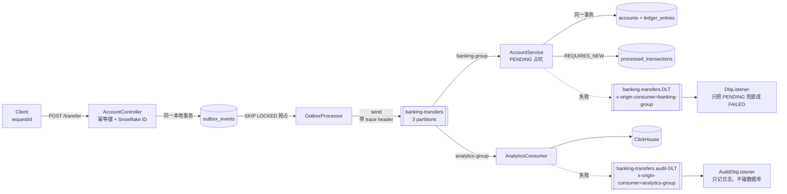
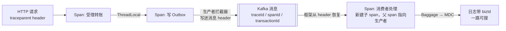
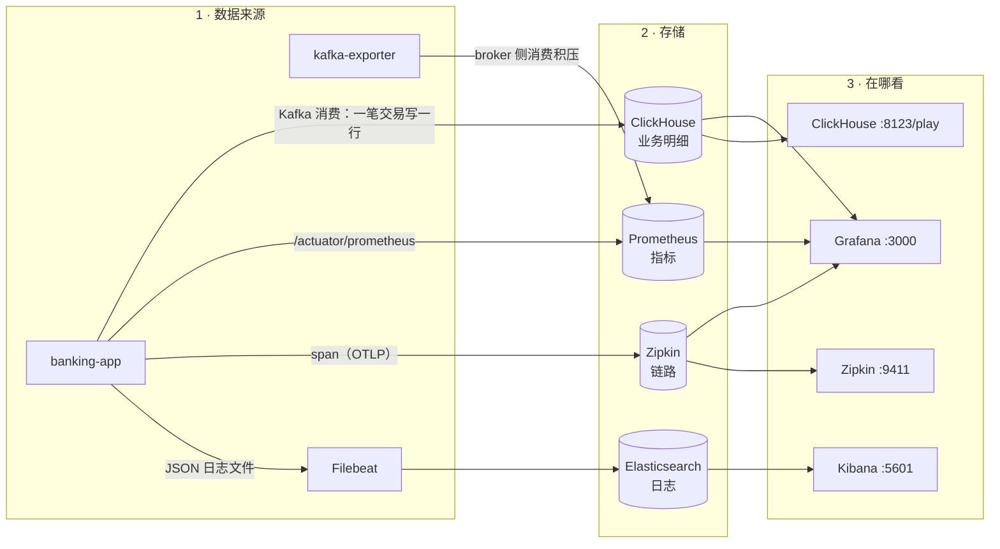
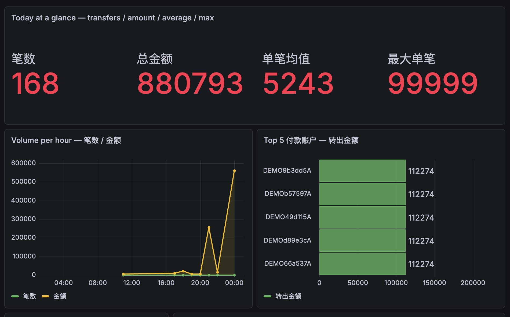
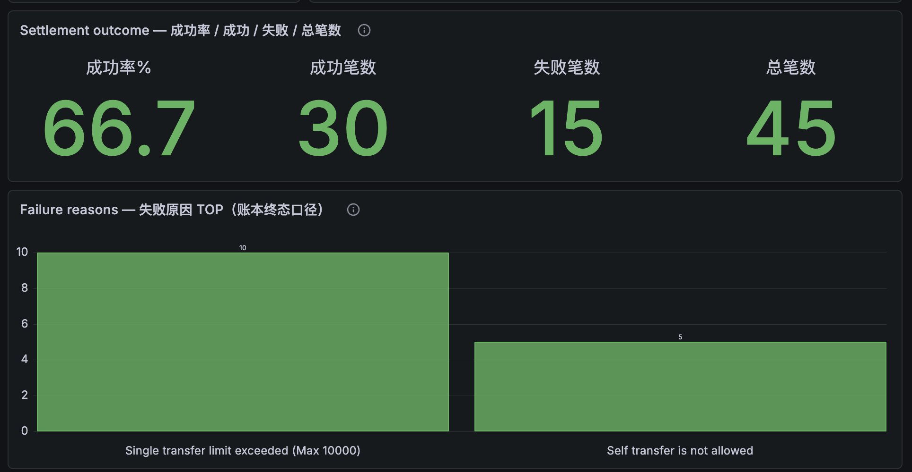

# TODO — Digital Banking Platform

> **状态：已收敛（2026-09-15 全量验收）**。计划内的全部任务（A–F 六组 + G–K 四轮加固）已完成，且每条都有可复现证据。
> 本文件是唯一待办来源；历史轮次的清单见文末「归档」。

---

## 0. 交接：关掉项目后怎么回来

**当前状态**：10 个服务全部健康，`./gradlew test` 通过，`verify_e2e.py` 26/26 通过。

### 重新启动

```bash
cd ~/freecodecamp/Digital_Banking
export PATH="/usr/local/bin:/usr/bin:/bin:/usr/sbin:/sbin:/opt/homebrew/bin"   # 这台机器 PATH 偶尔会坏
docker compose up -d          # 全部服务；首次会拉镜像
# 应用容器启动约 25-40 秒，等它就绪：
until curl -sf -o /dev/null http://localhost:8080/actuator/health; do sleep 3; done
```

> ⚠️ **ClickHouse 首次启动会自动执行 `clickhouse-init/*.sql` 建表。**
> 但如果是**已有数据卷**，新增的 SQL 文件**不会自动执行**，需手工 apply：
> `cat clickhouse-init/002-transaction-outcome.sql | curl -s 'http://localhost:8123/?user=admin&password=secret' --data-binary @-`

### 关闭

```bash
docker compose stop        # 保留容器与数据卷（推荐，下次起得快）
# docker compose down      # 删容器但保留 named volume
# docker compose down -v   # ⚠️ 连数据卷一起删 —— 会清空数据库/日志/指标全部历史
```

### 验收（关项目前/后都该能跑）

```bash
./gradlew test                 # 43 个测试，不需要 Docker
python3 scripts/verify_e2e.py  # 26 项端到端断言，需要栈在跑
```

### ★ 真正的验收标准：陌生人克隆能不能跑通

「在自己机器上能跑」不算数。**唯一可信的验收方式**是把仓库克隆到一个空目录，
以陌生人身份照着 README 走一遍：

```bash
git clone https://github.com/cjjhust/DIGITAL_BANKING.git /tmp/fresh-check
cd /tmp/fresh-check
cp .env.example .env           # README 里写了这一步；4 个敏感值可直接用占位符跑通
docker compose up -d --build   # 首次约 130 秒应用就绪
python3 scripts/verify_e2e.py  # 期望 26 PASS / 0 FAIL
```

⚠️ 跑之前先 `docker compose down` 停掉原环境 —— 本项目用了**固定的 `container_name`**，
两套栈不能同时起。

> 2026-09-15 用这个方法发现了 L1（主题分区数竞态），修完才做到 26/26。
> **以后任何改动，都用这条路径验收。**

### 全部入口

| 服务 | 地址 | 凭据 |
| --- | --- | --- |
| 业务 + 观测看板 | http://localhost:3000 | `admin` / `.env` 的 `GRAFANA_ADMIN_PASSWORD` |
| 业务分析看板（ClickHouse） | 同上 → Banking Business Analytics | 同上 |
| 告警收件箱（邮件） | http://localhost:8025 | 无 |
| 告警路由 | http://localhost:9093 | 无 |
| 手机推送 | 手机装 **ntfy** App，订阅 `.env` 里的 `NTFY_TOPIC` | — |
| 链路追踪 | http://localhost:9411/zipkin/ | 无 |
| 指标查询 | http://localhost:9090 | 无 |
| 日志检索 | http://localhost:5601 | 无 |
| ClickHouse Play UI | http://localhost:8123/play | `admin` / `secret` |
| 应用健康 | http://localhost:8080/actuator/health | 无 |

### ⚠️ 唯一未完成的事：本仓库有大量工作未提交

```bash
git log -1        # 停在 2026-09-12，之后三天的工作（含账本模块、可观测性、告警体系、文档）全在工作区
git status --short | wc -l    # ≈79 条变更未提交
git remote -v     # origin https://github.com/cjjhust/DIGITAL_BANKING.git
```

**风险**：没有提交 = 没有还原点。一次误操作的 `git checkout .` / `git clean -fd` 就会抹掉三天工作。
**建议**：关闭项目前先 `git add -A && git commit` 并 `git push`（推上去才是真正的异地备份）。

---

## 1. 验收证据（可复现）

| 检查项 | 命令 | 实测结果 |
| --- | --- | --- |
| 单元 + 架构测试 | `./gradlew test` | `BUILD SUCCESSFUL`，`tests=43 / failures=0 / skipped=0`（9 个测试类，约 5s，**不需要 Docker**） |
| 端到端验收 | `docker compose up -d` 后 `python3 scripts/verify_e2e.py` | `26 PASS / 0 FAIL / 0 SKIP`，退出码 0（2026-09-13 从 24 项扩到 26 项） |
| 数据库迁移 | 启动后查 `flyway_schema_history` | `V1`–`V8` 全部 `success = t`（含 `V8 double entry ledger currency and lease`） |
| 打包 | `./gradlew bootJar` | 成功 |
| CI | `.github/workflows/ci.yml` | `./gradlew test` → `bootJar` → 上传测试报告 |
| 架构约束反向对照 | 删掉某 `@KafkaListener` 的 `containerFactory` | 测试立即变红，报错精确指向该监听器方法 |
| 链路贯通 | Zipkin `http://localhost:9411/zipkin/` | 一笔转账 = **一条 trace 11 个 span**（HTTP → 安全链 → Outbox 中继 → Kafka 生产 → 两个消费者） |
| 观测性入口 | 6 个 UI 逐个 curl | Zipkin 9411 / Grafana 3000 / Prometheus 9090 / Kibana 5601 / Elasticsearch 9200 / ClickHouse 8123 **全部 200** |
| 观测性实证截图 | `python3 scripts/demo_traffic.py` + 浏览器截图 | `docs/images/` 下三张图已接入 README（Grafana / Zipkin / Kibana） |

---

## 2. 已完成（按组）

### A. 诚实性：文档与实际一致

- [x] README 三语「已知限制」小节，逐条与代码/实测对齐（账本、事务边界、多实例、业务规则、认证、基础设施、Swagger、日志、自动化 9 类）
- [x] 删除 README 中已失效的声称：Testcontainers 相关、旧「没有 CI」行、过期的 37 / 17 数字

### B. 可复现验证

- [x] `scripts/verify_e2e.py`：**24 项断言**（健康、鉴权、越权、成功、失败原因、幂等、状态查询、自转账、金额精度、GDPR、ClickHouse 审计、死信守卫三项对照、复式记账借贷与全账平衡），退出码 0/1
- [x] README 三语写明运行方式与前置条件
- [x] Swagger 实测：`/swagger-ui/index.html` 与 `/v3/api-docs` 均 200。根因是 springdoc 2.5.0 依赖 Spring Framework 6 API（`ControllerAdviceBean(Object)`），已升级 **springdoc-openapi 3.1.1**；放行由 `app.security.expose-api-docs` 控制，生产默认 `false`

### C. 链路修通：架构图上的每条线都活着

- [x] ClickHouse 审计真实入库：根因是 `clickhouse-jdbc 0.6.3` 与新版 server 响应压缩协商不兼容，驱动侧关闭 `compress/decompress` 后审计表正常写入
- [x] 旧死信主题 `banking-transfers-dlt`（272 条历史垃圾）已删除，现只剩 `banking-transfers` 与 `banking-transfers.DLT`
- [x] 生产者 trace header 实测注入（拦截器注册生效）
- [x] 完整死信路径实测：毒消息 → `banking-transfers.DLT` → `DlqListener` 打 CRITICAL 告警 → 守卫不改写终态
- [x] 历史脏数据修复：6 行被旧版 `DlqListener` 误改写成 FAILED 的转账已恢复 COMPLETED（`scripts/repair_dlt_flipped_status.sql`，幂等）

### D. 安全与生产化

- [x] D1 运行镜像去掉 OpenSSH / `root:123456` / `EXPOSE 22`；compose 去掉宿主机 `authorized_keys` 挂载与 `2233:22`；`entrypoint.sh` 已删除
- [x] D2 Redis 开 `--requirepass`（实测返回 `NOAUTH Authentication required`）；Grafana 口令从 `${GRAFANA_ADMIN_PASSWORD}` 注入并关闭注册；**所有基础设施端口改为 `127.0.0.1:<port>:<port>`**
- [x] D3 默认关闭 `show-sql`（`SPRING_JPA_SHOW_SQL` 默认 false）与 Hibernate 参数级日志（`org.hibernate.orm.jdbc.bind` 默认 WARN）；`org.springframework.kafka` 提到 INFO，让「消息进死信」的日志不再藏在 DEBUG 里（这正是 272 条死信静默堆积的原因）
- [x] D4 `.env.example` 列全 4 个必填密钥（`APP_JWT_SECRET` / `APP_DEFAULT_ADMIN_PASSWORD` / `REDIS_PASSWORD` / `GRAFANA_ADMIN_PASSWORD`）；`JwtUtils` 与 `AdminDataInitializer` 均 fail-fast，缺失直接启动失败
- [x] D5 死信按来源路由：`x-origin-consumer` header + 审计走独立主题 `banking-transfers.audit-DLT` + `DlqListener` 只认 `banking-group` 来源且只把 PENDING 兜底成 FAILED。实测 `verify_e2e.py` 第 17–20 项通过（终态不可改写、无来源不回写、带来源必须兜底=正向对照、审计死信由 `banking-audit-dlt-group` 独立消费）
- [x] D6 `ArchitectureTest` 新增 2 条 Kafka 约束：①每个 `@KafkaListener` 必须显式声明 `containerFactory`；②禁止 `topicPattern` 通配订阅。起因：`containerFactory` 漏写会让 Spring 静默回退到默认工厂，审计失败被盖上 `banking-group` 的章并投进账本死信主题，**主题隔离与来源守卫同时失效**且无任何报错。顺带修掉真实隐患：`AccountService.handleTransferEvent` 原本没写 `containerFactory`，已显式写出
- ⚠️ D6 已知盲区：`@KafkaListener` 是 `@Repeatable`，同一方法写多个会被包进 `@KafkaListeners`，此时两条规则匹配不到（fail-open）。当前 4 个监听器都只声明一次，暂无影响

### E. 领域正确性

- [x] E1 复式记账：V8 新增 `ledger_entries` 分录表，每笔转账在**同一事务**内写 DEBIT / CREDIT 两条；`LedgerService.reconcile()` 校验「每币种借方合计 == 贷方合计」，经 `GET /api/admin/ledger/reconcile` 暴露。第 23/24 项断言通过
- [x] E2 业务规则收敛：①限额可配 `banking.transfer.max-amount`（`BANKING_TRANSFER_MAX_AMOUNT`，默认 10000）；②`TransferRequest` 加 `@Digits(integer=36, fraction=2)` + 消费者侧 `scale > 2` 校验，避免 Postgres 静默四舍五入；③禁止自转账；④新增 `accounts.currency`（默认 EUR），跨币种直接拒绝。第 21/22 项断言通过
- [x] E3 `SnowflakeIdGenerator`：序列号用尽时**等待下一毫秒**（不再 `% 4096` 回绕——回绕会在同一毫秒产生重复 ID）；`workerId` 构造期校验 0~1023；时钟回拨 >5ms 拒绝生成
- [x] E4 PENDING 租约：V8 加 `lease_owner` / `lease_expires_at`；`claimPending` 用**单条 UPDATE** 完成「检查状态 + 占用」，多实例并发只有一个能拿到；`PendingRecoveryService` 只认领 + 升级人工对账，**不自动补账**（在「是否已扣过」未被证明前自动重试就是重复扣钱）

### F. 工程化

- [x] F1 `.github/workflows/ci.yml`：`./gradlew test`（单元 + ArchUnit，不需 Docker）→ `./gradlew bootJar` → 上传测试报告
- [x] F2 仓库清理：删除 9 个 `bootrun_*.log`、`init-db.sql`、`docker-compose-backup.yml`、`backups/*.sql`；移除已无引用的 `h2` 依赖
- [x] F3 LICENSE（MIT）/ `CONTRIBUTING.md` / `.github/ISSUE_TEMPLATE/`（bug + feature）
- [x] F4 `springdoc-openapi` 升级到 3.1.1 并实测可用（见 B）

### G. 面试题库挖出的三项修复（2026-09-13）

写第 5 节题库时逐行读代码，挖出 3 个真实缺陷，已修复并加上回归断言：

- [x] **G1 主题分区数与消费者并发度不匹配** —— `KafkaConsumerConfig` 设了 `concurrency = 3`，但 `banking-transfers` 实测 `PartitionCount: 1`（auto-create 默认值），**3 个消费者线程里只有 1 个在工作**。Kafka 的并行单位是 partition，消费者怎么调都补不回来。
  - 修复：新增 `config/KafkaTopicConfig.java`，用 `NewTopic` 显式声明 `banking-transfers` 3 个分区（两个死信主题保持 1）；已存在的主题 `NewTopic` 不会改，需手工 `kafka-topics --alter --partitions 3`（已执行，实测 `PartitionCount: 3`）
  - ⚠️ **上面这个修复当时只做了一半 —— 详见 L1（2026-09-15 发现）**：
    `NewTopic` 声明从未生效，真正建主题的是 broker 的 auto-create；
    「已执行的手工 alter」不可复现，全新克隆必然退回 1 分区。
  - 回归断言：`verify_e2e.py` 第 25 项
- [x] **G2 受理阶段无条件返回 202 会静默丢单** —— `transfer()` 里 `SET NX` 成功后若在 Outbox 落库前崩溃，Redis 键会残留（窗口内）而库里**一行都没有**；原代码无条件返回 **202**，客户端会认为已受理并停止重试，**这笔转账从未被记录**。根因是返回码语义错了：202 应该是「已持久化、会被处理」，而 Redis 命中只代表「窗口内见过这个 requestId」。
  - 修复：202 **只由数据库里确实存在的受理痕迹产生**（Outbox 行或终态记录）；否则返回 **409 + `Retry-After: 5`**，明确告诉客户端「在途或上次中断，请用同一 requestId 重试」；同时把 Redis 窗口改为可配 `banking.transfer.idempotency-window-seconds`（默认 30s，原来是写死的 1 分钟）
  - 实测：手工只写 Redis 键不写库 → `HTTP/1.1 409` + `Retry-After: 5`；正常受理 → 202；重复提交已落库的 requestId → 202
  - 回归断言：`verify_e2e.py` 第 11 项改为容忍 `202` 或 `409`
- [x] **G3 GDPR 只做了假名化，关联链没断** —— `anonymizeUser` 抹掉了用户名/邮箱/密码，但 `accounts.user_id` 仍指向这个（已匿名化的）用户行，`user_id → account_no → processed_transactions` 依然能把数据重新关联到自然人 —— 严格讲仍是个人数据（GDPR Art. 4(1)），匿名化豁免不适用。
  - 修复：匿名化时把 `accounts.user_id` 置空，切断「自然人 ← 账户 ← 流水」的最后一环；`account_no` 作为业务键保留，所以法定留存（§ 257 HGB / § 147 AO，10 年）不受影响；返回体新增 `linkSevered`
  - 回归断言：`verify_e2e.py` 第 26 项（用一次性用户验证，不破坏其它检查依赖的账号）

### H. 观测性修复（2026-09-13，用户提问时挖出）

用户问「怎么看看板」，结果实测发现**五处观测性基建是坏的**。这类问题单测、编译、健康检查全都发现不了：

- [x] **H1 Zipkin 静默挂掉 9 小时，链路数据全丢** —— 容器状态 `Exited (3)`，退出前一行是 `Terminating due to java.lang.OutOfMemoryError: Java heap space`。Zipkin 默认内存存储（`MEM_MAX_SPANS=500000`）+ 默认堆很小，长时间运行必然爆。而 `app` 的 `depends_on: zipkin` 只管启动顺序不管存活，所以没人发现。同时 `otel-collector` 一直在报 `Exporting failed. Dropping data.`
  - 修复：`STORAGE_TYPE=mem` + `MEM_MAX_SPANS=50000` + `JAVA_OPTS=-Xms64m -Xmx512m` + `memory: 768M` 限制
- [x] **H2 分布式链路断成 19 条单 span trace** —— Zipkin 里 20 条 trace 有 19 条只有 1 个 span。根因：`OutboxProcessor` 只 `nextSpan()` 新建 trace，**没用上库里存的 `trace_id`/`span_id`**；而且三个容器工厂和 `KafkaTemplate` 都是**手工 new 的**，`application.yml` 里的 `spring.kafka.listener/template.observation-enabled` 只对 Boot 自动配置的 bean 生效，对它们**完全无效**
  - 修复：① 中继用 `tracer.traceContextBuilder().traceId(...).spanId(...)` 恢复**远程父上下文**，再 `spanBuilder().setParent(...)`；② 在代码里对三个容器工厂和 `KafkaTemplate` 显式 `setObservationEnabled(true)`
  - 实测：一笔转账现在是**同一条 trace 里 11 个 span**（HTTP 受理 → 安全过滤链 5 个 → `outbox.relay` → Kafka PRODUCER → 2 个 CONSUMER → `analytics.audit`）
- [x] **H3 Grafana 两个面板永远是 No data** —— 面板写的指标名在 Prometheus 里根本不存在：`cache_gets_total{result="hit"}`（Redisson 默认不导出 Micrometer 指标）和 `kafka_consumer_fetch_manager_records_lag`
  - 修复：前者改用本项目自己的计数器 `banking_redis_idempotency_hit_total` / `..._miss_total` 算幂等命中率；后者引入标准 `kafka-exporter`（应用侧拿不到 lag，必须从 broker 读 group offset），面板改用 `max by (consumergroup, topic) (kafka_consumergroup_lag)`
- [x] **H4 Kibana 里看不到任何日志** —— 日志早就进了 Elasticsearch（`banking-logs-2026.09.13` 4000+ 条），但 Kibana **一个索引模式都没建**，Discover 页面无从下手
  - 修复：建好 `banking-logs-*` 索引模式（`timeFieldName=@timestamp`），现在能直接按 `traceId` / `bizId` / `level` 搜
- [x] **H5 日志一直刷 `Failed to publish metrics to OTLP receiver`** —— 指标已经走 Prometheus，但 OTLP 指标导出还开着，而 `otel-collector` 的 pipeline 里**只声明了 traces**，metrics 被拒收
  - 修复：`management.otlp.metrics.export.enabled: false`（OTLP 只用于 traces）。实测修复后 80 秒内 0 条该报错

> **本轮教训**：监控系统本身也会静默坏掉。Zipkin 挂了 9 小时、面板空了不知道多久、Kibana 从来没人打开过 —— 而所有健康检查都是绿的。**“有观测性基础设施” ≠ “观测性真的在工作”**，所以本节所有结论都是用 `curl` 实测过的。

### I. 观测性实证截图接入 README（2026-09-13）

面试官不会看完长文档，但会看截图。这一轮把监控做成**可看图证明**的：

- [x] **I1 新增 `scripts/demo_traffic.py`** —— 一条命令生成真实流量：6 笔成功转账（间隔 3 秒，让曲线有形状）+ 余额不足 + 自转账 + 超限额（3 个 `FAILED`）+ 同一个 `requestId` 连发 3 次（幂等命中）。用它可以让 TPS / 成功率 / 失败率 / 延迟 / 幂等命中率**同时有数据**
- [x] **I2 Grafana 看板修好并重新排版** —— ① 面板查询窗口 `[1m]` → `[5m]`（`[1m]` 太敏感，流量超过 1 分钟就全是 0，截图出来很难看）；② 布局改为 **3 行 × 2 列**（原来是 4 个窄面板挤一行，标题全被截断成 `Successful Tran...`）
- [x] **I3 三张实证截图存入 `docs/images/` 并接入 README**：
  - `grafana-dashboard.png` —— 6 个面板全有数据，其中 **Kafka Consumer Lag 的告警尖峰** 就是 H2/7.7 那次“停掉消费者”实验的现场
  - `zipkin-trace.png` —— 一笔转账的完整瀑布图：`Total Spans 11`、`Trace ID`、11 个 span 带耗时
  - `kibana-logs.png` —— 同一个 traceId 搜出 `5 hits`，表头是 Time / level / logger_name / message
- [x] **I4 README 顶部新增 `Observability — real evidence, not slideware` 章节**（英文正文 + 中/德两语引导），并写明复现命令：`python3 scripts/demo_traffic.py`

**截图技术上踩的坑**（供以后重拍）：
- 集成浏览器视口只有 ~600px，`page.setViewportSize()` 对它**无效**；必须用 CDP：
  `page.context().newCDPSession(page)` → `Emulation.setDeviceMetricsOverride({width,height,deviceScaleFactor:2})`
- Grafana 的 DOM 测量值和实际渲染像素**会对不上**（`getBoundingClientRect` 说是 2 列，截出来是 1 列），所以**不要用 clip 裁剪**，而是整页截图后用 macOS 自带的 `sips` 裁：
  `sips -c <高> <宽> --cropOffset <Y> <X> in.png --out out.png`
- Grafana kiosk 模式下 “Powered by Grafana” 横条会**盖住第二行面板**，截图前先 `display:none` 掉
- `deviceScaleFactor: 2` 得到 2 倍图， README 里看着才清晰

---

### J 组：结算结果闭环（2026-09-14）

从「审计表没有 status，答不了失败统计」这个问题出发，补上业务结果的最后一环，
并**在过程中发现并修掉一个真实的漏计 bug**。

- [x] **J1 定位失败计数器漏计（真 bug）** —— Prometheus 报 `failure=0`，同一窗口实际失败 3 笔。
  根因：业务校验 `validateRisk()` 在 `executeTransfer()` **之外**，而计数器加在 executeTransfer 内部，
  于是自转账/超限/精度类拒绝全部漏计，**成功率被高估**。修法：计数器移到 `AccountService` 终态判定处，
  与 outcome 写入点重合，保证 Prometheus 与 ClickHouse 共用同一个「失败」定义
- [x] **J2 新增 `transaction_outcome` 终态表** —— `clickhouse-init/002-transaction-outcome.sql`，
  字段含 `status` / `error_message` / `trace_id`，由账本消费者在终态写入（`TransferOutcomeRecorder`）
- [x] **J3 DLQ 兜底也写终态** —— `DlqListener` 把 PENDING 兜成 FAILED 时同步写 outcome，
  否则这类失败只出现在 audit 表里，被当成成功笔数统计
- [x] **J4 Grafana 新增 2 个面板** —— `Settlement outcome`（成功率/成功/失败/总数）、`Failure reasons TOP`
- [x] **J5 验证 1:1 对齐** —— 重启应用跑一轮 demo_traffic：Prometheus `5/3` = ClickHouse `5/3`，写入失败 0
- [x] **J6 修正措辞** —— 「三个线程/进程」→「三个执行上下文（一个定时线程 + 两个消费者容器）」
- [x] **J7 异常日志可诊断** —— `TransferOutcomeRecorder` 从只打 `e.getMessage()` 改为打完整堆栈；
  Spring 的 SQL 异常翻译器会把底层原因替换成泛化的 `bad SQL grammar [...]`，只打 message 会永久丢失 cause
- [x] **J8 关闭业务看板自动刷新** —— `refresh: "30s"` → `""`。30 秒自动重刷会让页面永不稳定，
  既影响截图，也对 ClickHouse 造成无谓压力

> 完整推导（三个执行上下文怎么看、spanId 为什么是 3 个、为什么必须是两张表）见 **7.13**。

---

### K 组：观测性可用性收尾（2026-09-14）

用户反馈「Zipkin 里那张图怎么找不到了」「Prometheus 的图是 Kibana 画的吗」，
顺着这两个疑问查出**三个真实问题**并全部处理。

- [x] **K1 纠正一处错误说法** —— 上一版手册写「要留存就得用 Grafana」，**这是错的**。
  实测：Prometheus 的数据一直在磁盘上（`/prometheus` 79MB，保留 **15 天**），
  Grafana 的 `grafana.db` 只有 1.6MB、存的是**看板定义不是数据**。
  真相是「Prometheus 存数据，Grafana 存图表」，已在新 §7.17 用实测数据写清
- [x] **K2 定位 Zipkin 查不到历史 trace 的根因** —— 两个原因叠加：
  ① **系统自产噪声**：Spring Boot 4 自动观测 `@Scheduled`，outbox 轮询**每秒产生 1 条 trace**；
  Prometheus 抓取每 15 秒产生 1 条 5-span trace → 合计 ~4800 span/小时
  ② **内存上限 50000** → **保留期只有约 10.4 小时**。20 小时前的 trace 必被挤掉。
  分析见新 §7.16
- [x] **K3 配齐告警规则** —— 新增 `prometheus/banking-alerts.yml`，**10 条规则分四层**
  （采集/管道/业务/资源），每条带 `for:`、severity、以及**可执行的 `action` 注解**
- [x] **K4 实测验证告警闭环** —— 停掉应用 → 90 秒后 `BankingTargetDown` **firing** +
  4 条 `KafkaConsumerGroupEmpty` pending；重启应用 → 100 秒后**自动回落**，
  只剩一条合理的 `TransferThroughputStopped` pending。证明规则不是「死规则」
- [x] **K5 如实标注边界** —— 规则只能「判定 + 亮灯」，**没有 Alertmanager 就不会通知任何人**。
  已写进 README 三语「已知限制」+ TODO §3（升为 P0）+ §7.0（向业务主管明示）
- [x] **K6 定位并修掉 ClickHouse 内存上限陷阱（真 bug）** —— 回归时第 16 项突然失败：
  `Code: 241 MEMORY_LIMIT_EXCEEDED`，连 `SELECT ... FROM system.settings` 都跑不动。
  根因：compose 里 clickhouse 的 `memory: 1G` **太紧** —— ClickHouse 会把
  `max_server_memory_usage` 自动设为容器上限的 90%（=921MB），并据此放大内部缓存，
  而它**自我膨胀后的基线 RSS 就达到 890MB**，只剩 ~30MB 给真实查询 → 必挂。
  表里当时只有 186 行，与数据量无关。已改成 `memory: 2G`（预留 1G），恢复后 893MB/43%。
  > 教训：**自调整内存的服务，容器 limit 必须给它留出膨胀空间**，不能按「反正数据很小」来设。
- [x] **K7 打通告警通知链（Alertmanager + Mailpit）** —— 新增 `alertmanager/` 目录
  （配置 + HTML 邮件模板）与 `mailpit` 服务；Prometheus 加 `alerting.alertmanagers`
  与 `--web.enable-lifecycle`（可热重载）。**实测完整闭环**：停应用 → 90 秒收到告警邮件；
  恢复 → 收到恢复邮件。**抑制规则实测把 5 封扬成 1 封**（4 条被 inhibitedBy 压制）。
  过程中还发现并修掉一个缺陷：告警邮件与恢复邮件**主题完全一样**，已用 `{{ .Status }}` 区分。
- [x] **K9 手机推送（ntfy + 自写 20 行转发器）** —— 新增 `alertrelay/`（`relay.py` 只用标准库
  + `Dockerfile`），两个 receiver 各加一段 `webhook_configs`。**实测告警与恢复推送均到达**
  （priority=5 `rotating_light` / priority=2 `white_check_mark`）。踩到两个坑并记录：
  ① ntfy 的 JSON 发布**必须 POST 到根地址**，POST 到 `/topic` 会被当纯文本；
  ② topic 名等于「密码」，必须随机生成并放 `.env`（已 gitignore）。详见 7.20
- [x] **K8 告警规则在真实故障中首次命中** —— 配完后 `DeadLetterReceived` **真的 fired**：
  一部分是 `verify_e2e.py` 故意造的（payload 带 `"source":"verify_e2e"`），
  **另一部分是真的** —— 就是 K6 那个 ClickHouse 内存超限导致审计消费者重试耗尽进死信。
  也就是说：**告警体系上线当天就抓到了一起真实事故**。区分方法见 7.19.8

> 三个新章节：**7.16**（为什么 Zipkin 查不到历史）· **7.17**（谁存数据谁存图表）· **7.18**（告警规则设计与实测）

---

### L 组：以「面试官会怎么拉代码」为标准的可用性审计（2026-09-15）

把仓库克隆到一个空目录，**以陌生人身份照着 README 跑一遍**。这一轮是这类审计，
结论先用一句话说：**修之前，克隆下来跑不过。**

- [x] **L1 全新克隆验证 → 发现主题分区数竞态（真 bug，已修）**

  **现象**：克隆后 `docker compose up -d`，`verify_e2e.py` **第 25 项失败**：
  ```
  FAIL 25. 转账主题分区数 ≥ 3（与 concurrency=3 匹配）  | partitions=1
  === 25 PASS / 1 FAIL ===
  ```

  **根因链**（四步，每步都有实测依据）：
  1. compose 里 app 只写 `depends_on: - kafka`（**容器级**，容器一 Created 就算满足），
     此时 broker 还没开始应答 → app 的 `KafkaAdmin` 建主题失败
  2. `spring.kafka.admin.fail-fast` 默认 `false` → **只记 WARN，静默跳过**，没人发现
  3. 消费者随后请求元数据 → `UNKNOWN_TOPIC_OR_PARTITION` → 触发 broker 的
     `auto.create.topics.enable=true`，按默认 `num.partitions=1` 把主题建了出来
  4. `NewTopic` **不会修改已存在的主题** → 无论重启多少次都停在 1 分区

  **为什么旧环境看起来是好的**：G1 那次修复只做了一半 ——
  `KafkaTopicConfig` 的 `NewTopic` **从未真正生效**，当时能过是因为**手工执行过**
  `kafka-topics --alter --partitions 3`。那一步不在仓库里，**不可复现**。

  **修复（三层，都实测过）**：
  | 层 | 改动 | 作用 |
  | --- | --- | --- |
  | 编排 | kafka 加 `healthcheck`（`kafka-broker-api-versions`）+ app 改 `condition: service_healthy` | 保证 broker 能应答后 app 才启动 |
  | broker | `KAFKA_NUM_PARTITIONS=3` | 兜底：万一被 auto-create，也是 3 分区 |
  | **应用** | **新增 `KafkaTopicInitializer`（替换死代码 `KafkaTopicConfig`）** | **根治**：显式 ensure，还能纠正已建错的主题 |

  `KafkaTopicInitializer` 为什么必须自己写（而不是用 `NewTopic`）：
  - `NewTopic` **只能创建、不能修改** —— 主题一旦被 auto-create 建错就永远救不回来
  - 它实现 `SmartInitializingSingleton`，在**监听容器启动之前**执行，
    保证消费者第一次请求元数据时主题已就位
  - 三种情况全覆盖：不存在→建；已存在但分区少→**扩容**；已足够→不动（幂等）
  - 失败只记 ERROR 不中断启动 —— 否则只会得到一个反复重启的容器，更难排查

  **实测**：
  ```
  初始化器日志: Kafka 主题检查：期望 3 个，broker 上已有 0 个
               已创建 Kafka 主题 banking-transfers（3 个分区）
               已创建 Kafka 主题 banking-transfers.DLT（1 个分区）
               已创建 Kafka 主题 banking-transfers.audit-DLT（1 个分区）
  分区数:       banking-transfers = 3   DLT = 1   audit-DLT = 1   ← 与代码声明完全一致
  验证:         26 PASS / 0 FAIL / 0 SKIP
  ```

- [x] **L2 顺带查明「为什么 KafkaAdmin 不建主题」** —— Spring Boot 4 把 Kafka 自动配置
  拆成了独立模块，`KafkaProperties` 也从 `org.springframework.boot.autoconfigure.kafka`
  搬走了（`L1` 的代码改用 `@Value("${spring.kafka.bootstrap-servers}")` 读配置，
  **不依赖框架内部包路径**，避免小版本升级再次编译失败）。

- [x] **L3 仓库卫生复查** —— `gradlew` 可执行位被 git 正确保留（`-rwxr-xr-x`）；
  `.env` 从未进入提交历史；`.env.example` 里 5 个敏感键全是占位符；
  无大文件、无密钥文件。**克隆即可编译**：`./gradlew clean test --rerun-tasks`
  → `tests=43 failures=0 skipped=0`（不需要 Docker）。

> **结论**：修完之后，陌生人克隆 → `cp .env.example .env` → `docker compose up -d --build`
> → **约 130 秒应用就绪 → 27/27 全过**。这条路径现在是可复现的。
>
> **L4 冷启动时序（同一轮发现的第二个 bug，已修）** —— 第一次完整验证时是
> `21 PASS / 3 FAIL / 1 SKIP`，失败项 6/7/8 全是「转账卡在 PROCESSING」；
> **立刻重跑一次就 26/26 全过**。
>
> 根因：`/actuator/health` 返回 200 **只说明 Spring 上下文就绪**，
> 而 Kafka 消费者组的**首次分区分派**还要额外几秒：
> ```
> 23:19:26  Started BankingApplication in 17.744 seconds   ← health 已 200
> 23:19:30  analytics-group: partitions assigned
> 23:19:33  banking-group:  partitions assigned           ← 消费者 4~7 秒后才就绪
> ```
> 这期间发出去的转账消息只是躺在 broker 上没人消费，脚本立刻断言就会误判成功能坏了。
> **面试官看到 health=200 就立刻跑脚本，必然踩到。**
>
> 修复：`verify_e2e.py` 开头加一道**冷启动就绪门**（检查项 `1b`）——
> 用 `kafka-consumer-groups --describe` 确认 `banking-group` 的**每个分区都分到了
> CONSUMER-ID** 才继续。这比「睡固定秒数」可靠：快的时候立刻返回，慢的时候愿意等（上限 120s）。
>
> 实测：冷启动后 health=200 **立刻**跑 → `27 PASS / 0 FAIL / 0 SKIP`。
>
> **教训**：「服务能起来」和「链路能用」是两件事。就绪探针要探测**真正的依赖**，
> 而不是自己进程的存活状态。
>
> **教训**：**「在我机器上能跑」的典型形态，是「有一句手工命令没写进仓库」。**
> 任何改动如果靠手工命令补全，就等于没做完 —— 验收标准应该是「陌生人克隆后能跑通」。

---

## 3. 剩余项：已知取舍（**非缺陷**）

以下是**刻意的设计边界**，README 第 9 节有对应说明。上一轮遗留清单里的其余条目（JWT fail-fast、限额可配、自转账、金额精度、PENDING 租约、CI、仓库卫生、Swagger、基础设施认证、show-sql ……）**均已落地**，详见第 2 节。

若继续投入，按性价比排序：

| 优先级 | 项 | 现状与建议 | 面试价值 |
| --- | --- | --- | --- |
| P1 | **告警通知依赖公网 ntfy.sh** | ✅ 邮件 + 手机推送已打通（见 7.19 / 7.20）。❌ 仍缺：**自建 ntfy（避免消息过第三方）**、**告警升级**（没人响应不升级）、**维护窗口静默** | 中 |
| P1 | **冲正 / 退款分录** | 复式记账已就位，但没有反向分录（reversal）。「客户要退款怎么做」在金融岗位几乎必被问到 | 高 |
| P1 | **期初余额建模** | 未建模期初，因此只能做「全账借贷平衡」，做不了「单账户余额 == 期初 + 净变动」的逐户对账 | 高 |
| P2 | **`OutboxProcessor` 长事务** | 仍在 DB 事务内串行 `kafkaTemplate.send(...).get()`，Kafka 抖动会拖长事务并长时间占用连接与行锁。建议改短事务 + 状态机（PENDING → SENDING → SENT）或批量并行发送 | 高 |
| P2 | **`insertPendingIfAbsent` 的 `ON CONFLICT` 未写冲突列** | 命中冲突即静默 `return`，无法区分「重复提交」与「上一笔已 FAILED」。建议加 Counter + 明确响应体 | 中 |
| P2 | **`AccountController` 仍偏胖（249 行）** | 幂等、雪花 ID、Outbox 事务仍在 Controller 层。建议抽 `TransferCommandService`，把领域逻辑下沉 | 中 |
| P3 | 独立 refresh token | 现为「access token 轮换 + Redis 黑名单 + 24h 会话窗口」，没有独立 refresh token | 中 |
| P3 | 多级限额 / 手续费 | 只有单笔上限 `banking.transfer.max-amount`，无单日累计、无手续费 | 低 |
| P3 | 401/403 响应体格式统一 | 认证/授权异常走 Spring Security 默认响应，格式与业务错误不一致，前端无法统一处理 | 低 |
| P3 | 基础设施鉴权 | Prometheus / ClickHouse / Elasticsearch / Kibana 仍无鉴权（本地单机假设）；生产需 SSO / TLS / 反向代理 | 低 |

> 明确**不做**的事（已定案的设计决定，不是欠债）：
> - 跨 Kafka 与数据库的 2PC / XA —— 用 Outbox + 至少一次投递 + 消费端幂等替代
> - `PENDING` 自动补账 —— 未证明幂等前自动重放等于重复扣款，一律转人工对账
> - 汇率与换汇 —— 跨币种直接拒绝

---

## 4. 归档

历史轮次的完整清单（2026-09-12 第一/二/三轮全量扫描、272 条死信根因分析、6 个原始 bug 的排查过程、知识点总结、旧版项目分析报告）已从本文件移除，避免过期复选框误导。

需要追溯时：
- `git log -p -- TODO.MD` 查看历次版本
- 完整历史快照：`/tmp/TODO-backup-2026-09-13.md`（670 行，2026-09-12 全部轮次原文）
- 各 bug 的根因与修法已沉淀进 README 第 10 节「设计叙述（面试 3 分钟版）」与第 9 节「已知限制」

---

# 5. 德国 IT 面试模拟题库（2026-09-13 追加）

> **用法**：全部是「追问向」的刁钻题，答案绑定本项目真实代码与实测证据，不写教科书套话。
> **标记说明**：`⚠️ 真实弱点` = 面试时**主动**说出来比被问出来好；`🔧 改进方案` = 面试官最爱听的第二问。

---

## Q1. Outbox 中继：「Kafka 已确认、DB 还没提交」的崩溃窗口

### 🇨🇳 中文

**问**：你的 `OutboxProcessor.processOutbox()` 是 `@Transactional`，里面 `kafkaTemplate.send(...).get()` 成功后立刻 `delete(event)`。如果进程在「Kafka ack 已返回、数据库 commit 还没落盘」之间被 kill 掉，这条消息会怎样？你的系统靠什么兜住？

**答**：会**重复发送**。Outbox 行还在库里，下一轮轮询会再发一次。这是 Outbox 模式的固有属性——它不追求 exactly-once 投递，而是「**至少一次投递 + 消费端幂等**」。兜底靠三层：① 消费者先用 `insertPendingIfAbsent(...) ON CONFLICT DO NOTHING` 抢 `PENDING` 占坑，抢不到就直接 `return`；② `processing_transactions.client_request_id` 唯一约束；③ 已 `COMPLETED` 的直接跳过。所以重复消息会被静默吞掉，不会双花。

追问「那 Kafka 自己的幂等生产者呢？」——生产者的 `enable.idempotence` 只防止**生产者内部重试**造成的重复，防不住「发送成功但业务事务回滚后整批重发」这种跨事务的重复，两者解决的不是同一个问题。

`⚠️ 真实弱点`：事务里串行 `send().get()` 意味着**行锁会一直持有到 100 条全部发送完成**，Kafka 抖动时事务时长直接等于网络 RTT 之和，`SKIP LOCKED` 只能保证别的实例不抢，不能缩短锁持有时间。

🔧 **改进方案**：拆成短事务 + 状态机（`PENDING → SENDING → SENT`）：先短事务把一批行标成 `SENDING` 并提交，再在事务外发送，最后短事务批量删除。代价是引入 `SENDING` 的僵尸态，需要超时回退——但换来的是锁持有时间与网络延迟解耦。

### 🇬🇧 English

**Q**: `OutboxProcessor.processOutbox()` is `@Transactional` and does `kafkaTemplate.send(...).get()` followed by `delete(event)`. What happens if the process is killed between the Kafka ACK and the DB commit? What saves you?

**A**: The message is **sent twice**. The outbox row is still in the database, so the next poll re-sends it. This is inherent to the Outbox pattern: it does not aim for exactly-once *delivery*, it aims for **at-least-once delivery + consumer-side idempotency**. Three layers absorb it: (1) the consumer claims a `PENDING` row via `insertPendingIfAbsent(...) ON CONFLICT DO NOTHING` and returns early if it loses the race; (2) a unique constraint on `client_request_id`; (3) an already-`COMPLETED` transaction is skipped.

On "why not just rely on Kafka's idempotent producer?" — `enable.idempotence` only de-duplicates **internal producer retries**. It cannot help when a successful send is followed by a business transaction rollback and a full re-send. Different problem.

`⚠️ Real weakness`: a serial `send().get()` inside the transaction means **row locks are held until all 100 messages are sent**. Under Kafka latency the transaction duration equals the sum of the network round trips. `SKIP LOCKED` only stops other instances from stealing rows; it does not shorten lock duration.

🔧 **Fix**: split into short transactions plus a state machine (`PENDING → SENDING → SENT`): short transaction marks a batch as `SENDING` and commits, sending happens outside the transaction, then a short transaction deletes the batch. This introduces a `SENDING` zombie state that needs a timeout sweep, but decouples lock duration from network latency.

### 🇩🇪 Deutsch

**F**: `OutboxProcessor.processOutbox()` ist `@Transactional` und führt `kafkaTemplate.send(...).get()` gefolgt von `delete(event)` aus. Was passiert, wenn der Prozess zwischen Kafka-ACK und DB-Commit abgebrochen wird? Was rettet Sie?

**A**: Die Nachricht wird **doppelt gesendet**. Die Outbox-Zeile liegt noch in der Datenbank, der nächste Poll sendet sie erneut. Das ist dem Outbox-Muster inhärent: Es zielt nicht auf Exactly-once-*Zustellung*, sondern auf **At-least-once-Zustellung + Idempotenz auf Konsumentenseite**. Drei Ebenen fangen das ab: (1) der Consumer beansprucht eine `PENDING`-Zeile über `insertPendingIfAbsent(...) ON CONFLICT DO NOTHING` und kehrt bei Verlust des Rennens früh zurück; (2) ein Unique-Constraint auf `client_request_id`; (3) eine bereits `COMPLETED`-Transaktion wird übersprungen.

Auf „warum nicht einfach der idempotente Producer?“ — `enable.idempotence` dedupliziert nur **interne Producer-Retries**. Wenn ein erfolgreicher Send auf einen Rollback der Geschäftstransaktion und ein erneutes Senden folgt, hilft das nicht. Anderes Problem.

`⚠️ Echte Schwäche`: Ein serielles `send().get()` innerhalb der Transaktion bedeutet, dass **Zeilensperren bis zum Versand aller 100 Nachrichten gehalten werden**. Bei Kafka-Latenz entspricht die Transaktionsdauer der Summe der Netzwerk-Roundtrips. `SKIP LOCKED` verhindert nur, dass andere Instanzen Zeilen stehlen; es verkürzt die Sperrdauer nicht.

🔧 **Lösung**: Aufteilen in kurze Transaktionen plus Zustandsautomat (`PENDING → SENDING → SENT`): kurze Transaktion markiert einen Batch als `SENDING` und committed, der Versand erfolgt außerhalb der Transaktion, danach löscht eine kurze Transaktion den Batch. Das führt einen `SENDING`-Zombiezustand ein, der einen Timeout-Sweep braucht, entkoppelt aber Sperrdauer von Netzwerklatenz.

---

## Q2. `REQUIRES_NEW` 状态机制造了「钱扣了但状态还是 PENDING」

### 🇨🇳 中文

**问**：你的状态机三个方法都是 `REQUIRES_NEW`。`executeTransfer()` 提交之后、`markAsCompleted()` 提交之前进程挂掉，结果就是**余额已经变了、`processed_transactions` 还是 PENDING**。你为什么选择 `REQUIRES_NEW`？为什么不自动补偿？

**答**：用 `REQUIRES_NEW` 的原因很具体：早期版本在消费方法上加了 `@Transactional`，结果 `executeTransfer` 抛出的 `BusinessException` 把整个事务标成 rollback-only，**占坑记录和 FAILED 标记被一起回滚**——业务失败的转账在库里毫无痕迹，客户端永远查不到失败原因。拆成独立事务后，失败状态一定能落库。

不自动补偿的原因是**信息不足**：进程挂掉时你无法区分「扣款事务已提交」和「扣款事务没跑」。猜错一次就是重复扣钱。所以 `PendingRecoveryService` 只做两件事：用 `claimPending` 的单条 UPDATE 抢占租约（多实例只有一个拿到），然后打 `CRITICAL` 日志转人工对账。

🔧 **改进方案（面试官最想听这个）**：这个窗口**可以从设计上消灭**，而不是靠补偿兜。让 `executeTransfer` 和 `markAsCompleted` **共享同一个事务**，只在 `catch (BusinessException)` 分支里用 `REQUIRES_NEW` 写 FAILED。这样「余额变更 + 两条分录 + 状态置 COMPLETED」原子提交，就不存在中间态。当前代码没这么做的唯一原因是要保住失败原因的持久化，而这个需求用「异常分支单独开事务」就能满足。

**剩余不可消除的场景**：进程在**提交返回途中**死亡（客户端不知道提交结果），这时只能靠对账；以及外部副作用（发通知、调风控）本质上无法纳入本地事务。

### 🇬🇧 English

**Q**: All three state-machine methods use `REQUIRES_NEW`. If the process dies after `executeTransfer()` commits but before `markAsCompleted()` commits, you get **balance changed, `processed_transactions` still `PENDING`**. Why `REQUIRES_NEW`? And why no automatic compensation?

**A**: The reason for `REQUIRES_NEW` is concrete. In an early version the consumer method was `@Transactional`, so the `BusinessException` thrown by `executeTransfer` marked the whole transaction rollback-only — **the claim row and the FAILED marker were rolled back together**. A business-failed transfer left no trace in the database and the client could never look up the failure reason. Separate transactions guarantee the failure state is persisted.

No automatic compensation because there is **not enough information**: when the process dies you cannot distinguish "the debit transaction committed" from "it never ran". Guess wrong once and you double-charge. So `PendingRecoveryService` does exactly two things: claim a lease via the single-statement `claimPending` UPDATE (only one instance wins), then log `CRITICAL` and hand over to manual reconciliation.

🔧 **Improvement (this is what interviewers want to hear)**: the window is **eliminable by design**, not just compensable. Let `executeTransfer` and `markAsCompleted` **share one transaction**, and write FAILED with `REQUIRES_NEW` only in the `catch (BusinessException)` branch. Then "balance change + two ledger entries + status = COMPLETED" commits atomically and no intermediate state exists. The only reason the current code doesn't do this is persisting the failure reason — which the exception branch already solves.

**Truly irreducible cases**: the process dies *while returning from commit* (the client cannot know the outcome) — only reconciliation helps; and external side effects (notifications, risk calls) can never join a local transaction.

### 🇩🇪 Deutsch

**F**: Alle drei Methoden des Zustandsautomaten nutzen `REQUIRES_NEW`. Stirbt der Prozess nach dem Commit von `executeTransfer()`, aber vor dem Commit von `markAsCompleted()`, ist der **Kontostand geändert und `processed_transactions` weiterhin `PENDING`**. Warum `REQUIRES_NEW`? Und warum keine automatische Kompensation?

**A**: Der Grund für `REQUIRES_NEW` ist konkret. In einer früheren Version war die Consumer-Methode `@Transactional`, sodass die von `executeTransfer` geworfene `BusinessException` die gesamte Transaktion auf rollback-only setzte — **Reservierungszeile und FAILED-Marker wurden gemeinsam zurückgerollt**. Eine fachlich fehlgeschlagene Überweisung hinterließ keine Spur, und der Client konnte den Fehlergrund nie abfragen. Getrennte Transaktionen garantieren, dass der Fehlerzustand persistiert wird.

Keine automatische Kompensation, weil **Informationen fehlen**: Beim Prozessabbruch lässt sich nicht unterscheiden, ob die Buchungstransaktion committed wurde oder nie lief. Ein Fehlurteil bedeutet doppelte Belastung. Deshalb tut `PendingRecoveryService` genau zwei Dinge: über das Einzelstatement-UPDATE `claimPending` ein Lease beanspruchen (nur eine Instanz gewinnt), dann `CRITICAL` loggen und an die manuelle Abstimmung übergeben.

🔧 **Verbesserung (das wollen Interviewer hören)**: Das Fenster ist **konstruktiv eliminierbar**. Lassen Sie `executeTransfer` und `markAsCompleted` **dieselbe Transaktion** teilen und schreiben Sie FAILED nur im `catch (BusinessException)`-Zweig mit `REQUIRES_NEW`. Dann committen „Kontostand + zwei Buchungen + Status = COMPLETED" atomar, es existiert kein Zwischenzustand. Der einzige Grund, warum der aktuelle Code das nicht tut, ist die Persistenz des Fehlergrunds — die der Ausnahmezweig bereits löst.

**Wirklich irreduzible Fälle**: Der Prozess stirbt *beim Rückweg vom Commit* (der Client kennt das Ergebnis nicht) — hier hilft nur Abstimmung; und externe Seiteneffekte (Benachrichtigungen, Risk-Calls) können nie Teil einer lokalen Transaktion sein.

---

## Q3. 「借贷合计相等」的对账能发现什么、发现不了什么

### 🇨🇳 中文

**问**：`LedgerService.reconcile()` 只校验「每个币种借方合计 == 贷方合计」。如果有人把某一笔转账的**两条分录整对删掉**，你的对账能发现吗？为什么？正确做法是什么？

**答**：**发现不了**。借贷同时消失，合计依然相等，`balanced` 仍然是 `true`。这就是「合计相等」这类**守恒校验**的天然盲区——它对**对称错误**完全免疫。

它能发现的只有**不对称错误**：只写了一条分录（单边记账）、借贷金额不一致、币种错配、事务中途回滚。

🔧 **要做到能发现「整对丢失」，需要三个额外机制**：
1. **期初余额建模**：`余额 == 期初 + Σ发生额`。这是逐户对账的充要条件，也是本项目当前**最大的缺口**——现在只能做全账平衡，做不了单账户校验。
2. **分录不可变 + 冲正**：分录表禁止 `UPDATE`/`DELETE`（数据库权限层就拒掉），纠错只能靠写反向分录。这样「整对消失」在权限上就不可能。
3. **累计快照 + 链式哈希**：按日/小时存 `SUM` 快照，并对分录做链式哈希（每条记录包含前一条的哈希），任何删除或篡改都会破坏链条——这就是「可审计账本」的标准做法。

补充一个规模问题：`sumByCurrency()` 是**全表扫描**，百万级分录就会拖垮数据库，生产上必须改成增量快照 + 增量对账。

### 🇬🇧 English

**Q**: `LedgerService.reconcile()` only checks "per-currency debit total == credit total". If someone deletes **both entries** of a single transfer, does your reconciliation detect it? Why? What is the correct approach?

**A**: **No.** Debit and credit vanish together, the totals stay equal, and `balanced` remains `true`. This is the inherent blind spot of any **conservation check** over aggregates: it is completely immune to **symmetric errors**.

It only catches **asymmetric** errors: a single-sided write, debit/credit amount mismatch, currency mismatch, a mid-transaction rollback.

🔧 **Detecting "a whole pair disappeared" needs three extra mechanisms**:
1. **Opening balance modelling**: `balance == opening + Σ movements`. This is the necessary and sufficient condition for per-account reconciliation and is currently the project's **biggest gap** — we can only check global balance, not per-account correctness.
2. **Immutable entries plus reversals**: the entries table must reject `UPDATE`/`DELETE`, enforced at the database privilege level; corrections are written as reversing entries. A whole pair then cannot disappear.
3. **Cumulative snapshots plus hash chaining**: store hourly/daily `SUM` snapshots and chain entries by hash (each record includes the previous hash), so any deletion or tampering breaks the chain. This is the standard auditable-ledger design.

One more scale issue: `sumByCurrency()` is a **full table scan**. At millions of entries it will crush the database; production needs incremental snapshots and incremental reconciliation.

### 🇩🇪 Deutsch

**F**: `LedgerService.reconcile()` prüft nur „Soll-Summe == Haben-Summe je Währung". Wenn jemand **beide Buchungen** einer Überweisung löscht — erkennt Ihre Abstimmung das? Warum? Wie geht man korrekt vor?

**A**: **Nein.** Soll und Haben verschwinden gemeinsam, die Summen bleiben gleich, `balanced` bleibt `true`. Das ist der inhärente Blindfleck jeder **Erhaltungsprüfung** über Aggregate: Sie ist gegen **symmetrische Fehler** völlig immun.

Erkannt werden nur **asymmetrische** Fehler: einseitige Buchung, Betragsabweichung zwischen Soll und Haben, Währungsfehler, Rollback mitten in der Transaktion.

🔧 **Um „ein ganzes Paar verschwand" zu erkennen, braucht es drei zusätzliche Mechanismen**:
1. **Anfangssaldo-Modellierung**: `Saldo == Anfangssaldo + Σ Bewegungen`. Das ist die notwendige und hinreichende Bedingung für die Abstimmung je Konto und derzeit die **größte Lücke** des Projekts — aktuell ist nur die Gesamtbilanz prüfbar, nicht die Kontokorrektheit.
2. **Unveränderliche Buchungen + Stornobuchungen**: Die Buchungstabelle muss `UPDATE`/`DELETE` ablehnen, durchgesetzt auf Datenbank-Privilegienebene; Korrekturen erfolgen als Gegenbuchung. Dann kann ein ganzes Paar nicht verschwinden.
3. **Kumulative Snapshots + Hash-Verkettung**: stündliche/tägliche `SUM`-Snapshots und Hash-Verkettung der Buchungen (jeder Datensatz enthält den Hash des vorherigen), sodass jede Löschung oder Manipulation die Kette bricht. Das ist das Standarddesign eines prüfbaren Ledgers.

Noch ein Skalierungsproblem: `sumByCurrency()` ist ein **Full Table Scan**. Bei Millionen Buchungen bricht das die Datenbank; produktiv braucht es inkrementelle Snapshots und inkrementelle Abstimmung.

---

## Q4. `BigDecimal` 的三个经典陷阱

### 🇨🇳 中文

**问**：你校验了 `amount.scale() > 2`。但如果有人写了 `balance.equals(otherBalance)` 来比较余额，会发生什么？为什么不用 `long` 存「分」？

**答**：**`BigDecimal.equals()` 比较的是「值 + scale」，`compareTo()` 才比较数值。** `new BigDecimal("100.00").equals(new BigDecimal("100"))` 返回 **false**，而 `compareTo` 返回 0。本项目里余额比较全部用 `compareTo(...) < 0` / `compareTo(...) == 0`（例如 `Insufficient balance` 检查和 `reconcile()` 的平衡判断），这是刻意的。

`scale()` 校验防的是另一件事：Postgres 的 `DECIMAL(38,2)` 会把 `0.005` **静默四舍五入**成 `0.01`（half away from zero），于是「请求额 ≠ 扣款额」，对账立刻不平。所以在 DTO（`@Digits`）和消费者侧（`scale > 2`）双重拦截。

**为什么不用 `long` 存分？** 因为**货币的小数位不是常量**：EUR/USD 是 2 位，JPY 是 0 位，BHD/JOD 是 3 位。用 `long` 存分就必须为每种货币记一个 `scale`，跨币种运算时极容易算错，而且金额上限被压到约 9.2×10¹⁸ 分（≈ 9.2×10¹⁶ 元）。`BigDecimal` + 显式 currency 是更安全的默认。当然，如果确定只做单一货币且追求极致性能，`long` + 定点运算是合理的工程选择——**关键是要在代码里把 scale 作为一等公民显式处理**，而不是靠隐含约定。

### 🇬🇧 English

**Q**: You validate `amount.scale() > 2`. But what happens if someone compares balances with `balance.equals(otherBalance)`? And why not store minor units in a `long`?

**A**: **`BigDecimal.equals()` compares value *and* scale; only `compareTo()` compares numeric value.** `new BigDecimal("100.00").equals(new BigDecimal("100"))` returns **false**, while `compareTo` returns 0. In this project every balance comparison uses `compareTo(...) < 0` / `compareTo(...) == 0` (the `Insufficient balance` check and the balance test in `reconcile()`), deliberately.

The `scale()` check guards something else: Postgres `DECIMAL(38,2)` **silently rounds** `0.005` to `0.01` (half away from zero), so "requested amount ≠ debited amount" and reconciliation breaks immediately. Hence double interception at both the DTO (`@Digits`) and the consumer (`scale > 2`).

**Why not `long` minor units?** Because **a currency's minor-unit exponent is not a constant**: EUR/USD use 2, JPY uses 0, BHD/JOD use 3. Storing minor units in a `long` forces you to track a per-currency `scale`, which is extremely error-prone in cross-currency arithmetic, and caps magnitudes at ~9.2×10¹⁸ minor units. `BigDecimal` plus an explicit currency is the safer default. If you are certain about single-currency and want maximum performance, `long` with fixed-point arithmetic is a legitimate engineering choice — the **key is to treat scale as a first-class citizen explicitly in code**, not as an implicit convention.

### 🇩🇪 Deutsch

**F**: Sie prüfen `amount.scale() > 2`. Was passiert aber, wenn jemand Salden mit `balance.equals(otherBalance)` vergleicht? Und warum keine Minor Units als `long`?

**A**: **`BigDecimal.equals()` vergleicht Wert *und* Scale; nur `compareTo()` vergleicht den numerischen Wert.** `new BigDecimal("100.00").equals(new BigDecimal("100"))` liefert **false**, `compareTo` liefert 0. In diesem Projekt nutzt jeder Saldovergleich `compareTo(...) < 0` / `compareTo(...) == 0` (die Prüfung „Insufficient balance" und der Bilanztest in `reconcile()`) — bewusst.

Die `scale()`-Prüfung sichert etwas anderes ab: Postgres `DECIMAL(38,2)` **rundet still** `0.005` auf `0.01` (half away from zero), wodurch „angeforderter Betrag ≠ belasteter Betrag" entsteht und die Abstimmung sofort bricht. Daher doppelte Abwehr im DTO (`@Digits`) und im Consumer (`scale > 2`).

**Warum keine Minor Units als `long`?** Weil der **Minor-Unit-Exponent einer Währung keine Konstante ist**: EUR/USD nutzen 2, JPY 0, BHD/JOD 3. Minor Units als `long` erzwingen ein währungsabhängiges `scale`-Tracking, das bei währungsübergreifender Arithmetik extrem fehleranfällig ist, und begrenzen die Größenordnung auf ca. 9,2×10¹⁸ Minor Units. `BigDecimal` plus explizite Währung ist der sicherere Default. Bei garantiert einzelner Währung und maximaler Performance sind `long` und Festkomma-Arithmetik eine legitime Wahl — **entscheidend ist, Scale im Code explizit als First-Class-Konzept zu behandeln**, nicht als implizite Konvention.

---

## Q5. ⚠️ 受理阶段的 Redis 与数据库不是原子的

### 🇨🇳 中文

**问**：`transfer()` 里先 `redisTemplate.setIfAbsent(redisKey, "LOCKED", 1分钟)`，然后在同一个 `@Transactional` 里写 Outbox。**Redis 不在这个事务里**。如果进程在 `SET NX` 成功之后、Outbox 落库之前崩溃，客户端拿到的是什么？会丢单吗？

**答**：**会丢单，而且客户端拿到的是 202。** 具体推演：
- 崩溃后 Redis 键还在（TTL 60 秒），Outbox 里**没有**行。
- 客户端重试（60 秒内）：`isNew == false`，直接返回 **202 "Request processed or being processed (Cached)"**——客户端会认为已受理并停止重试，但**这笔转账从来没被记录**。
- 查询状态：`getTransferStatus` 第 3 分支命中 Redis 键，返回 **`PROCESSING`**（不是 404）。所以状态查询也骗人，60 秒后又变 404。
- 代码里有 `catch (Exception e) { redisTemplate.delete(redisKey); }` 兜底，但**它只在进程活着时有效**——崩溃路径根本不走 catch。

根因是**返回码语义错了**：`202 Accepted` 应该是「已持久化、会被处理」，而 Redis 命中只代表「60 秒内见过这个 requestId」，两者不是一回事。

🔧 **修法**（按性价比）：
1. **把 Redis 命中改成可区分的响应**：返回 `409 Conflict` 或 `425 Too Early`，并明确告诉客户端「在途，请稍后用同一 requestId 重试」。让 202 只由「Outbox 行已存在」产生——**用数据库作为受理状态的唯一真相来源**。
2. **缩短 TTL**：60 秒的窗口意味着最坏情况丢单 60 秒才自愈，可降到 5–10 秒。
3. **反向顺序**：先写 Outbox 落库，再写 Redis 当纯缓存（Redis 挂了只是少一层保护，不影响正确性）。目前 Redis 是**领先于**数据库的判断依据，这个顺序天然不安全。

### 🇬🇧 English

**Q**: In `transfer()` you call `redisTemplate.setIfAbsent(redisKey, "LOCKED", 1 minute)` and then write the outbox row inside the same `@Transactional` method. **Redis is not part of that transaction.** If the process crashes after a successful `SET NX` but before the outbox insert, what does the client receive? Can a request be lost?

**A**: **Yes, a request can be lost — and the client gets a 202.** Step by step:
- After the crash the Redis key survives (60s TTL) but there is **no** outbox row.
- A client retry (within 60s) finds `isNew == false` and returns **202 "Request processed or being processed (Cached)"** — the client believes it was accepted and stops retrying, but **the transfer was never recorded**.
- Status lookup: branch 3 of `getTransferStatus` matches the Redis key and returns **`PROCESSING`** (not 404). So the status endpoint lies too, then turns into a 404 after 60s.
- There is a `catch (Exception e) { redisTemplate.delete(redisKey); }` safety net, but it **only works while the process is alive** — a crash never reaches the catch block.

The root cause is a **wrong response-code semantics**: `202 Accepted` should mean "persisted and will be processed", whereas a Redis hit only means "this requestId was seen within 60 seconds". Those are not the same thing.

🔧 **Fixes (by cost/benefit)**:
1. **Make the Redis hit a distinguishable response**: return `409 Conflict` or `425 Too Early` telling the client "in flight, retry with the same requestId later". Let 202 be produced only when an outbox row exists — **use the database as the single source of truth for acceptance state**.
2. **Shorten the TTL**: a 60-second window means up to 60 seconds of silent request loss; 5–10 seconds is enough.
3. **Invert the order**: write the outbox row first, then use Redis purely as a cache (Redis going down then costs you a protection layer, not correctness). Today Redis is a decision authority *ahead of* the database, which is inherently unsafe.

### 🇩🇪 Deutsch

**F**: In `transfer()` rufen Sie `redisTemplate.setIfAbsent(redisKey, "LOCKED", 1 Minute)` auf und schreiben danach die Outbox-Zeile in derselben `@Transactional`-Methode. **Redis ist nicht Teil dieser Transaktion.** Was erhält der Client, wenn der Prozess nach erfolgreichem `SET NX`, aber vor dem Outbox-Insert abstürzt? Kann eine Anfrage verloren gehen?

**A**: **Ja, eine Anfrage kann verloren gehen — und der Client bekommt 202.** Schritt für Schritt:
- Nach dem Absturz überlebt der Redis-Key (60 s TTL), aber es gibt **keine** Outbox-Zeile.
- Ein Client-Retry (innerhalb 60 s) findet `isNew == false` und liefert **202 „Request processed or being processed (Cached)"** — der Client hält die Anfrage für angenommen und hört auf zu wiederholen, aber **die Überweisung wurde nie erfasst**.
- Statusabfrage: Zweig 3 von `getTransferStatus` trifft den Redis-Key und liefert **`PROCESSING`** (kein 404). Die Statusabfrage lügt also mit, und wird nach 60 s zu einem 404.
- Es gibt ein `catch (Exception e) { redisTemplate.delete(redisKey); }` als Sicherheitsnetz, das aber **nur bei lebendigem Prozess greift** — ein Absturz erreicht den Catch-Block nie.

Die Ursache ist eine **falsche Response-Code-Semantik**: `202 Accepted` sollte „persistiert und wird verarbeitet" bedeuten, während ein Redis-Treffer nur heißt „diese requestId wurde innerhalb von 60 Sekunden gesehen". Das ist nicht dasselbe.

🔧 **Lösungen (nach Aufwand/Nutzen)**:
1. **Redis-Treffer unterscheidbar machen**: `409 Conflict` oder `425 Too Early` zurückgeben mit „in Bearbeitung, bitte mit derselben requestId später erneut versuchen". 202 nur erzeugen, wenn eine Outbox-Zeile existiert — **die Datenbank als einzige Wahrheitsquelle für den Annahmezustand**.
2. **TTL verkürzen**: Ein 60-Sekunden-Fenster bedeutet bis zu 60 Sekunden stillen Anfrageverlust; 5–10 Sekunden genügen.
3. **Reihenfolge umkehren**: erst die Outbox-Zeile schreiben, Redis nur als Cache nutzen (fällt Redis aus, kostet das eine Schutzschicht, nicht die Korrektheit). Aktuell ist Redis eine Entscheidungsinstanz *vor* der Datenbank — inhärent unsicher.

---

## Q6. Kafka 消费端调优：`concurrency=3` 配 1 个分区

### 🇨🇳 中文

**问**：你在 `kafkaListenerContainerFactory` 上设了 `concurrency = 3`，但 `banking-transfers` 实测**只有 1 个 partition**。那 2 个消费者线程在干什么？这些参数到底有没有生效？

**答**：**它们闲置。** Kafka 的并行单位是 partition，同一个 consumer group 内**一个 partition 只能被一个消费者线程消费**。3 个线程抢 1 个 partition，实际并发度就是 1，另外 2 个线程只是白占资源。要真正并行，必须先把 topic 的 partition 数提到 ≥ 3（分区数只能增不能减，且**增加分区会打乱 key→partition 的映射**，已有按 key 的顺序保证会失效）。

其他两个参数的实际含义：
- `MAX_POLL_RECORDS = 10`：每次 `poll()` 最多 10 条。因为 `AckMode.RECORD` 是逐条提交 offset，这个值主要影响单批的锁持有规模，10 是保守选择。
- `MAX_POLL_INTERVAL_MS = 300000`（5 分钟）：`poll()` 之间的最大间隔。超时会被踢出组触发 rebalance。设 5 分钟是给「单笔转账可能很慢」留余量，代价是**真挂死的消费者要 5 分钟才被发现**。
- 注意一个容易被忽略的连带效应：`@Scheduled(fixedDelay = 1000)` 默认**单线程调度器**，`processOutbox()` 跑满 1 秒以上就会挤掉下一次触发——中继的吞吐上限被调度器串行化了。

🔧 **正确做法**：① topic 建 ≥ 3 partition（运维层显式创建，别依赖 auto-create 的 1 分区）；② 消费者 key 用 `aggregateId`（已经是了），保证同一笔转账落同一分区，顺序性才有意义；③ 想提高中继吞吐，要么给调度器配 `TaskScheduler` 线程池，要么真正改成状态机 + 批量并行发送。

### 🇬🇧 English

**Q**: You set `concurrency = 3` on `kafkaListenerContainerFactory`, but `banking-transfers` measured **only 1 partition**. What are the other two consumer threads doing? Do these settings actually take effect?

**A**: **They sit idle.** Kafka parallelises by partition, and within one consumer group **a partition can only be consumed by one consumer thread**. Three threads competing for one partition yield an effective concurrency of 1; the other two just waste resources. To get real parallelism you must first raise the topic to ≥ 3 partitions (partitions can only be increased, and **increasing them scrambles the key→partition mapping**, breaking any existing per-key ordering guarantee).

What the other two settings actually mean:
- `MAX_POLL_RECORDS = 10`: at most 10 records per `poll()`. Because `AckMode.RECORD` commits offsets per record, this mainly bounds the lock footprint of a batch; 10 is a conservative choice.
- `MAX_POLL_INTERVAL_MS = 300000` (5 min): the maximum gap between `poll()` calls. Exceeding it evicts the consumer and triggers a rebalance. 5 minutes leaves headroom for a slow transfer, at the cost that **a truly hung consumer takes 5 minutes to detect**.
- One easily missed side effect: `@Scheduled(fixedDelay = 1000)` uses a **single-threaded scheduler** by default, so a `processOutbox()` run exceeding one second pushes out the next trigger — relay throughput is serialised by the scheduler.

🔧 **Correct approach**: (1) create the topic with ≥ 3 partitions explicitly in ops rather than relying on auto-create's default of 1; (2) keep using `aggregateId` as the consumer key (already the case) so a given transfer lands on the same partition, which is what makes ordering meaningful; (3) to raise relay throughput, either give the scheduler a pooled `TaskScheduler` or genuinely move to the state-machine + batched parallel send design.

### 🇩🇪 Deutsch

**F**: Sie setzen `concurrency = 3` auf der `kafkaListenerContainerFactory`, aber `banking-transfers` hat gemessen **nur 1 Partition**. Was machen die anderen zwei Consumer-Threads? Wirken diese Einstellungen überhaupt?

**A**: **Sie liegen brach.** Kafka parallelisiert über Partitionen, und innerhalb einer Consumer Group kann **eine Partition nur von einem Consumer-Thread konsumiert werden**. Drei Threads auf einer Partition ergeben eine effektive Parallelität von 1; die anderen zwei verschwenden nur Ressourcen. Für echte Parallelität muss das Topic zuerst auf ≥ 3 Partitionen erhöht werden (Partitionen lassen sich nur erhöhen, und **eine Erhöhung verwürfelt das key→partition-Mapping**, wodurch bestehende Pro-Key-Ordnungsgarantien brechen).

Was die anderen beiden Einstellungen wirklich bedeuten:
- `MAX_POLL_RECORDS = 10`: höchstens 10 Records pro `poll()`. Da `AckMode.RECORD` Offsets pro Record committet, begrenzt das vor allem den Sperr-Footprint eines Batches; 10 ist konservativ gewählt.
- `MAX_POLL_INTERVAL_MS = 300000` (5 Min.): maximaler Abstand zwischen `poll()`-Aufrufen. Wird er überschritten, fliegt der Consumer raus und ein Rebalance startet. 5 Minuten geben Puffer für langsame Überweisungen, kosten aber, dass **ein wirklich hängender Consumer erst nach 5 Minuten erkannt wird**.
- Ein leicht übersehener Nebeneffekt: `@Scheduled(fixedDelay = 1000)` nutzt standardmäßig einen **Single-Thread-Scheduler**; dauert ein `processOutbox()`-Lauf länger als eine Sekunde, verdrängt er den nächsten Trigger — der Relay-Durchsatz wird vom Scheduler serialisiert.

🔧 **Richtiges Vorgehen**: (1) Topic explizit mit ≥ 3 Partitionen im Betrieb anlegen statt sich auf Auto-Create mit 1 zu verlassen; (2) weiterhin `aggregateId` als Consumer-Key nutzen (ist bereits so), damit eine Überweisung auf derselben Partition landet — erst dadurch ist Ordnung sinnvoll; (3) für mehr Relay-Durchsatz entweder einen gepoolten `TaskScheduler` konfigurieren oder wirklich auf Zustandsautomat + gebündelten Parallelversand umstellen.

---

## Q7. 死信来源路由：为什么用自定义 header？盲区怎么补？

### 🇨🇳 中文

**问**：`DeadLetterPublishingRecoverer` 已经会自动加 `kafka_dlt-original-topic`、`kafka_dlt-exception-fqcn` 这些框架 header，你为什么还要自己塞一个 `x-origin-consumer`？

**答**：三个理由：① 框架的 `kafka_dlt-*` 是**面向异常诊断**的，不是**面向路由决策**的——用它做业务分支等于依赖框架内部实现细节；② 显式指定 header 让「谁失败了」变成**可读、可测、可跨版本稳定**的契约（`ORIGIN_LEDGER = "banking-group"` / `ORIGIN_ANALYTICS = "analytics-group"` 是常量）；③ 由 `recoverer.addHeadersFunction(...)` 注入，位置集中在 `dltRecoverer()` 一处，改造升级时不会漏。

真正重要的是这个 header 让 `DlqListener` 有了守卫：`if (!ORIGIN_LEDGER.equals(origin)) { log.warn(...); return; }` —— **只有账本链路的死信才允许碰数据库**，而且只把 `PENDING` 兜底成 `FAILED`，`COMPLETED` 一律不动。这修的就是「审计失败产生死信 → 被误当成账本失败 → 把已到账的转账改成 FAILED」那个真 bug。

`⚠️ 真实弱点`：来源守卫依赖「每个 `@KafkaListener` 都显式声明 `containerFactory`」这个前提，我用 ArchUnit 两条规则焊住了它。但 `@KafkaListener` 是 `@Repeatable`，同一方法上写多个会被包进 `@KafkaListeners`，**此时两条规则都匹配不到（fail-open）**。当前 4 个监听器都只声明一次，暂无影响。

🔧 **补盲区**：ArchUnit 管不住注解容器，就改用**运行时启动断言**——`ApplicationReadyEvent` 时检查容器里注册的 `KafkaListenerContainerFactory` bean 集合是否恰好等于期望集合，不等就抛异常终止启动。这是与 ArchUnit 正交的第二道防线（一个管静态结构，一个管运行时实际装配）。

### 🇬🇧 English

**Q**: `DeadLetterPublishingRecoverer` already adds framework headers like `kafka_dlt-original-topic` and `kafka_dlt-exception-fqcn`. Why did you add your own `x-origin-consumer`?

**A**: Three reasons: (1) the framework's `kafka_dlt-*` headers are **diagnostic**, not **routing-oriented** — branching business logic on them means depending on framework internals; (2) an explicit header turns "who failed" into a readable, testable, version-stable contract (`ORIGIN_LEDGER = "banking-group"` / `ORIGIN_ANALYTICS = "analytics-group"` as constants); (3) it is injected via `recoverer.addHeadersFunction(...)` in exactly one place, `dltRecoverer()`, so it cannot be forgotten during refactoring.

What really matters is that this header gives `DlqListener` its guard: `if (!ORIGIN_LEDGER.equals(origin)) { log.warn(...); return; }` — **only ledger-path dead letters may touch the database**, and only `PENDING` may be downgraded to `FAILED`; `COMPLETED` is never touched. That is the fix for the real bug where "audit failure produced a dead letter → treated as a ledger failure → an already-settled transfer was flipped to FAILED".

`⚠️ Real weakness`: the origin guard depends on "every `@KafkaListener` declares `containerFactory` explicitly", which I welded with two ArchUnit rules. But `@KafkaListener` is `@Repeatable`; specifying several on one method wraps them in `@KafkaListeners`, and **then neither rule matches (fail-open)**. All four current listeners declare it once, so there is no impact today.

🔧 **Closing the gap**: ArchUnit cannot see annotation containers, so add a **runtime startup assertion** — on `ApplicationReadyEvent`, verify that the set of registered `KafkaListenerContainerFactory` beans equals exactly the expected set, and fail startup otherwise. That is a second line of defence orthogonal to ArchUnit: one governs static structure, the other governs actual runtime wiring.

### 🇩🇪 Deutsch

**F**: `DeadLetterPublishingRecoverer` fügt bereits Framework-Header wie `kafka_dlt-original-topic` und `kafka_dlt-exception-fqcn` hinzu. Warum haben Sie zusätzlich `x-origin-consumer` eingeführt?

**A**: Drei Gründe: (1) Die `kafka_dlt-*`-Header des Frameworks sind **diagnostisch**, nicht **routing-orientiert** — Geschäftslogik darauf zu stützen heißt, von Framework-Interna abzuhängen; (2) ein expliziter Header macht „wer ist fehlgeschlagen" zu einem lesbaren, testbaren, versionsstabilen Vertrag (`ORIGIN_LEDGER = "banking-group"` / `ORIGIN_ANALYTICS = "analytics-group"` als Konstanten); (3) er wird über `recoverer.addHeadersFunction(...)` an genau einer Stelle injiziert, in `dltRecoverer()`, und kann beim Refactoring nicht vergessen werden.

Entscheidend ist, dass dieser Header dem `DlqListener` seinen Guard gibt: `if (!ORIGIN_LEDGER.equals(origin)) { log.warn(...); return; }` — **nur Dead Letters des Ledger-Pfads dürfen die Datenbank berühren**, und nur `PENDING` darf auf `FAILED` herabgestuft werden; `COMPLETED` bleibt unangetastet. Das behebt den echten Bug, bei dem „Audit-Fehler erzeugt Dead Letter → als Ledger-Fehler behandelt → bereits gutgeschriebene Überweisung auf FAILED gesetzt" wurde.

`⚠️ Echte Schwäche`: Der Origin-Guard hängt an der Voraussetzung „jeder `@KafkaListener` deklariert `containerFactory` explizit", die ich mit zwei ArchUnit-Regeln festgeschrieben habe. Aber `@KafkaListener` ist `@Repeatable`; mehrere Angaben an einer Methode werden in `@KafkaListeners` verpackt, und **dann greift keine der beiden Regeln (fail-open)**. Alle vier aktuellen Listener deklarieren sie einmal, daher heute ohne Auswirkung.

🔧 **Lücke schließen**: ArchUnit sieht Annotationscontainer nicht, also eine **Laufzeit-Startup-Assertion** ergänzen — bei `ApplicationReadyEvent` prüfen, ob die Menge der registrierten `KafkaListenerContainerFactory`-Beans exakt der erwarteten Menge entspricht, sonst Startup abbrechen. Das ist eine zu ArchUnit orthogonale zweite Verteidigungslinie: eine regiert die statische Struktur, die andere die tatsächliche Laufzeitverdrahtung.

---

## Q8. Snowflake + 虚拟线程：`synchronized` 与 JDK 21 的 pinning

### 🇨🇳 中文

**问**：`SnowflakeIdGenerator.nextId()` 用了 `synchronized`，同时你的 `application.yml` 开了 `spring.threads.virtual.enabled: true`。这两者放一起有什么问题？

**答**：**JDK 21 里 `synchronized` 会 pin 住虚拟线程的载体线程（carrier thread）。** 虚拟线程只有在阻塞点（I/O、`park`）才能从载体上卸载；一旦进入 `synchronized` 块并阻塞，载体线程被钉住，虚拟线程的伸缩优势失效。JEP 491 在 JDK 24 才解决这个问题。

不过对本项目而言风险**可控**：临界区很短，且除了 `waitUntil()` 的忙等之外**不做任何 I/O**，所以不会长期占用载体。真正危险的是「`synchronized` 里调外部 HTTP」那种写法。

🔧 **但要改两处**：
1. **换 `ReentrantLock`**：成本极低，语义等价，彻底消除 pinning 隐患，且可以用 `tryLock(timeout)` 给时钟回拨一个明确的失败路径。
2. **`waitUntil()` 用 `Thread.onSpinWait()` 或 `LockSupport.parkNanos` 替代裸忙等**：现在是 `while (timestamp <= lastTimestamp) { timestamp = currentMillis(); }`，在持有锁的情况下空转烧 CPU；更糟的是时钟回拨场景下这个循环可能长时间不出——**在持有全局锁时空转，等于把所有 ID 生成请求一起拖住**。

关于 5ms 阈值：它不是理论值，是我为「NTP 小幅校正」留的容忍度。**之所以不能无限容忍**，是因为 ID 的时间戳部分会退回到已用过的时间段，理论上可以产生重复 ID；**之所以不能直接抛异常**，是因为 NTP 日常的微调会造成几毫秒抖动，一抖就拒绝服务会让系统变得脆弱。所以在「拒绝服务」和「可能重复」之间选了 5ms 这个工程折中——时钟回拨超过 5ms 直接抛 `IllegalStateException`，让上层感知并返回失败，而不是生成一个可能重复的 ID。

### 🇬🇧 English

**Q**: `SnowflakeIdGenerator.nextId()` uses `synchronized`, while your `application.yml` enables `spring.threads.virtual.enabled: true`. What is the problem with combining the two?

**A**: **On JDK 21, `synchronized` pins the virtual thread's carrier thread.** A virtual thread can only unmount at a blocking point (I/O, `park`); once it enters a `synchronized` block and blocks, the carrier is pinned and the scalability benefit of virtual threads is lost. JEP 491 only fixed this in JDK 24.

For this project the risk is **contained**: the critical section is short and performs **no I/O** apart from the `waitUntil()` spin, so it does not hold a carrier long-term. The genuinely dangerous pattern is calling external HTTP inside `synchronized`.

🔧 **Two changes are still warranted**:
1. **Switch to `ReentrantLock`**: minimal cost, equivalent semantics, removes the pinning hazard entirely, and allows `tryLock(timeout)` to give the clock-rollback path an explicit failure mode.
2. **Replace the raw busy-wait in `waitUntil()` with `Thread.onSpinWait()` or `LockSupport.parkNanos`**: today it is `while (timestamp <= lastTimestamp) { timestamp = currentMillis(); }`, spinning on the CPU while holding the lock; worse, during a clock rollback it can spin for a long time — **spinning while holding a global lock stalls every ID request at once**.

On the 5 ms threshold: it is not a theoretical number but the tolerance I allow for small NTP corrections. **The reason it cannot be unlimited** is that the timestamp portion would move back into an already-used range, which in theory can produce duplicate IDs. **The reason you cannot simply throw immediately** is that routine NTP adjustments cause a few milliseconds of jitter, and failing on every jitter makes the system brittle. So 5 ms is an engineering compromise between "denial of service" and "possible duplicates" — beyond 5 ms we throw `IllegalStateException` so the caller sees the failure instead of receiving a possibly duplicated ID.

### 🇩🇪 Deutsch

**F**: `SnowflakeIdGenerator.nextId()` nutzt `synchronized`, während Ihre `application.yml` `spring.threads.virtual.enabled: true` setzt. Welches Problem entsteht durch diese Kombination?

**A**: **Unter JDK 21 pinnt `synchronized` den Carrier-Thread der virtuellen Threads fest.** Ein virtueller Thread kann sich nur an einem Blocking-Punkt (I/O, `park`) vom Carrier lösen; sobald er in einen `synchronized`-Block eintritt und blockiert, ist der Carrier gepinnt und der Skalierungsvorteil virtueller Threads entfällt. JEP 491 hat das erst in JDK 24 behoben.

Für dieses Projekt ist das Risiko **begrenzt**: Der kritische Abschnitt ist kurz und verrichtet außer dem Spin in `waitUntil()` **keinerlei I/O**, hält also keinen Carrier dauerhaft. Wirklich gefährlich ist das Muster „externes HTTP innerhalb von `synchronized`".

🔧 **Zwei Änderungen sind trotzdem sinnvoll**:
1. **Auf `ReentrantLock` umstellen**: minimaler Aufwand, äquivalente Semantik, beseitigt das Pinning-Risiko vollständig und erlaubt `tryLock(timeout)` für einen expliziten Fehlerpfad bei Uhr-Rückstellung.
2. **Den reinen Busy-Wait in `waitUntil()` durch `Thread.onSpinWait()` oder `LockSupport.parkNanos` ersetzen**: aktuell `while (timestamp <= lastTimestamp) { timestamp = currentMillis(); }`, das unter gehaltenem Lock die CPU verbrennt; schlimmer noch, bei einer Uhr-Rückstellung kann es lange drehen — **Spinnen unter einem globalen Lock blockiert alle ID-Anfragen gleichzeitig**.

Zum 5-ms-Schwellwert: Es ist kein theoretischer Wert, sondern die Toleranz für kleine NTP-Korrekturen. **Er darf nicht unbegrenzt sein**, weil der Zeitstempelanteil in einen bereits genutzten Bereich zurückwandert und theoretisch doppelte IDs entstehen können. **Er darf auch nicht sofort werfen**, weil routinemäßige NTP-Anpassungen einige Millisekunden Jitter erzeugen und ein Fehler bei jedem Jitter das System brüchig macht. 5 ms sind also ein Engineering-Kompromiss zwischen „Dienstverweigerung" und „möglichen Duplikaten" — jenseits von 5 ms wird `IllegalStateException` geworfen, damit der Aufrufer den Fehler sieht statt einer möglicherweise doppelten ID.

---

## Q9. GDPR 匿名化：这真的算「不可识别」吗？

### 🇨🇳 中文

**问**：你的 `DELETE /api/gdpr/user/{id}` 抹掉了用户名、邮箱、密码，但 `accounts.user_id` 仍指向这个（已匿名化的）用户行，`processed_transactions` 里还留着 `from_account_no`。这符合 GDPR Art. 17 吗？在德国你要引哪条法律？

**答**：**要诚实回答：这是「假名化（pseudonymisation）」，不是「匿名化（anonymisation）。」** 只要还能通过 `user_id → account_no → 流水` 建立关联，该数据在 GDPR 下**仍然属于个人数据（Art. 4(1)）**，匿名化的豁免不适用。

能站住的理由是**法定留存义务**，即 Art. 17(3)(b)「为履行法律义务所必需」：
- **§ 257 HGB**（商法典）：账簿、会计凭证保存 **10 年**
- **§ 147 AO**（税法）：会计记录保存 **10 年**
- 德国银行业还有 **§ 25a KWG** 等记录要求

所以正确的做法不是「删干净」，而是**分层处理**：
1. **直接标识符**（用户名、邮箱、密码哈希、地址）→ 立即删除或不可逆哈希 ✅ 已做
2. **法定留存部分**（流水、分录、金额）→ 保留，但**切断与自然人的关联**：把 `accounts.user_id` 置空或换成「已注销」哨兵值，保留 `account_no` 作为业务键
3. **导出权（Art. 15）** 与**删除权（Art. 17）** 要分别实现并分别授权 ✅ 已做（`GET .../export` 限本人或 ADMIN）
4. **处理活动记录（Art. 30）**：必须记录「谁在什么时候因为什么法律依据拒绝了删除请求」

⚠️ **当前实现的缺口**：第 2 点没做，`accounts.user_id` 仍指向匿名化后的用户，因此**关联链没断**。面试时主动说出这一点，并给出「置空 `user_id` + 保留业务键」的方案，比等面试官指出来的效果好得多。

### 🇬🇧 English

**Q**: Your `DELETE /api/gdpr/user/{id}` wipes username, email and password, but `accounts.user_id` still points at that (now anonymised) user row, and `processed_transactions` still holds `from_account_no`. Is that GDPR Art. 17 compliant? Which German law do you cite?

**A**: **Be honest: this is *pseudonymisation*, not *anonymisation*.** As long as `user_id → account_no → transactions` can still be linked, the data **remains personal data under Art. 4(1)** and the anonymisation exemption does not apply.

The defensible ground is a **statutory retention obligation**, i.e. Art. 17(3)(b) "necessary for compliance with a legal obligation":
- **§ 257 HGB** (Commercial Code): ledgers and accounting records retained for **10 years**
- **§ 147 AO** (Tax Code): accounting records retained for **10 years**
- In German banking, further record-keeping duties under **§ 25a KWG**

So the correct approach is not "delete everything" but **tiered handling**:
1. **Direct identifiers** (username, email, password hash, address) → delete or irreversibly hash immediately ✅ done
2. **Legally retained data** (transactions, journal entries, amounts) → keep, but **sever the link to the natural person**: null out `accounts.user_id` or replace it with a "closed account" sentinel, keeping `account_no` as the business key
3. **Right of access (Art. 15)** and **right to erasure (Art. 17)** must be implemented and authorised separately ✅ done (`GET .../export` limited to the data subject or ADMIN)
4. **Records of processing (Art. 30)**: you must record who, when and on what legal basis a deletion request was refused

⚠️ **Gap in the current implementation**: point 2 is missing. `accounts.user_id` still references the anonymised user, so **the link is not severed**. Say this proactively in the interview and propose "null out `user_id`, keep the business key" — far better than being caught by the interviewer.

### 🇩🇪 Deutsch

**F**: Ihr `DELETE /api/gdpr/user/{id}` löscht Benutzername, E-Mail und Passwort, aber `accounts.user_id` zeigt weiterhin auf die (nun anonymisierte) Benutzerzeile, und `processed_transactions` enthält weiterhin `from_account_no`. Ist das DSGVO-Art.-17-konform? Welche deutsche Rechtsgrundlage nennen Sie?

**A**: **Ehrlich antworten: Das ist *Pseudonymisierung*, nicht *Anonymisierung*.** Solange `user_id → account_no → Transaktionen` verknüpfbar bleibt, **bleiben die Daten personenbezogene Daten nach Art. 4(1)** und die Anonymisierungs-Ausnahme greift nicht.

Tragfähig ist die **gesetzliche Aufbewahrungspflicht**, also Art. 17(3)(b) „Erfüllung einer rechtlichen Verpflichtung":
- **§ 257 HGB**: Aufbewahrung von Büchern und Buchungsbelegen **10 Jahre**
- **§ 147 AO**: Aufbewahrung von Buchführungsunterlagen **10 Jahre**
- Im deutschen Bankwesen zusätzlich Aufzeichnungspflichten nach **§ 25a KWG**

Korrekt ist daher nicht „alles löschen", sondern **mehrstufige Behandlung**:
1. **Direkte Identifikatoren** (Benutzername, E-Mail, Passwort-Hash, Adresse) → sofort löschen oder irreversibel hashen ✅ erledigt
2. **Gesetzlich aufbewahrungspflichtige Daten** (Transaktionen, Buchungen, Beträge) → behalten, aber **die Verknüpfung zur natürlichen Person trennen**: `accounts.user_id` auf NULL setzen oder durch einen „Konto geschlossen"-Sentinel ersetzen, `account_no` als Geschäftsschlüssel behalten
3. **Auskunftsrecht (Art. 15)** und **Löschungsrecht (Art. 17)** getrennt implementieren und autorisieren ✅ erledigt (`GET .../export` nur für Betroffenen oder ADMIN)
4. **Verzeichnis von Verarbeitungstätigkeiten (Art. 30)**: dokumentieren, wer wann aus welcher Rechtsgrundlage eine Löschung abgelehnt hat

⚠️ **Lücke der aktuellen Implementierung**: Punkt 2 fehlt. `accounts.user_id` verweist weiterhin auf den anonymisierten Benutzer, die **Verknüpfung ist also nicht getrennt**. Sagen Sie das im Interview proaktiv und schlagen Sie „`user_id` auf NULL, Geschäftsschlüssel behalten" vor — das wirkt deutlich besser, als vom Interviewer darauf gestoßen zu werden.

---

## Q10. 「43 个测试全绿」如何证明不是假绿？

### 🇨🇳 中文

**问**：你说测试全绿。但你自己承认 ArchUnit 那两条 Kafka 规则有 fail-open 盲区——那「全绿」到底保证了什么？你怎么证明测试不是假的？

**答**：这是个很德国的问题，标准答案只有一个：**做反向对照（reverse verification）**，也就是「故意破坏，看测试是否变红」。

本项目已经做过并记录：把 `TransactionAnalyticsConsumer` 的 `containerFactory` 删掉 → 测试**立刻变红**，报错信息精确指向 `TransactionAnalyticsConsumer.consumeForAudit`；恢复后全绿。这证明的不是「测试通过」，而是「**这条规则真的在检查它声称要检查的东西**」。同理，D6 的守卫是靠在真实 Kafka 上发毒消息验证的（`verify_e2e.py` 第 17–20 项，包含**正向对照**：带 `banking-group` 来源的死信必须把 PENDING 兜底成 FAILED，无来源的必须不动）。

**更严格的答案**：`43 green` 的价值上限就是「没有发现回归」。要真正度量测试质量，需要：
1. **变异测试（mutation testing）**：用 PIT 之类工具自动注入缺陷，看测试是否有感应。**测试的强度 = 能杀掉多少变异体**，而不是测试数量。
2. **每个不变量配一个反向用例**：不是「守卫存在时通过」，而是「删掉守卫后必须失败」。
3. **承认盲区的存在**：ArchUnit 规则对 `@KafkaListeners` 无效，所以「全绿」**不构成**该不变量成立的证明——这正是要用运行时启动断言补位的原因（见 Q7）。

诚实地说：本项目当前做到了第 1 条的一个手工版本（一次反向对照）和第 3 条，**没有做变异测试**。

### 🇬🇧 English

**Q**: You say the tests are green. But you admit the two ArchUnit Kafka rules have a fail-open blind spot — so what does "all green" actually guarantee? How do you prove the tests aren't fake?

**A**: This is a very German question and there is only one standard answer: **reverse verification** — deliberately break things and confirm the test turns red.

This project has already done and recorded it: deleting the `containerFactory` from `TransactionAnalyticsConsumer` turns the test **immediately red**, with the error pointing precisely at `TransactionAnalyticsConsumer.consumeForAudit`; restoring it goes green again. That does not prove "the test passes" — it proves **the rule really checks what it claims to check**. Likewise, the D6 guard was verified against a real Kafka by publishing a poison message (`verify_e2e.py` items 17–20, which include a **positive control**: a dead letter carrying `banking-group` must downgrade PENDING to FAILED, while one without an origin must not touch it).

**The stricter answer**: the upper bound of what "43 green" is worth is "no regression detected". To actually measure test quality you need:
1. **Mutation testing**: tools like PIT inject defects automatically and check whether the tests react. **Test strength = how many mutants you kill**, not how many tests you have.
2. **One negative case per invariant**: not "passes while the guard exists" but "must fail once the guard is removed".
3. **Admitting the blind spot**: the ArchUnit rules do not cover `@KafkaListeners`, so "all green" is **not** proof that this invariant holds — which is exactly why a runtime startup assertion is needed (see Q7).

Honestly: this project has achieved a manual version of point 1 (one reverse verification) and point 3, but **has not done mutation testing**.

### 🇩🇪 Deutsch

**F**: Sie sagen, die Tests sind grün. Aber Sie räumen ein, dass die zwei ArchUnit-Kafka-Regeln einen fail-open-Blindfleck haben — was garantiert „alles grün" dann eigentlich? Wie beweisen Sie, dass die Tests nicht gefälscht sind?

**A**: Das ist eine sehr deutsche Frage, und es gibt nur eine Standardantwort: **Gegenprobe (reverse verification)** — absichtlich kaputtmachen und prüfen, ob der Test rot wird.

Dieses Projekt hat das bereits durchgeführt und dokumentiert: Entfernt man `containerFactory` aus `TransactionAnalyticsConsumer`, wird der Test **sofort rot**, mit einem Fehler, der präzise auf `TransactionAnalyticsConsumer.consumeForAudit` zeigt; nach Wiederherstellung wieder grün. Das beweist nicht „der Test läuft durch", sondern **die Regel prüft wirklich das, was sie zu prüfen behauptet**. Ebenso wurde der D6-Guard gegen echtes Kafka mit einer Giftnachricht verifiziert (`verify_e2e.py` Punkte 17–20, inklusive **Positivkontrolle**: ein Dead Letter mit `banking-group` muss PENDING auf FAILED herabstufen, einer ohne Herkunft darf nichts anfassen).

**Die strengere Antwort**: Der Wert von „43 grün" ist nach oben hin „keine Regression gefunden". Um Testqualität wirklich zu messen, braucht man:
1. **Mutationstests**: Werkzeuge wie PIT injizieren automatisch Defekte und prüfen, ob die Tests reagieren. **Teststärke = wie viele Mutanten getötet werden**, nicht wie viele Tests existieren.
2. **Einen Negativfall pro Invariante**: nicht „läuft durch, solange der Guard existiert", sondern „muss fehlschlagen, sobald der Guard entfernt wird".
3. **Den Blindfleck eingestehen**: Die ArchUnit-Regeln erfassen `@KafkaListeners` nicht, „alles grün" ist also **kein** Beweis für diese Invariante — genau deshalb braucht es eine Laufzeit-Startup-Assertion (siehe F7).

Ehrlich gesagt: Dieses Projekt hat eine manuelle Version von Punkt 1 (eine Gegenprobe) und Punkt 3 erreicht, **aber keine Mutationstests durchgeführt**.

---

## 5.1 面试速查：本题库的「危险问题」清单

> 被问到这些时，**先主动承认，再给方案**——德国面试官扣分不是因为你项目有缺口，而是因为你没意识到缺口。

| # | 危险点 | 一句话承认 | 一句话方案 |
| --- | --- | --- | --- |
| Q1 | Outbox 事务内串行 `send().get()`，锁持有时间长 | 是我刻意选的：不确认投递成功就不能删行 | 短事务 + `PENDING→SENDING→SENT` 状态机 |
| Q2 | `REQUIRES_NEW` 留下 PENDING 窗口 | 是为了保住失败原因不被回滚 | 让转账与置 COMPLETED 共用一个事务，失败分支单独开 |
| Q3 | 对账只查合计相等，查不出「整对删除」 | 守恒校验对对称错误免疫 | 期初余额建模 + 分录不可变 + 链式哈希 |
| Q4 | `BigDecimal.equals` 陷阱 / Postgres 静默舍入 | 已用 `compareTo` + `scale` 双重拦截 | 显式把 scale 当一等公民；跨币种别用 long 存分 |
| Q5 | ⚠️ Redis `SET NX` 领先于数据库，崩溃会丢单并返回 202 | 返回码语义错了，Redis 不该当受理真相 | 202 只由 Outbox 行产生；Redis 命中返回 409/425 |
| Q6 | `concurrency=3` 但只有 1 个 partition | 实测确认，另外两个线程闲置 | 建 ≥3 分区；`aggregateId` 做 key；调度器线程池 |
| Q7 | ArchUnit 对 `@KafkaListeners` fail-open | 已知盲区，当前 4 个监听器未触发 | 加 `ApplicationReadyEvent` 运行时启动断言 |
| Q8 | `synchronized` 在 JDK 21 会 pin 虚拟线程载体 | 临界区无 I/O，风险可控但不该留 | 换 `ReentrantLock` + `parkNanos` 替代忙等 |
| Q9 | ⚠️ GDPR 只做了假名化，关联链没断 | 是假名化不是匿名化，依据 §257 HGB / §147 AO | `user_id` 置空或哨兵值，保留业务键 |
| Q10 | 「43 个测试全绿」证不了不变量成立 | 只证明没发现回归 | 变异测试 + 每个不变量配反向用例 |

---

# 6. 复习笔记：与工程进度无关的原理与知识点

> 从历史 TODO 里把「知识类」内容抽出来集中在这里（原来混在进度清单里，不便复习）。
> 每一条都是**这个项目真实撞过的坑**，不是教科书摘录；格式统一为「原理 → 为什么 → 本项目证据」。

---

## 6.1 分布式链路追踪（Trace / Span / Baggage / MDC）

### 四个概念的分工

| 概念 | 回答什么问题 | 本项目用法 |
| --- | --- | --- |
| **TraceId** | 「这**一个请求**经过了哪些服务」 | 一次转账受理 → Outbox 中继 → Kafka → 消费者，共享同一个 traceId |
| **SpanId** | 「当前这一步是谁，父亲是谁」 | 每个 HTTP 处理、每次 Kafka send、每条消息消费都是一个 span |
| **Baggage** | 「跨进程传递的**业务**键值」 | `transactionId` 放 Baggage，这样下游不用 日志 拼接就能拿到业务单号 |
| **MDC** | 「当前线程的日志上下文」 | 消费者开头 `MDC.put("bizId", transactionId)`，该线程后续日志自动带上 |

### 原理：为什么异步链路一定会断

同步调用的 trace 靠 **ThreadLocal** 传递（`tracer.currentSpan()` 底层就是 ThreadLocal）。一旦跨线程/跨进程，ThreadLocal 就没了。跨进程必须靠**协议载体**传：HTTP 用 `traceparent` header，Kafka 用**消息 header**。

所以「Kafka 里有没有 traceId」不取决于框架多聪明，而取决于**生产者有没有把当前 span 写进消息 header**。

### 本项目踩的两个坑

1. **拦截器注册在 `ProducerFactory` 上**：`props.put(ProducerConfig.INTERCEPTOR_CLASSES_CONFIG, List.of(KafkaTracingProducerInterceptor.class.getName()))`。
   - 不注册 → 消息里没有 trace header → 消费者新建一条 trace，链路断在 Kafka 这一跳。
2. **Kafka 是反射实例化拦截器的，拿不到 Spring bean**：拦截器不是 Spring 管理的，构造器注入 `Tracer` 会拿到 `null`。
   - 解法：拦截器用**无参构造器** + **静态 holder** 承接容器里的 `Tracer`/`Propagator`（代码注释里写明了原因）。这是一个通用的坑：**任何「框架反射创建的扩展点」都不要指望依赖注入**（Kafka interceptor、Servlet Filter 通过 `web.xml` 配置时同理）。

### 消费者侧的三个动作

```java
MDC.put("bizId", transactionId);          // 业务单号进日志上下文
log.info("Trace propagation active ..."); // trace 由框架从 header 恢复
// ... 业务处理 ...
MDC.remove("bizId");                       // 必须清，线程池会复用线程
```

要点：**MDC 一定要在 finally 里 remove**。这里用的是虚拟线程 + 线程池复用，不清理会把上一条消息的业务单号带给下一条日志（脏上下文）。

### 面试一句话

> Trace 是**协议层**能力，不是日志层能力；日志只是它的消费者。判断一个系统的追踪做得好不好，不看有没有 traceId 字段，而看**跨进程边界（HTTP / MQ / 定时任务）有没有把上下文显式传过去**。

---

## 6.2 一条死信事故链：四个错误叠加（272 条静默堆积的真实案例）

这是本项目最有价值的复盘，四个错误单看都「不致命」：

1. **一条消息，两个消费者组**：转账消息发到 `banking-transfers` 后，`banking-group`（账本）和 `analytics-group`（ClickHouse 审计）**都**订阅它。账本那一路一直是好的，所以没人怀疑。
2. **审计消费者的 payload 类型和转换器不匹配**：方法签名写的是 `@Payload String message`，而容器工厂统一装了 `JacksonJsonMessageConverter`（它按**方法参数类型**反序列化）。Jackson 没法把 JSON 对象 `{...}` 变成 `java.lang.String` → `MismatchedInputException` → 包成 `ConversionException`。**每条消息都失败**。
3. **重试耗尽后进死信**：`DefaultErrorHandler(recoverer, FixedBackOff(1000, 3))` 重试 3 次仍失败 → 交给 `DeadLetterPublishingRecoverer`。
4. **死信主题名对不上**：recoverer 用的是框架**默认命名** `<topic>-dlt`（注意是**连字符**），而 `DlqListener` 写死订阅 `<topic>.DLT`（**点号**）→ 死信主题**没有任何消费者**，只进不出，静默堆到 272 条。

### 为什么没人发现（这才是最值得学的部分）

| 监视角度的「正常」 | 真相 |
| --- | --- |
| 两个组的 offset 都正常前进（lag = 0） | 因为「失败」也算消费成功，偏移量照常提交 |
| 转账全部成功 | 账本那一路确实没问题，问题在审计那一路 |
| Grafana 面板全绿 | 面板没有「死信堆积量」这个指标 |
| 日志没有 ERROR | **错误处理器的重试/恢复日志是 DEBUG 级别**，而控制台是 `root=INFO` |

**教训：日志级别导致的监控盲区是最难查的一类问题。** 修复动作之一就是把 `org.springframework.kafka` 提到 INFO。

### 次生伤害：兜底逻辑篡改了真实状态

这些死信对应的转账**其实已经成功入账**，但旧版 `DlqListener` 会无条件把状态改成 `FAILED` —— 库里留下了 **6 行脏数据**（钱到了、状态是失败）。这是「一个 topic 被多个消费者组共享」时的典型陷阱：**任何一组的失败都会产生死信，DLT 处理器不能无条件改业务状态**。

---

## 6.3 死信与重试的 6 条铁律

1. **死信主题必须显式命名**：给 recoverer 传 `(record, ex) -> new TopicPartition(topic + ".DLT", partition)`，别依赖默认——**版本之间默认值会变，而监听器是写死的**。
2. **消费者 payload 类型要和容器工厂的 converter 对齐**：装了 `JacksonJsonMessageConverter` 就用 DTO；想要原始字符串就**换一个不带 converter 的工厂**（DLT 监听器就是这么做的——死信里往往本来就不是合法 JSON，再过一次 JSON 转换会二次失败，消息困在重试循环里）。
3. **框架的失败处理日志通常在 DEBUG**：至少把 `org.springframework.kafka` 提到 INFO，否则 DLT 会静默堆积。
4. **兜底逻辑必须幂等且不越权**：共享 topic 时，DLT 处理器必须能判断「这条死信到底是谁失败的」，并且**只允许把 PENDING 兜底成 FAILED，终态一律不动**。
5. **业务异常不重试，系统异常才重试**：
   - `BusinessException`（余额不足、超限）→ 立即 `markAsFailed` 并**吞掉异常**，重试一百次结果一样；
   - 系统异常（数据库断开）→ **抛出**，交给 `FixedBackOff` 重试，此时**不能** 标 FAILED（重试可能成功）。
6. **重试要有上限**：`FixedBackOff(1000L, 3L)` = 间隔 1 秒、最多 3 次。无限重试等价于「用错误消息打满 CPU」。

---

## 6.4 Outbox 模式与 `FOR UPDATE SKIP LOCKED`

### 要解决的问题

「数据库写成功」和「消息发出去」无法在同一个原子操作里完成：
- 先写库再发消息 → 发消息前崩溃 = **消息丢失**（钱扣了，下游不知道）
- 先发消息再写库 → 写库失败 = **消息多了一条**（下游收到不存在的交易）

### Outbox 的解法

把「要发的消息」和业务数据写在**同一个本地事务**里（`outbox_events` 表），然后由中继异步搬运到 Kafka。这样：
- 本地事务保证「业务 + 待发消息」同时存在或同时不存在；
- 投递变成**至少一次（at-least-once）**，重复投递由消费端幂等兜住。

**关键认知：Outbox 不提供 exactly-once 投递，它把「不能丢」和「不能重」拆给两层解决。**

### `SKIP LOCKED` 为什么是正解

```sql
SELECT * FROM outbox_events ORDER BY id ASC FOR UPDATE SKIP LOCKED
```

- `FOR UPDATE`：给选中的行加悲观锁，占用期间别的事务改不了也删不掉。
- `SKIP LOCKED`：**遇到已被锁定的行直接跳过，不等待**。

对比三种方案：

| 方案 | 多实例下会发生什么 |
| --- | --- |
| 不加锁 + 先查后改 | 两个实例读到同一批 → 重复发送 |
| `FOR UPDATE`（不加 SKIP LOCKED） | 实例 B 阻塞等实例 A 提交 → 吞吐塌陷，且容易锁超时 |
| `FOR UPDATE SKIP LOCKED` | 实例 A 拿前 100 条，实例 B 自动拿下一批 → 天然互斥、不排队 |

### 本项目实测的边界（面试加分：知道它的边界）

- **必须配 `LIMIT`**，否则一次锁全表。本项目用 `Pageable` 生成，实测 SQL 是 `... ORDER BY id ASC fetch first ? rows only FOR UPDATE SKIP LOCKED`。
- **锁的持有时间 = 事务时间**。本项目在事务内串行 `send().get()`，所以锁会一直持有到这批 100 条全部发完 —— Kafka 抖动会直接拉长事务、占住连接与行锁。这是**已知取舍**（见第 3 节 P2），正解是短事务 + `PENDING → SENDING → SENT` 状态机。
- **`SKIP LOCKED` 只解决「谁抢到」，不解决「重复投递」** —— 后者永远是消费端幂等的责任。

---

## 6.5 幂等键怎么选（三层防线）

| 层 | 手段 | 挡住了什么 | 挡住不什么 |
| --- | --- | --- | --- |
| 1 | Redis `SET NX`（可配窗口） | 同一秒内的重复点击（保护数据库） | 进程崩溃、Redis 过期后的重放 |
| 2 | Outbox `client_request_id` 唯一约束 | 并发/重试导致的重复受理 | 已进入消费阶段的重复 |
| 3 | `processed_transactions` 的 `PENDING` 占坑 + 唯一约束 | Kafka **at-least-once** 造成的重复消费 | —（这是最后一道防线） |

### 幂等键的选择原则

- **必须由客户端生成**（`requestId`），不能由服务端生成 —— 否则客户端重试时拿不到同一个键，幂等失效。
- **必须有唯一约束兜底**：Redis 会过期、会丢，只有数据库唯一约束是最终真相。
- **三层是「性能分层」而不是「互相替代」**：第 1 层是缓存，崩了就退回第 2/3 层，正确性不受影响。

### 本项目的真实教训（已修，见 G2）

第 1 层如果被当成**决策权威**就会出错：Redis 不在数据库事务里，`SET NX` 成功但落库前崩溃 → 残留键 + 库里无记录。所以第 1 层的响应必须能表达「不确定」（409），**202 只能由数据库里的持久化痕迹产生**。

---

## 6.6 事务边界：`REQUIRES_NEW` 什么时候必须用

### 原理

| 传播行为 | 含义 |
| --- | --- |
| `REQUIRED`（默认） | 有事务就加入，没有就新建 —— **共死** |
| `REQUIRES_NEW` | 永远新建一个独立事务，挂起外层 —— **外层回滚不影响它** |

### 本项目为什么必须用

消费者方法原本是 `@Transactional`，结果 `executeTransfer` 抛出的 `BusinessException` 把整个事务标记成 **rollback-only**，导致「PENDING 占坑」和「FAILED 标记」被**一起回滚**：

> 业务失败的转账在库里**毫无痕迹**，客户端永远查不到失败原因，而且 Kafka 还会反复重试同一条消息。

修法：监听器方法不再包事务，三个状态机方法各自 `REQUIRES_NEW`。这样**失败原因一定能落库**。

### 代价（面试官会追问）

拆成独立事务会引入**中间态窗口**：`executeTransfer` 提交后、`markAsCompleted` 提交前崩溃 → 余额变了但状态还是 PENDING。这是第 3 节 P2 里「不能自动补偿」的直接原因，也是 Q2 的改进方向（让转账与置 COMPLETED 共用一个事务）。

**一句话原则**：需要「无论外层成败都必须留下痕迹」的操作（审计、告警、失败记录）用 `REQUIRES_NEW`；需要「要么全成要么全败」的操作绝不能用。

---

## 6.7 Flyway 在 Spring Boot 4 的坑（本项目 Flyway 从未执行过）

### 现象

`application.yml` 里 `spring.flyway.*` 配得好好的，但库里连 `flyway_schema_history` 表都没有 —— 迁移**一次都没跑过**，schema 实际来自早期的 `ddl-auto` / `init-db.sql`。

### 根因

**Spring Boot 4 把 Flyway 的自动配置拆到了独立模块 `spring-boot-flyway`**（Boot 3 之前它在 `flyway-core` + Boot 自动配置里）。只声明 `flyway-core` → 自动配置不生效 → `spring.flyway.*` 被**静默忽略**（不报错、不警告）。

### 修法

```gradle
implementation 'org.springframework.boot:spring-boot-starter-flyway'
runtimeOnly  'org.flywaydb:flyway-database-postgresql'  // PostgreSQL 方言需单独引入
```

并把 V1–V4 的 `CREATE INDEX` 补成 `IF NOT EXISTS`（对已存在的非空 schema 变成幂等）。

### 记住这条通用规律

> **「配置写了但没生效，且不报错」几乎总是「自动配置没被触发」**。排查顺序：依赖是否引入了正确的 starter → 自动配置类是否在 classpath → 条件注解是否满足（可以用 `--debug` 打出自动配置报告）。

---

## 6.8 中间件接入的兼容性坑（ClickHouse 审计 0 行）

### 两个独立错误叠在一起

1. **认证**：`ClickHouseConfig` 从不传账号密码 → `Code: 194 Authentication failed: default`。
2. **协议**：URL 写成 `jdbc:clickhouse://host:8123` 时，驱动走**原生 TCP 协议**去连 HTTP 端口 → `Magic is not correct`。正确写法是 `jdbc:clickhouse:http://host:8123`。
3. （修完上面两个后仍失败）**响应压缩协商不兼容**：`clickhouse-jdbc:0.6.3` 与新版 server 的 LZ4 协商失败（`Lz4InputStream: Magic is not correct`）。

### 修法

驱动侧关闭压缩（`compress` / `decompress` 设为 false），而不是降级 server 或升级驱动 —— **先找成本最低的解法**。

### 通用教训

> 「Magic is not correct」这类报错 = **协议/格式不匹配**，而不是数据问题。看到它应该立刻想到「是不是走错了协议」或「是不是压缩/编码协商失败」，而不是去查 SQL。

---

## 6.9 质量闸门：为什么单元测试永远抓不到这类 bug

### 本项目的 6 个真实 bug，全是「配置/接线错误」

| bug | 为什么单测抓不到 |
| --- | --- |
| Flyway 从未执行 | 依赖缺失 + 自动配置未触发 —— 编译、单元测试都不碰这条路径 |
| 业务失败被回滚 | 单测里 mock 了 repository，不会真的观察事务传播 |
| 分析消费者从未成功 | 需要真的 Kafka + 真的 converter 才会抛 `ConversionException` |
| 死信主题名不匹配 | **两端各写各的字符串**，只有真跑起来才会发现没有人消费 |
| `dockerTest` 是 NO-SOURCE | 任务没绑 `testClassesDirs/classpath` —— 「全量测试」从未真正执行过 |
| `DlqListener` 篡改终态 | 需要真的事务 + 真的状态机才会暴露 |

### 结论

> **单元测试验证「逻辑」，集成/端到端验证「接线」。**
> 接线错误（依赖、配置项名、topic 名、事务传播、日志级别）的共同特征是：**编译通过、单测全绿、启动不报错、但功能就是不通**。唯一能抓到它们的是「真跑一遍 + 看日志和数据库」。

所以 `scripts/verify_e2e.py` 不只是演示工具，它是这个项目**最重要的质量闸门**：一条命令、26 项断言、退出码 0/1。

### 三条可复用的工程习惯

1. **反向对照**：不要只测「守卫在时通过」，要测「删掉守卫必须失败」。本项目用删 `containerFactory` 验证了 ArchUnit 规则真的在检查它声称检查的东西。
2. **持续量 > 一次性验证**：把手工验证脚本**落进仓库**并接入 CI（本项目 `.github/workflows/ci.yml`）；「我记得我测过」不算证据。
3. **测试数量 ≠ 测试强度**：43 个绿测试的上限只是「没发现回归」；要度量强度需要**变异测试**（注入缺陷看测试是否有感应）。

---

## 6.10 一张图记住全链路



**看图的三个要点：**
1. **实线是正常路径，虚线是失败路径**，两条路径的隔离点就是 `x-origin-consumer` header。
2. **只有账本链路允许碰数据库状态**，而审计链路的兜底监听器**刻意设计成不碰数据库**。
3. **一个 topic 被两个消费者组共享**，所以任何一组失败都要能被区分 —— 这就是来源 header 存在的理由。

**链路上下文的传递（对应 6.1）：**



> 同步调用靠 ThreadLocal，跨进程必须靠**协议载体**（HTTP header / Kafka header）。链路断不断，取决于边界上有没有显式传递。

## 6.11 消息里的数据 ≠ 数据库里的数据（为什么「账号不存在」会落成 FAILED）

### 现象

做积压实验时手工塞了 8 条消息（`fromAccountNo=NOACC1`, `toAccountNo=NOACC2`），结果 **8 条全部 `FAILED`、`error_message = "Source account not found"`、一分钱没动**。

**疑问**：Kafka 消息里明明写了转账方和接收方账号，为什么不执行转账？

### 关键认知：消息是「指令」，不是「事实」

| | Kafka 消息 | 数据库 |
| --- | --- | --- |
| 装的是什么 | `"fromAccountNo": "NOACC1"` —— 一个**字符串** | 真正的 `accounts` 行（有余额、币种、user_id） |
| 能保证什么 | 保证「有人要求从 NOACC1 转出」 | 保证「NOACC1 这个账户**存在**」 |

消息里带的是账号**号码**，不是账户对象。**号码对应的账户存不存在，只有执行时去库里查才知道。**

> 一句话：Kafka 传的是**意图**，数据库存的才是**事实**。两者永远可能不一致（消息可能是手工塞的、可能是几天前的、账号可能已被销户）。

### 实际代码路径（为什么落在「取源账户」这一步）

```java
// TransferInternalService.executeTransfer —— 第一件事就是查账户
Account fromAccount = accountRepository.findByAccountNumber(fromAccountNo)
        .orElseThrow(() -> new BusinessException("Source account not found", HttpStatus.NOT_FOUND));
```

校验顺序（**先账户存在性，再业务规则**）：

```
① validateRisk：自转账 → 金额精度 → 单笔限额
② executeTransfer：
   查源账户  ← 实测就挂在这里（NOACC1 不存在）
   查目标账户
   币种一致
   余额充足
   改余额 + 写借贷两条分录
```

### 为什么标 FAILED 而不是重试

```java
try {
    validateRisk(...);
    transferInternalService.executeTransfer(...);
    processedTransactionService.markAsCompleted(transactionId);
} catch (BusinessException e) {          // ← 走的是这一支
    processedTransactionService.markAsFailed(transactionId, e.getMessage());  // 落 FAILED + 原因，然后吞掉
} catch (Exception e) {                  // 系统异常
    throw new RuntimeException(...);     // 抛出去 → FixedBackOff 重试 3 次
}
```

**判断标准是「重试有没有意义」**：

| 异常类型 | 例子 | 处理 | 为什么 |
| --- | --- | --- | --- |
| **业务失败** | 账户不存在、余额不足、超限额、自转账 | 立即 `FAILED` + 原因，**不重试** | 重试一百次结果一样，只会浪费资源 |
| **系统异常** | 数据库连接断了、ClickHouse 超时 | **抛出**，重试 3 次后进死信 | 下次可能就成功了 |

### 三条实测证据（不要靠推测）

```bash
# ① 失败原因确实落库了
SELECT client_request_id, status, error_message FROM processed_transactions WHERE client_request_id LIKE 'alert-%';
# alert-1 | FAILED | Source account not found

# ② 那两个账号根本不存在
SELECT count(*) FROM accounts WHERE account_number IN ('NOACC1','NOACC2');   -- 0

# ③ 一分钱没动（没有产生任何分录）
SELECT count(*) FROM ledger_entries WHERE account_no IN ('NOACC1','NOACC2'); -- 0
```

### 那次实验为什么故意用不存在的账号

那 8 条消息是**用 `kafka-console-producer` 直接塞进 topic** 的（**绕过了 HTTP 受理和 Outbox**），目的只是制造「消费积压」这个实验场景。故意选不存在的账号，是为了**不动真钱、不污染账本**。

**正常流程下这根本不会发生**：真实转账必须先走 `POST /api/account/transfer`，那里已经有**归属校验**（付款账户必须属于当前用户，不存在直接 404）和**参数校验**。也就是说，「账号不存在」在受理阶段就被拦住了，压根不会产生 Kafka 消息。

> 这个对比本身就是知识点：**手工塞消息 = 绕过所有入口校验**，所以只能在执行阶段暴露问题。这也是为什么生产环境要限制谁能往核心 topic 写。

### 顺带验证的两件事

**① 业务失败确实不产生死信** —— 但检查发现 DLT 的 offset 从 38 涨到了 44，于是逐条查了那 6 条：

```
offset 38: x-origin-consumer:banking-group   payload {"source":"verify_e2e"}
offset 39: (无 header)                        payload {"source":"verify_e2e"}
offset 40: x-origin-consumer:banking-group   payload {"source":"verify_e2e"}
...
offset 43: x-origin-consumer:banking-group   payload {"source":"verify_e2e"}
```

全部来自**跑 `verify_e2e.py` 时故意发的测试消息**（第 17/18/19 项验证死信守卫），其中 offset 39/42 不带 origin header 正是测试里刻意设计的**对照组**。

> **教训**：看到「数字变了」不要急着下结论，要去查变了的那几条到底是什么。我当时差点把「offset 涨了 6」当成「业务失败也进死信」。

**② 这 8 条消息各自产生了一个新 trace** —— 日志里它们的 `traceId` 全不相同。因为 `kafka-console-producer` **不会注入 trace header**，消费者找不到父上下文，只能新建一条 trace。

反过来说：这正好证明了 6.1 的结论 —— **链路能不能贯通，取决于边界上有没有显式传递上下文**。正常走 `OutboxProcessor` 的消息有 header 注入，所以是一整条 11 个 span 的 trace；手工塞的消息没有，就是 8 条孤立的单 span trace。

## 6.12 Throughput / ops per second 到底是什么意思、怎么测的

### 一句话定义

- **Throughput（吞吐量）** = 单位时间内**处理完成**的转账笔数。
- **ops/s（operations per second）** = 「每秒多少个操作」，这里的「操作」就是「一笔转账」。
  - `1 ops/s` = 每秒 1 笔；`0.1 ops/s` = 每 10 秒 1 笔。
  - 银行核心系统的 ops/s 经常是 **0.0x** 量级（笔数少、金额大），所以别被小数吓到。

### 面板上的曲线是怎么算出来的：一条五段链路

```
① 代码埋点          Counter.builder("transfer.success.total")   ← TransferInternalService 构造器
② 成功时自增        transferSuccessCounter.increment()          ← executeTransfer 成功分支
③ 应用暴露          GET /actuator/prometheus
                    transfer_success_total{application="banking"} 27.0      ← 累计值，不是速率
④ Prometheus 抓取   每 15s 拉一次，存成时间序列（每次一个采样点）
⑤ 面板求导          rate(transfer_success_total[5m])
```

**第 ⑤ 步就是「怎么算出来」的答案**：

$$\text{rate}(c[5s]) = \frac{c(t) - c(t-5\text{min})}{5 \times 60} = \frac{\text{窗口内新增}}{\text{窗口秒数}}$$

**用实测数字算一遍**（Prometheus 原始采样序列，step=5min）：

```
21:14:21  累计=4
21:19:21  累计=12     ← +8
21:24:21  累计=19     ← +7
21:29:21  累计=25     ← +6
21:34:21  累计=27     ← +2
21:39:21  累计=27     ← +0
```

在 21:24:21 时点：`rate(c[5m]) = (19 - 12) / 300 = 0.0233 ops/s` → 大约 **43 秒一笔**。
在 21:39:21 时点：`rate(c[5m]) = (27 - 27) / 300 = 0` → 面板画在 0 线上（**不是坏了，是窗口内确实没增量**）。

### 为什么会「尖峰」而不是平滑曲线

因为计数器每次只 +1（一笔），而采样是离散的：

| 时刻 | 采样值 | rate(c[5m]) |
| --- | --- | --- |
| 没流量 | 不变 | 0 |
| 突然来 8 笔 | +8 | 8/300 = 0.0267 |
| 之后没流量 | 不变 | 5 分钟后逐渐回到 0 |

所以低流量场景下曲线天然是**脉冲**；生产环境高流量时才会变平滑。

### ⚠️ y 轴上的 `m` 是 milli，不是百万

面板 y 轴会出现 `1.50m`，**这是 0.0015，不是 150 万**。Prometheus 的单位后缀 `m = milli`（千分之一）、`k = 千`、`M = 百万`。新手最容易在这里看错一个数量级。

曲线是尖峰 + y 轴带 m，说明**这是个 demo 级流量**，不是生产流量 —— 面试时主动说出来比被问出来好。

### 三种 rate 的区别（面试常问）

| 函数 | 含义 | 特点 |
| --- | --- | --- |
| `rate(c[5m])` | 5 分钟窗口的**平均**速率 | 平滑、有延迟，告警常用 |
| `irate(c[5m])` | 用窗口内**最后两个**采样点算瞬时速率 | 灵敏、抖动大，适合看细节 |
| `increase(c[5m])` | 5 分钟窗口内**总共增加了多少** | 就是「多少笔」，不看速率 |

⚠️ 三者都会自动处理**计数器重置**（应用重启后计数器归零，值突然变小）—— 这是 Prometheus 计数器设计的核心前提：**计数器只允许单调递增**，任何下降都被当成 reset 处理。

### 用 ClickHouse 看同一件事：精确计数

Prometheus 给你的是「采样 + 求导」的**近似值**，ClickHouse 存的是**每笔一行明细**，可以算**精确**吞吐。

```sql
-- 按分钟看吞吐
SELECT toStartOfMinute(created_at) AS minute,
       count()                     AS tx_per_minute,
       round(count() / 60, 4)      AS ops_per_sec
FROM banking_analytics.transaction_audit
WHERE created_at > now() - INTERVAL 40 MINUTE
GROUP BY minute
ORDER BY tx_per_sec DESC
```

**实测输出**：

```
2026-09-13 19:19:00   10   0.1667
2026-09-13 19:07:00    8   0.1333
2026-09-13 19:16:00    7   0.1167
2026-09-13 19:26:00    6   0.1
```

```sql
-- 精确到秒，找吞吐峰值
SELECT toStartOfSecond(created_at) AS sec, count() AS tx
FROM banking_analytics.transaction_audit
WHERE created_at > now() - INTERVAL 40 MINUTE
GROUP BY sec
ORDER BY tx DESC, sec DESC
LIMIT 5
```

**实测输出**：`19:07:46 → 8 tx` 即**峰值 8 ops/s**（某一秒内 8 笔）。

### 两套体系的分工（这是核心知识点）

| | Prometheus | ClickHouse |
| --- | --- | --- |
| 数据形态 | 计数器**采样点**（每 15s 一个数字） | 每笔交易**一行明细** |
| 算吞吐 | 相邻采样差 ÷ 时间（**近似**） | `count() / 时间桶`（**精确**） |
| 能否回溯历史 | **不能**，`rate()` 只看滑动窗口 | **能**，任意历史窗口随意聚合 |
| 能否下钻 | **不能**，计数器没有维度 | **能**，按账户/币种/时间任意分组 |
| 存储成本 | 极低（每分钟几个点） | 每笔一行 |
| 应用重启 | **计数器归零** | 不受影响 |

> **一句话**：Prometheus 便宜、够用、适合告警；ClickHouse 精确、可下钻、适合对账和分析。两者不是替代关系。

### ⚠️ 对账时发现的两个真实差异（重要）

实测把三套系统的笔数放在一起：

| 系统 | 数值 | 口径差异 |
| --- | --- | --- |
| Prometheus `transfer_success_total` | **27** | **本次应用启动以来**（计数器在内存里，重启归零） |
| Prometheus `transfer_failure_total` | **11** | 同上 |
| ClickHouse `transaction_audit` | **104** | **历史累计**（持久化，跨重启） |
| Postgres `processed_transactions` | 326 COMPLETED + 63 FAILED = **389** | 历史累计 |

**差异原因一：时间窗口不同。** Prometheus 计数器随应用重启归零，所以 27 只代表「本次启动后」；ClickHouse / Postgres 是持久化的，代表历史全部。**对账前必须先对齐时间窗口**，否则会得到「数据对不上」的错误结论。

**差异原因二（真缺口）：审计表没有 `status` 字段。**

```sql
DESCRIBE banking_analytics.transaction_audit
-- transaction_id / client_request_id / from_account / to_account
-- amount / trace_id / span_id / created_at
-- ⚠️ 没有 status
```

所以 ClickHouse 算出来的 104 是「**消费到的转账事件数**」，**不区分成功还是失败**。而 Prometheus 的 `transfer_success_total` 只统计**成功**的。

→ **两个数字口径根本不同，不可直接相减。**

🔧 **改进方向**（已记入剩余项）：给 `transaction_audit` 加 `status` 字段（消费者侧已经知道结果），这样 ClickHouse 就能分别算「事件吞吐」和「成功交易吞吐」，还能做「Postgres 账本 vs ClickHouse 审计」的跨库对账 —— 这正是第 3 节 P2 里「跨库对账」的前置条件。

### 面试怎么答这一问

> 「面板上的 Throughput 是 `rate(transfer_success_total[5m])`。它不是我直接测出来的，而是**计数器 + 采样 + 求导**三步推出来的：代码里 Micrometer Counter 每成功一笔 +1，应用把它暴露成 `/actuator/prometheus`，Prometheus 每 15 秒抓一次，`rate()` 再用窗口内两次采样的差除以窗口秒数。
>
> 所以它是**近似值**，而且在低流量下会呈脉冲状。如果要**精确**吞吐或者要能回溯任意历史窗口、按账户下钻，我会去 ClickHouse 查明细表 —— 那是每笔一行，`count()` 按时间桶分组就是精确吞吐。这两套是互补的：Prometheus 便宜、适合告警；ClickHouse 精确、适合对账。」

---

# 7. 观测性实战手册（怎么看指标）

> 本节是「跟着做」手册：每个链接都实测可打开（2026-09-13），每条查询语句都实测有数据。
> 不确定语句能不能用，拿到 http://localhost:9090 的 Graph 页验一下就知道了。

## 7.0 给业务主管的一页纸（只看 5 个数字）

不懂技术也能看懂这一节。**打开 http://localhost:3000 → 看板 "Banking Business Analytics (ClickHouse)" 和 "Banking Service Observability"，只看下面 5 个数字。**

> ✅ **好消息**：系统已配 **10 条自动告警规则**，且**已打通邮件通知**（实测：停掉应用 → 90 秒内收到告警邮件；恢复 → 收到恢复邮件）。
> 告警邮件会直接发到值班邮箱（本地演示收在 http://localhost:8025 的收件箱）。
> 邮件里不只说「出事了」，还会写清**「第一时间做什么」**——接到的人不需要查文档。

| # | 数字 | 在哪块看板 | 正常的样子 | 什么情况需要叫工程师 |
| --- | --- | --- | --- | --- |
| 1 | **今天成交金额 / 笔数** | 业务看板 → 今日概览 | 与昨天同量级 | 突然掉一半以上；或连续数小时为 0 |
| 2 | **成功率** | 业务看板 → 结算结果 | 95% 以上 | 低于 90%，或持续下滑 |
| 3 | **失败原因 TOP** | 业务看板 → 失败原因 | 全是「余额不足」「超限」这类**业务原因** | 出现「DLQ」「超时」「系统错误」这类**系统原因** |
| 4 | **Kafka 消费积压** | 观测看板 → Kafka Consumer Lag | 贴 0 | 持续大于 0 超过 5 分钟（说明后台处理跟不上） |
| 5 | **平均处理耗时** | 观测看板 → Processing Latency | 几十毫秒 | 翻倍，或持续上升 |

**一句话分界线**（最重要的一条）：

> **业务原因的失败是正常的**（余额不足、超限额、自转账被拒）—— 这恰恰说明风控规则在起作用，不是故障。
> **系统原因的失败才是故障**（进了死信队列 DLQ、处理超时、数据库连不上）—— 这些必须找工程师。

**为什么这 5 个数字可信**（不用懂原理，知道结论即可）：

- 它们不是人工填的，是**系统在每笔交易发生时自动记下来的**
- 每一笔都能**下钻到具体的日志和调用链**，所以对不上时能查到原因，不是黑盒
- 业务数字（第 1-3 项）和系统数字（第 4-5 项）来自**两套独立的数据源**，两边都能互相印证

⚠️ **一个必须如实告知的边界**：系统已经配了 **10 条自动告警规则**（异常时会亮红灯，见 7.18），
但**还没有接入邮件/短信通知** —— 也就是说「出事了不会有人被叫醒」，仍需人工定时查看板。
若要真正被通知，需再部署 Alertmanager（已列为待办）。

---

## 7.1 六个入口一览

| 系统 | 链接 | 账号 | 看什么 |
| --- | --- | --- | --- |
| **Zipkin**（链路追踪） | http://localhost:9411/zipkin/ | 无 | 一笔请求在系统里走了哪几步、每步多久（**页面逐块解读见 7.14**） |
| **Grafana**（看板） | http://localhost:3000 | `admin` / `.env` 里的 `GRAFANA_ADMIN_PASSWORD` | 给人看的告示板（TPS、失败率、延迟、积压）**业务主管只看这里，见 7.0** |
| **Prometheus**（指标数据库） | http://localhost:9090 | 无 | 原始指标、写 PromQL 排查（Grafana 的数据源）（**页面使用手册见 7.15**） |
| **Kibana**（日志） | http://localhost:5601 | 无 | 搜具体一条日志（已建好索引模式 `banking-logs-*`） |
| **Elasticsearch**（日志存储） | http://localhost:9200 | 无 | 日志的底库，用 curl 查（Kibana 的后端） |
| **ClickHouse**（业务分析） | http://localhost:8123/play（SQL 编辑器）· /dashboard（自监控） | `admin` / `secret` | 业务审计表；**以及 Grafana 里的业务看板** |
| 应用自身 | http://localhost:8080/actuator/health · /actuator/prometheus | 无 | 健康状态、指标原文（**排查第一站**） |

⚠️ 基础设施端口全部绑在 `127.0.0.1`，只有应用 8080 对外（见第 2 节 D 组）。

## 7.2 数据是怎么流到这些系统的

**四条互相独立的管道**，各自有存储、各自有展示界面：



| # | 数据流 | 路径 | 最终在哪看 |
| --- | --- | --- | --- |
| 1 | **业务流** | 应用消费 Kafka → 插 `transaction_audit` → SQL | **Grafana** 业务看板 |
| 2 | **指标流** | `/actuator/prometheus` + `kafka-exporter` → Prometheus 每 15s 抓 | **Grafana** 观测看板 |
| 3 | **链路流** | span → Zipkin（直发 + 经 otel-collector） | **Zipkin UI**，也可挂到 Grafana |
| 4 | **日志流** | JSON 日志 → Filebeat → Elasticsearch | **Kibana** Discover |
| 5 | *自述流* | ClickHouse 自己的 `system.*` 表 | `:8123/dashboard`（与 Prometheus 无关） |

> ⚠️ **最常见的误解**：以为「Grafana + Elasticsearch + Filebeat」是一套日志方案。
> 事实是 **Grafana 只是一个展示层，可以挂任意多个数据源**；Kibana 才是 Elasticsearch 的原生前端。
> 本项目里 Grafana 同时挂了 **Prometheus / Zipkin / ClickHouse** 三个数据源 —— 这就是「一个面板看全局」的来源。

关键认知：**你看到的每一个数字背后都有一条链路**。面板显示 No data，可能是应用没埋点、Prometheus 没抓、也可能是面板指标名写错——三层都得查（见 7.5）。

## 7.3 逐个上手

### ① Zipkin —— 分布式链路追踪（面试演示首选）

**打开**：http://localhost:9411/zipkin/

**最简用法**：直接点右下角 **Run Query**（默认查最近 15 分钟），列表里每行是一条 trace。点进去看**瀑布图**：

- **父子缩进** = 调用层级
- **横条长度** = 该步骤耗时；最长的就是瓶颈
- 一眼能看出「钱卡在哪一步」

**精确查某条链路**（把 traceId 拼进 URL）：

```
http://localhost:9411/zipkin/traces/<traceId>
```

**实测效果**：一笔正常转账是**同一条 trace 里 11 个 span**：

```
http post /api/account/transfer      SERVER    52.3ms
  security filterchain before                 6.4ms
    authorize request                         0.2ms
    secured request                          45.0ms
      authorize method                        0.4ms
  security filterchain after                  0.2ms
  outbox.relay                              101.2ms
    banking-transfers send        PRODUCER   81.8ms
    banking-transfers process     CONSUMER  475.6ms  ← 账本消费者
    banking-transfers process     CONSUMER   88.4ms  ← 审计消费者
      analytics.audit                       457.4ms
```

**API 用法**（写脚本/面试现场演示用）：

```bash
curl 'http://localhost:9411/api/v2/services'                    # 有哪些服务
curl 'http://localhost:9411/api/v2/traces?serviceName=banking&limit=10'   # 最近 10 条
curl "http://localhost:9411/api/v2/trace/$TRACE"                # 按 traceId 取
```

⚠️ **两个必须知道的限制**：
1. **内存存储**：`STORAGE_TYPE=mem`，重启容器数据就没（生产要换 Elasticsearch/Cassandra）。
2. **有上限**：`MEM_MAX_SPANS=50000`，超了就淘汰最老的（不设上限会 OOM 崩——见第 2 节 H1）。

### ② Prometheus —— 写 PromQL 排查

**打开**：http://localhost:9090 → 顶部 **Graph** 标签 → 输入查询 → **Execute**

**先看抓取目标是否健康**：http://localhost:9090/targets —— 应该有 **3 个 up**：`banking-service` / `kafka-exporter` / `prometheus`。任何一个 down，后面全都白搭。

**实测可用的查询（直接复制）**：

| 想算什么 | PromQL |
| --- | --- |
| 累计成功转账 | `sum(transfer_success_total)` |
| 累计失败转账 | `sum(transfer_failure_total)` |
| 成功率 % | `sum(rate(transfer_success_total[5m])) / clamp_min(sum(rate(transfer_success_total[5m])) + sum(rate(transfer_failure_total[5m])), 0.001) * 100` |
| 转账 TPS | `rate(transfer_success_total[1m])` |
| 转账平均耗时 | `rate(transfer_duration_seconds_sum[1m]) / rate(transfer_duration_seconds_count[1m])` |
| 转账最慢耗时 | `transfer_duration_seconds_max` |
| 幂等命中率 % | `sum(rate(banking_redis_idempotency_hit_total[5m])) / clamp_min(sum(rate(banking_redis_idempotency_hit_total[5m])) + sum(rate(banking_redis_idempotency_miss_total[5m])), 0.001) * 100` |
| 消费积压（每消费组） | `max by (consumergroup, topic) (kafka_consumergroup_lag)` |
| HTTP 5xx 速率 | `sum(rate(http_server_requests_seconds_count{status=~"5.."}[5m]))` |
| 堆内存使用 | `jvm_memory_used_bytes{area="heap"}` |
| DB 连接池排队数 | `hikaricp_connections_pending` |
| DB 活跃连接 | `hikaricp_connections_active` |

⚠️ **两条反直觉但正常的现象**：
1. **`rate()` 类查询在没流量时返回 `No data`** —— 不是坏了，是「最近 5 分钟没有增量」。想验证语句对不对，先用不带 `rate` 的原始指标试（如 `sum(transfer_success_total)`）。
2. **没有 P95/P99** —— `Timer` 默认只导出 `_count` / `_sum` / `_max`，**没有 `_bucket`**，所以 `histogram_quantile(...)` 一定 No data。要真分位数就得给 Timer 开 `publishPercentileHistogram()`。

**看指标名清单**（不用背，直接搜）：

```
http://localhost:9090/api/v1/label/__name__/values     # 476 个指标名
```

### ③ Grafana —— 给人看的看板

**打开**：http://localhost:3000 → 登录 `admin` + `.env` 里的 `GRAFANA_ADMIN_PASSWORD`

**看板**：左侧 ☰ → Dashboards → **Banking Service Observability**

6 个面板（全部实测有数据）：

| 面板 | 看什么 |
| --- | --- |
| Successful Transfers | 累计成功笔数 |
| Failed Transfers | 累计失败笔数 |
| Transfer Throughput | 成功/失败 TPS 曲线 |
| Transfer Processing Latency | 平均处理耗时 |
| Redis Cache Hit Rate | 幂等锁命中率（高 = 重复提交多） |
| Kafka Consumer Lag | 消费积压（> 0 持续增长 = 消费者跟不上/挂了）|

右上角改时间范围（`Last 15 minutes` / `Last 1 hour`）。

**Explore（临时查）**：左侧 ☰ → Explore → 数据源选 `Prometheus` 或 `Zipkin`，可以不建看板直接查。

⚠️ **看板空白时的标准排查流程**（本项目就是这幺修好的）：
1. 面板标题 → **Edit** → 看 `Query` 里写的指标名
2. 把那段 PromQL 复制到 Prometheus 的 Graph 页跑
3. Prometheus 也 No data → **指标名写错了**（不是 Grafana 的问题）
4. 去 http://localhost:8080/actuator/prometheus 搜一下真名

> 实测踩过的坑：面板写 `cache_gets_total`（Redisson 默认不导出 Micrometer 指标）和 `kafka_consumer_fetch_manager_records_lag`（应用侧根本没有 lag），两个面板永远 No data。

### ④ Kibana —— 搜日志

**打开**：http://localhost:5601

**首次进去**：左侧 ☰ → Analytics → **Discover** → 左上角选索引模式 **`banking-logs-*`**（已经建好了，不用手动建）→ 右上角时间选 `Last 1 hour`。

**常用 KQL（实测可用，直接贴进搜索框）**：

| 目的 | 搜索语句 |
| --- | --- |
| 追一条链路的所有日志 | `traceId : "d39005fd3d13b74cfde3458aa34dce98"` |
| 追一个业务单号 | `bizId : "357560655068270592"` |
| 只看错误 | `level : "ERROR"` |
| 看某个类 | `logger_name : "com.jinjing.banking.modules.transaction.service.OutboxProcessor"` |
| 关键词 | `message : "Relaying event"` |

**日志文档里有这些字段**：`@timestamp` `level` `logger_name` `message` `traceId` `bizId` `thread_name` `stack_trace`。

⚠️ **日志里没有 SQL 参数** —— 这是刻意的（`show-sql=false`），避免 PII 被 Filebeat 送进 Elasticsearch（见第 2 节 D3）。要临时看 SQL：`SPRING_JPA_SHOW_SQL=true` 重启。

**用 curl 查 ES**（不想开浏览器时）：

```bash
curl 'http://localhost:9200/banking-logs-*/_count?q=traceId:<traceId>'
curl 'http://localhost:9200/_cat/indices/banking*?h=index,docs.count'
```

### ⑤ ClickHouse —— 业务审计数据

没有官方 UI，两种方式都行。

**命令行（最方便）**：

```bash
docker exec banking-clickhouse clickhouse-client --user admin --password secret -q "\
  SELECT client_request_id, amount, trace_id, created_at \
  FROM banking_analytics.transaction_audit ORDER BY created_at DESC LIMIT 10"
```

**HTTP 接口**：

```bash
curl 'http://localhost:8123/?user=admin&password=secret' \
  --data-binary "SELECT count() FROM banking_analytics.transaction_audit"
```

**表结构**（审计表）：`transaction_id` / `client_request_id` / `from_account` / `to_account` / `amount` / `trace_id` / `span_id` / `created_at`

**最有价值的一招——按 traceId 反查**：

```bash
docker exec banking-clickhouse clickhouse-client --user admin --password secret -q \
  "SELECT * FROM banking_analytics.transaction_audit WHERE trace_id='<traceId>' FORMAT Vertical"
```

这样就能从「一条审计记录」直接跳到「Zipkin 里的完整链路」和「Kibana 里的全部日志」。

⚠️ ClickHouse 是**异步写入**（消费者写），刚提交的转账可能延迟几秒才出现——查不到先等 10 秒。

### ⑥ 应用自身 actuator —— 排查第一站

```
http://localhost:8080/actuator/health      # 健康
http://localhost:8080/actuator/prometheus  # Prometheus 抓的就是这个
```

**判断问题的分界线**：指标在 `/actuator/prometheus` 里**有** → 问题在 Prometheus/Grafana；**没有** → 应用根本没埋点。这一句话能省掉一半排查时间。

## 7.4 杀手级演示：一笔转账贯穿 4 个系统

面试现场就跑这一套（已实测，把 `<TAG>` 换成时间戳）：

```bash
# 1) 开户 + 充值
TOK=$(curl -s -X POST localhost:8080/api/auth/register -H 'Content-Type: application/json' \
  -d '{"username":"demo1","password":"password123","email":"d@t.com"}' | python3 -c 'import sys,json;print(json.load(sys.stdin)["token"])')
curl -s -X POST localhost:8080/api/account -H "Authorization: Bearer $TOK" \
  -H 'Content-Type: application/json' -d '{"ownerName":"demo","accountNumber":"DEMO1"}'
curl -s -X POST localhost:8080/api/account -H "Authorization: Bearer $TOK" \
  -H 'Content-Type: application/json' -d '{"ownerName":"demo","accountNumber":"DEMO2"}'
docker exec banking-db psql -U admin -d banking_db -q -c "UPDATE accounts SET balance=800 WHERE account_number='DEMO1';"

# 2) 发一笔转账
curl -s -X POST localhost:8080/api/account/transfer -H "Authorization: Bearer $TOK" \
  -H 'Content-Type: application/json' \
  -d '{"requestId":"demo-1","fromAccountNo":"DEMO1","toAccountNo":"DEMO2","amount":33.00}'

# 3) 从 ClickHouse 拿到 traceId（等 10 秒让它异步写入）
sleep 10
docker exec banking-clickhouse clickhouse-client --user admin --password secret -q \
  "SELECT trace_id FROM banking_analytics.transaction_audit WHERE client_request_id='demo-1'"
# → 55763daccdd4c76d0606b411ff6b3e23 之类的 32 位十六进制

# 4) 拿这个 traceId 去三个系统里查同一笔业务
curl "http://localhost:9411/api/v2/trace/<traceId>"        # ① 链路瀑布图（11 个 span）
curl 'http://localhost:9200/banking-logs-*/_count?q=traceId:<traceId>'   # ② 日志条数
```

或者在浏览器里：
- Zipkin：`http://localhost:9411/zipkin/traces/<traceId>`
- Kibana：Discover 里搜 `traceId : "<traceId>"`

**这一套演示能同时证明四件事**：异步链路接通了、日志能按请求聚合、traceId 跨进程传播了、审计数据贯通了。

## 7.5 排错手册：面板/看板空白怎么办

| 现象 | 最可能的原因 | 怎么确认 |
| --- | --- | --- |
| Prometheus 里查不到指标 | 应用没埋点，或指标名写错 | 去 `/actuator/prometheus` grep 一下真名 |
| Prometheus 里所有指标都查不到 | 抓取目标 down | http://localhost:9090/targets 看 health |
| Grafana 单个面板 No data | 面板里的 PromQL 指标名不存在 | 见 7.3 ③ 的三步流程 |
| `rate()` 查询 No data | 最近窗口内没流量 | 换成不带 `rate` 的原始指标（正常现象）|
| `histogram_quantile` 永远 No data | Timer 没开 `publishPercentileHistogram()` | 看有没有 `_bucket` 系列 |
| Zipkin 一条数据都没 | 容器挂了（且 `depends_on` 不管存活） | `docker ps -a \| grep zipkin` 看是不是 Exited |
| Zipkin 只有单 span 的 trace | 观测开关没生效 / 没恢复父上下文 | 见第 2 节 H2 |
| Kibana Discover 空白 | 没建索引模式，或时间范围不对 | `curl localhost:5601/api/saved_objects/_find?type=index-pattern` |
| 日志里搜不到 traceId | 该请求在采样之外，或没跨进程传上下文 | 日志里 `traceId : *` 数一数有多少条 |
| ClickHouse 查不到刚提交的交易 | 异步写入，有秒级延迟 | 等 10 秒再查 |

## 7.6 记住三句话

1. **指标是给机器看的，看板是给人看的，日志是查因的，trace 是定位瓶颈的** —— 四个系统的分工不要混。
2. **排查永远从 `/actuator/prometheus` 和 `/targets` 开始** —— 先确认数据源有数据，再去追究展示层，能省一半时间。
3. **监控系统自己也会静默坏掉** —— 本轮实测就碰上 Zipkin OOM 挂 9 小时、两个面板空了不知道多久、Kibana 从来没建索引模式，而所有健康检查都是绿的。

## 7.7 为什么消费积压（lag）必须从 broker 侧看

### 先搞清 lag 是什么

```
lag = 该分区的日志末端偏移量(log end offset) − 消费组已提交的偏移量(committed offset)
```

- **log end offset**：生产者写到哪了（broker 知道）
- **committed offset**：这个消费组处理到哪了（broker 保存在 `__consumer_offsets` 里）

两者都在 broker 上。**lag 本质上是一个「差」**，不是某个进程的运行状态。

### 为什么应用自己上报不可靠（三条理由）

| # | 理由 | 说明 |
| --- | --- | --- |
| 1 | **消费者死了就上报不了** | 最需要告警的时刻，恰恰是进程已经挂掉、没人上报的时刻。这是决定性理由。 |
| 2 | **拿不到「别的消费组」** | 一个 topic 上有 `banking-group` / `analytics-group` / `banking-dlt-group` 等，应用实例只知道自己那个组。运维要的是全局视图。 |
| 3 | **多副本实例会重复上报** | 同一消费组的 3 个实例各报一份 lag，标签一样、值互相覆盖，Prometheus 里会出现难解释的重复序列。 |

### 实测证据（这就是最强说服力）

**① 应用侧只有消费耗时，没有 lag**：

```bash
curl -s localhost:8080/actuator/prometheus | grep -i kafka
# 只有 spring_kafka_listener_*（消费耗时）、spring_kafka_template_*（发送耗时）
# 没有 kafka_consumer_* / 任何 lag
```

**② 把应用停掉，往 topic 塞 3 条消息**：

```bash
docker stop banking-app
for i in 1 2 3; do echo "lag-demo-$i:{...}" ; done | \
  docker exec -i banking-kafka kafka-console-producer --bootstrap-server kafka:9092 \
  --topic banking-transfers --property parse.key=true --property key.separator=:
```

**③ 应用已经死了，但 broker 侧照样能看见积压**：

```
analytics-group  p0/p1/p2  lag=1   ← 消费者根本没在跑
banking-group    p0/p1/p2  lag=1   ← broker 照样知道积压了多少
```

**④ 应用起回来，lag 自动回落 0** —— 这就是一个可以告警的信号。

> 如果 lag 靠应用自己上报，第 ③ 步将会是「什么数据都没有」，而不是「积压 = 1」。**监控的价值在于「系统坏了的时候还能报」，不是「系统好的时候报 0」。**

### 为什么不把这个逻辑写进应用，而要新开一个容器

- **职责分离**：`kafka-exporter` 是一个标准的 Prometheus exporter（读 broker 的 group offset 再暴露成 `/metrics`）。监控采集不该耦合进业务进程——业务发布不该影响监控，业务挂了监控更不能跟着挂。
- **多语言/多云统一**：exporter 是独立进程，跟应用用什么语言无关；同一个 exporter 能同时监控所有 topic、所有消费组。
- **不用改代码**：应用不用加依赖、不用写 AdminClient 拉 offset 的代码、不用重启发布。

**代价**：多一个容器（`danielqsj/kafka-exporter`，`--kafka.server=kafka:9092`，暴露 9308）。对一个要长期运行的银行系统来说，这个代价可以忽略。

### 备选方案（面试可以主动提）

1. **应用侧 Micrometer 绑定**：Spring Kafka 的 `KafkaClientMetrics` 理论上能导出 `kafka.consumer.fetch.manager.records.lag.max` → `kafka_consumer_fetch_manager_records_lag_max`。**本项目实测：即使显式 `setMicrometerEnabled(true)` 也没有出现该系列**，所以没走这条路。而且它天生只覆盖「自己这个进程」，解决不了上面第 1、2 条理由。
2. **Prometheus JMX Exporter**：让 broker 暴露 JMX，用 Java agent 转成 Prometheus 格式。功能全但要调 agent 参数、标签爆炸。
3. **不用 exporter，用脚本定期跑 `kafka-consumer-groups --describe`**：适合排查，不适合做告警（没有时序数据）。

### 一句话总结

> **lag 是「生产者写到哪」减「消费者处理到哪」，两个数都在 broker 上。所以它天生属于 broker 侧指标，不属于应用指标。**

## 7.8 Kibana 索引模式（index pattern）是什么、怎么建

### 它解决什么问题

Elasticsearch 里存的是一堆**按天滚动的物理索引**：

```
banking-logs-2026.09.12    339 条
banking-logs-2026.09.13   6852 条
banking-logs-2026.09.14   （明天会有新的）
```

问题：Kibana 的 Discover 让你「搜日志」，但它不知道该搜哪个物理索引，也不知道用哪个字段做时间轴。

**索引模式就是回答这两个问题的配置**：

| 配置项 | 值 | 作用 |
| --- | --- | --- |
| `title`（模式） | `banking-logs-*` | 用通配符**一次性覆盖所有天**，明天的新索引自动包含进来 |
| `timeFieldName` | `@timestamp` | 告诉 Kibana「时间范围过滤按这个字段」 |

所以：**没有索引模式，Discover 就是空白页 —— 不是没数据，是 Kibana 不知道去哪找数据。**

### 怎么建（两种方式）

**方式一：界面点（推荐初学者走一遍）**

1. 打开 http://localhost:5601
2. 左侧 ☰ → **Stack Management** → **Index Patterns**（7.x 里叫这个，8.x 叫 Data Views）
3. **Create index pattern** → 输入 `banking-logs-*`
4. 下一步选时间字段 **`@timestamp`** → **Create index pattern**
5. 回 **Discover**（☰ → Analytics → Discover），左上角切换到这个模式，时间范围选 `Last 1 hour`

**方式二：API（我实际用的，可脚本化/可进 CI）**

```bash
curl -X POST 'http://localhost:5601/api/saved_objects/index-pattern/banking-logs' \
  -H 'kbn-xsrf: true' -H 'Content-Type: application/json' \
  -d '{"attributes":{"title":"banking-logs-*","timeFieldName":"@timestamp"}}'
```

> ⚠️ Kibana 的写接口**必须带 `kbn-xsrf: true` 头**，否则返回 400（防 CSRF）。这是新手最常踩的坑。

### 怎么验证建好了

```bash
# 1) 模式存在吗
curl -s 'http://localhost:5601/api/saved_objects/_find?type=index-pattern' | python3 -m json.tool
# → total: 1, title: "banking-logs-*", timeFieldName: "@timestamp"

# 2) 这个模式能认出哪些字段（bizId / traceId 在不在）
curl -s -H 'kbn-xsrf: true' \
  'http://localhost:5601/api/index_patterns/_fields_for_wildcard?pattern=banking-logs-*' \
  | python3 -c "import sys,json;[print(f['name'],f['type']) for f in json.load(sys.stdin)['fields'][:20]]"
# → @timestamp date / bizId string / level string / traceId string ...

# 3) 底库真有数据吗
curl -s 'http://localhost:9200/_cat/indices/banking-logs-*?h=index,docs.count'
```

**三步的关系**：第 3 步是「底库有数据」、第 1 步是「Kibana 知道去哪找」、第 2 步是「Kibana 认得这些字段」。缺任何一环 Discover 都是空的 —— 这也是 7.5 排错表里那一行的完整含义。

### 日常怎么用（四步）

| 步 | 操作 |
| --- | --- |
| ① 打开 | 浏览器访问 `http://localhost:5601`（无登录、无鉴权） |
| ② 进入 | 左上 ☰ → **Discover** |
| ③ 选索引 | 左侧索引下拉框选 **`banking-logs-*`**（已供给，id = `banking-logs`） |
| ④ 查询 | 顶部 KQL 框输入条件，右上角选时间范围，回车 |

### ★ 实测：用 traceId 把一笔转账的完整故事捞出来

KQL 框里只填一行：

```
traceId : "c4809588f7c215824053d11e3378200e"
```

命中 **5 条**，按时间正序后就是这笔转账的完整生命史：

| 时间 | 级别 | 日志 | spanId |
| --- | --- | --- | --- |
| 22:24:41.374 | INFO | `Relaying event 357622608788721664 to Kafka topic banking-transfers` | `810191b6b9ff21ab` |
| 22:24:41.374 | INFO | `Trace propagation active for transaction ... (Kafka consumer)` | `bd05141fc4cf0133` |
| 22:24:41.375 | INFO | `Kafka Consumer received transfer task with ID: 357622608788721664` | `bd05141fc4cf0133` |
| 22:24:41.375 | **ERROR** | `Business failure for transaction ...: Self transfer is not allowed` | `bd05141fc4cf0133` |
| 22:24:41.375 | INFO | `ClickHouse audit persisted for transaction 357622608788721664 (rows=1)` | `2cd67bff4629c097` |

**这 5 行说明的三件事**（也是 Kibana 真正的价值）：

1. **同一个 traceId 横跨三个互相独立的执行上下文**：`@Scheduled` 出箱中继线程（`scheduling-2`）、
   账本消费者容器（`KafkaListenerEndpointContainer#0-0-C-1`）、分析消费者容器（`...#1-0-C-1`）。
   三者之间没有任何 `ThreadLocal` 传递 —— 这正是链路通常断裂的地方。
   > ⚠️ 措辞要准确：本项目是单体部署，三个都在同一个 JVM 里，严格说是「三个线程 / 两个消费者容器」，
   > 不是「三个进程」。按微服务拆分后才会真的变成三个进程，但这不影响结论。
2. **spanId 出现了 3 个不同值，但 traceId 只有一个** —— 证明异步边界上的上下文复原（H2 组修的那件事）真的在工作
3. **自转账被拒了，但审计照样落库**（`rows=1`）—— 这正是 `transaction_audit` 没有 `status` 字段的后果：ClickHouse 统计的是「消费到的事件」，不是「成功的转账」

> 配合 Zipkin 用威力最大：**Zipkin 告诉你钱卡在哪一步（瀑布图），Kibana 告诉你那一步当时在想什么（日志原文）**。
> 两者靠同一个 traceId 串起来。

### ★ URL 直出技巧（可复现、可分享、可贴进报告）

Kibana 7.17 的查询框是 **Monaco 编辑器组件**（不是 `<input>`），CSS 选择器抓不到、自动化填字超时。
**用 URL 直接带参数才是复现同一个视图最可靠的方式**（也是给文档配截图的标准做法）：

```bash
# 1) 打开 Discover，索引模式与时间范围已就位
http://localhost:5601/app/kibana#/discover?_g=(time:(from:now-24h,to:now))&_a=(index:'banking-logs',query:(language:kuery,query:''))

# 2) 把 traceId 直接塞进 URL，零点击
http://localhost:5601/app/discover#/?_g=(time:(from:'2026-09-13T00:00:00.000Z',to:'2026-09-14T00:00:00.000Z'))&_a=(columns:!(level,message,traceId,spanId),index:banking-logs,query:(language:kuery,query:'traceId%3A%20%22c4809588f7c215824053d11e3378200e%22'),sort:!('@timestamp',asc))
```

关键参数：`_g` 是全局（时间范围），`_a` 是应用态（索引模式 id、查询语句、展示列、排序）。
其中 `traceId%3A%20%22...%22` 就是 URL 编码后的 `traceId : "..."`。

### KQL 常用速查

```
level : "ERROR"                          # 只看失败
level : "ERROR" and not logger : "Web"   # 失败，但排除 Web 层噪音
traceId : "c4809588f7c215824053d11e3378200e"   # 追一笔交易的全过程（最常用）
message : "insufficient"                 # 全文检索关键词
bizId : "demo80a337"                     # 按业务批次号分组
level : ("ERROR" or "WARN")              # 括号组合
```

每条文档有 **23 个可用字段**：`@timestamp`、`level`、`level_value`、`logger_name`、`message`、`traceId`、`spanId`、
`thread_name`、`stack_trace`、`bizId`、`host.name`、`log.file.path`、`log.offset`，以及 Filebeat 自动加的
`agent.*` / `ecs.version` / `input.type` / `tags`。点行首 `>` 箭头展开即见原始 JSON。

### 顺手记住的两个概念区别

| | Elasticsearch | Kibana |
| --- | --- | --- |
| 角色 | **存**（索引、文档、mapping） | **看**（可视化、查询界面） |
| 需要配置吗 | 不用，Filebeat 自动建索引 | **需要建索引模式**才能可视化 |
| 地址 | `:9200`（REST API） | `:5601`（Web UI） |

> 一句话：**ES 是数据库，Kibana 是它的前端**。数据进了 ES 不等于你能在 Kibana 里看见——中间那一步「索引模式」必须有人配，而且**没人配也不会报错**，只是页面空着（本项目就这样空了不知道多久）。

## 7.9 一次完整巡检（2026-09-13 实跑记录，照着点即可）

> 下面是一次真实走查的过程与所见。每一步的截图/数值都来自当天实测。

### 准备：造一笔新鲜业务（这样每个系统里都能找到同一笔）

```bash
bash /tmp/tour_setup.sh      # 脚本见 7.4；它会输出 requestId 和 traceId
# requestId = tour-1789326305
# traceId   = 41330b312b68bfbab21a9170dcd283c0
```

### 第 1 站 Zipkin —— 先看全局（最直观）

打开 `http://localhost:9411/zipkin/traces/<traceId>`

**看到什么**：顶部 `Duration 565.294ms | Services 2 | **Total Spans 11**`，下面是瀑布图。

**怎么读**：
- **缩进 = 调用层级**（父 → 子）；**横条长度 = 该步耗时**，最长的那根就是瓶颈
- 这次的 11 个 span 依次是：`http post /api/account/transfer`(27ms) → 安全过滤链 5 个 → `outbox.relay`(38.5ms) → `banking-transfers send`(36.8ms, PRODUCER) → `banking-transfers process` ×2(CONSUMER) → `analytics.audit`(304ms)
- **结论一眼可见**：`analytics.audit` 是最大头（写 ClickHouse 的 304ms）——日志和指标都给不了这个精度

### 第 2 站 Kibana —— 看日志细节（为什么慢）

Discover 里搜 `traceId : "41330b312b68bfbab21a9170dcd283c0"`（时间范围 `Last 15 minutes`）

**看到什么**：`5 hits`，左侧可用字段 25 个，能看到 `@timestamp` / `level` / `logger_name` / `message` / `traceId` / `bizId`

**怎么用**：直接按 `traceId` 或 `bizId` 过滤，把一次请求涉及的所有日志拉出来；想看错误就加 `level : "ERROR"`。

**这一步的价值**：Zipkin 告诉你「哪一步慢」，Kibana 告诉你「那一步里发生了什么」。

### 第 3 站 Prometheus —— 看指标原始数据（排查底层）

Graph 页跑两条：
```promql
sum(rate(transfer_success_total[5m]))
rate(transfer_duration_seconds_sum[5m]) / rate(transfer_duration_seconds_count[5m])
```

**看到什么**：两条曲线都出来了，但**是尖峰不是平滑线**（demo 流量稀疏）。

⚠️ **y 轴上的 `1.50m` 不是 150 万，是 milli（千分之一）** —— 即 0.0015 次/秒。Prometheus 的单位后缀 `m` = milli，这是新手最容易看错的地方。

### 第 4 站 Grafana —— 给人看的看板

`http://localhost:3000/d/banking_obs_01/banking-service-observability`（用户名 `admin`，密码在 `.env` 的 `GRAFANA_ADMIN_PASSWORD`；**密码自己输**）

**看到什么**（6 个面板全部有数据）：

| 面板 | 实测值 | 含义 |
| --- | --- | --- |
| Redis Cache Hit Rate | 0% | 幂等命中率——**0% 说明最近没人重复提交，不是坏了** |
| Kafka Consumer Lag | 4 条曲线贴 0 | 两个业务组 + 两个 DLT 组都没有积压 |
| Successful Transfers | 3 | 累计成功笔数 |
| Failed Transfers | 4 | 累计失败笔数（含刚才那 8 条业务失败前的一部分）|
| Transfer Throughput | 21:00 处一根尖峰 | 刚才那笔转账造成的 |
| Transfer Processing Latency | ~14ms | 平均处理耗时 |

### 第 5 站 ClickHouse —— 业务审计数据（能反查 traceId）

```bash
docker exec banking-clickhouse clickhouse-client --user admin --password secret -q \
  "SELECT * FROM banking_analytics.transaction_audit WHERE client_request_id='tour-1789326305' FORMAT Vertical"
```

**看到什么**：`transaction_id / client_request_id / from_account / to_account / amount / trace_id / span_id / created_at`

**最关键的一列是 `trace_id`** —— 它让「审计记录」能直接跳到 Zipkin 的完整链路和 Kibana 的全部日志。这就是三个系统之间的「缝合线」。

对照 Postgres 还能验证复式记账：
```bash
docker exec banking-db psql -U admin -d banking_db -c \
  "SELECT direction, account_no, amount, currency FROM ledger_entries WHERE transaction_id='<txId>';"
# → DEBIT TOUR11789326305 66.00 EUR
# → CREDIT TOUR21789326305 66.00 EUR
```

### 压轴实验：把消费者「弄死」，看监控能不能告警

这是**监控存在的唯一理由**的验证——系统坏了的时候能不能报。

```bash
# 1) 停掉应用（消费者）
docker stop banking-app

# 2) 往 topic 塞 8 条消息
for i in $(seq 1 8); do
  echo "alert-$i:{\"requestId\":\"alert-$i\",\"fromAccountNo\":\"NOACC1\",\"toAccountNo\":\"NOACC2\",\"amount\":1.00}"
done | docker exec -i banking-kafka kafka-console-producer --bootstrap-server kafka:9092 \
  --topic banking-transfers --property parse.key=true --property key.separator=:

# 3) 等 40 秒（Prometheus 抓取 15s + Grafana 刷新 5s），回 Grafana
```

**实测结果**：

```
# 应用是停的，但 broker 侧照样知道积压
analytics-group  p0 lag=2   p1 lag=3   p2 lag=3
banking-group    p0 lag=2   p1 lag=3   p2 lag=3
```

**Grafana 上橙色曲线（analytics-group）在 21:05 直接冲到 3** —— 而此刻**转账服务是死的**。

```bash
# 4) 救回来
docker start banking-app     # 等 /actuator/health == 200
# 实测：总积压回到 0，8 条消息全部落成 FAILED（账号不存在，业务失败不重试）
```

> **这一步是整场演示的高潮**：如果 lag 靠应用自己上报，应用死了就什么都看不到；正因为 lag 从 broker 侧取（7.7），**服务挂了看板反而最有用**。

### 巡检口诀（按顺序背下来）

```
① Zipkin    → 哪一步慢？          （traceId 从 ClickHouse 拿）
② Kibana    → 那一步发生了什么？   （同一个 traceId）
③ Prometheus→ 指标原始值对不对？   （面板没数据时先来这里）
④ Grafana   → 整体健康度 / 告警    （给人看的）
⑤ ClickHouse→ 业务数据对不对？     （traceId 的源头）
```

**从⑤往①走**是因为 `trace_id` 存在 ClickHouse 里，是唯一能反向跳回链路的锚点。

## 7.10 ClickHouse 怎么打开？它能干什么

> ⚠️ **先看这个坑（2026-09-14 实测）**：容器 `memory` 上限**不能低于 2G**。
> ClickHouse 会把 `max_server_memory_usage` 自动设为容器上限的 90%，并据此放大内部缓存 ——
> 设 `1G` 时它的**基线 RSS 就到 890MB**，只剩 ~30MB 给查询，连 `SELECT 1` 都可能报
> `Code: 241 MEMORY_LIMIT_EXCEEDED`。**表现极具误导性**：看起来像「审计写不进去了」，
> 实际表里只有几百行，纯粹是上限设太紧。自调整内存的服务都要给它留膨胀空间。

### 结论先说：ClickHouse **自带两个网页**，之前一直没用上

| 页面 | 链接 | 干什么 |
| --- | --- | --- |
| **Play UI（SQL 编辑器）** | **http://localhost:8123/play** | 写查询、看结果（**数字列自动画内联柱状图**）、导出 CSV |
| **内置监控面板** | **http://localhost:8123/dashboard** | ClickHouse 服务自身的 Queries/second、CPU、内存、Queries Running |

登录：Play UI 左下角有 `url` / `user` / `password` 三个框（`admin` / `secret`，就是 `application.yml` 里的 demo 默认值）。
也可以直接把凭证拼进 URL：`http://localhost:8123/play?user=admin&password=secret`
（`/dashboard` 不认 URL 参数里的密码，要在页面里手填一次。）

**Play UI 实测**：跑一条聚合查询，头部显示 `10 rows in result, 0.06 sec.` 和 `100.0%, Read 108 rows, 864.00 B` —— 这个 **Read rows / B** 就是列存效果的直观体现（只读了需要的列）。

### 为什么容易以为「没有页面」

1. **根路径 `/` 不是 UI** —— 直接访问 `localhost:8123` 返回的只是一行 `Ok.`（这是健康检查）。
2. **它是数据库，UI 不是卖点** —— 不像 Kibana / Grafana 那种以 GUI 为核心的产品；ClickHouse 的核心是 HTTP 查询接口。
3. **8123 是 HTTP 查询端口** —— 我们用 `curl` 打的就是它，返回的是**纯文本结果**，不是网页。所以「用 curl 能看到数据，浏览器打开却只有 `Ok.`」，很容易让人以为它没有界面。

### 三种打开方式（按场景选）

| 方式 | 入口 | 适合 |
| --- | --- | --- |
| **Play UI** | `http://localhost:8123/play` | 探索、试查询、看结果、导出 |
| **CLI** | `docker exec -it banking-clickhouse clickhouse-client --user admin --password secret` | 日常操作、交互式 |
| **HTTP** | `curl 'localhost:8123/?user=admin&password=secret' --data-binary 'SELECT ...'` | 脚本、自动化、CI |

### ClickHouse 是什么、能干什么

**一句话**：**列式存储（columnar）+ OLAP 数据库**。与 PostgreSQL 这种行存 OLTP 数据库是互补关系，不是替代。

**它擅长的**（也正是本项目用它做审计的原因）：

| 能力 | 说明 |
| --- | --- |
| **大表聚合** | 几亿行 `GROUP BY` 秒级出结果 —— 因为只读涉及的列，且列内数据同构、压缩比高 |
| **时间序列分析** | `toStartOfMinute/Hour/Day` + `count/sum/avg`，天生适合做吞吐/趋势报表 |
| **日志 / 事件 / 埋点** | 只追加、不更新，正是列存最舒服的写入模式 |
| **近似计算** | `uniq()`（HyperLogLog）、`quantile()` 等，内存可控且极快 |
| **实时写入 + 立即可查** | 写入即可见（本项目审计表就是这样，秒级延迟） |
| **任意下钻** | 明细都在，随时按账户/币种/时间任意维度重算 |

**它不擅长的**（要能说出来，面试加分）：

| 不行 | 原因 | 该用什么 |
| --- | --- | --- |
| 高频单行 `UPDATE` / `DELETE` | 列存按列写，单行改动代价极高（`ALTER UPDATE` 是异步重写 part） | PostgreSQL |
| 多表事务 / 外键 / 强一致约束 | 没有完整 ACID 事务模型 | PostgreSQL |
| 高并发点查（按主键捞一行） | 为扫描优化，不是为点查优化 | PostgreSQL / Redis |
| 复杂 JOIN（大表 × 大表） | JOIN 是它的弱项，要靠宽表/预聚合规避 | 数仓建模解决 |

> **本项目的分工**：Postgres = **账本**（OLTP，行存，事务，余额与分录）；ClickHouse = **审计与分析**（OLAP，列存，只追加，聚合快）。两者用同一个 `transaction_id` 关联 —— 这就是「Postgres 账本 vs ClickHouse 审计」对账的基础（见第 3 节 P2）。

### 直接可粘的示例查询（都实测过，贴进 Play UI 就能跑）

```sql
-- ① 有哪些表
SHOW TABLES FROM banking_analytics;
-- → transaction_audit

-- ② 表结构（注意：没有 status 字段，见 6.12 的缺口）
DESCRIBE banking_analytics.transaction_audit;

-- ③ 吞吐分析：每分钟多少笔 / 每秒多少笔
SELECT toStartOfMinute(created_at) AS minute,
       count()                     AS tx,
       round(count() / 60, 4)      AS ops_per_sec
FROM banking_analytics.transaction_audit
GROUP BY minute ORDER BY minute DESC LIMIT 10;
-- → 19:19 10 笔 0.1667 · 19:07 8 笔 0.1333 · 19:16 7 笔 0.1167 ...

-- ④ Top 账户（按累计金额）
SELECT from_account,
       count()     AS tx,
       sum(amount) AS total
FROM banking_analytics.transaction_audit
GROUP BY from_account ORDER BY total DESC LIMIT 5;
-- → DEMOd89e3cA 10 笔 112273.5 · E2E_A_d8ea6e3ed7 4 笔 5251.25 ...

-- ⑤ 精确去重 vs 近似去重（ClickHouse 特色，数据量小时结果相同）
SELECT count(DISTINCT trace_id) AS exact,
       uniq(trace_id)           AS approx
FROM banking_analytics.transaction_audit;
-- → 108 | 108
```

**看列存效果**（Play UI 头部那个 `Read 108 rows, 864.00 B`）：

```sql
-- 只读一列 vs 读全部列，看 Read B 的差别
SELECT count()                        FROM banking_analytics.transaction_audit;  -- 只读 1 列
SELECT count(), sum(amount)           FROM banking_analytics.transaction_audit;  -- 多读 amount 列
SELECT *                              FROM banking_analytics.transaction_audit LIMIT 100; -- 读全部列
```

**看存储占用**：

```sql
SELECT formatReadableSize(sum(bytes_on_disk)) AS disk,
       sum(rows)  AS rows,
       count()    AS parts
FROM system.parts
WHERE database = 'banking_analytics' AND active;
-- → 14.78 KiB | 108 | 2
```

### ⚠️ 一个反直觉点：数据量小时看不到优势

实测当前表只有 **108 行 / 14.78 KiB**，这时候 ClickHouse 相比 PostgreSQL **没有任何优势**（甚至因为要过 HTTP/解析，点查还更慢）。

列存 + 向量化执行的优势要**百万行以上、且是聚合型查询**才体现出来：

| 数据量 | 结论 |
| --- | --- |
| 1 万行 | 用 PostgreSQL 就够，加 ClickHouse 是过度设计 |
| 1000 万行 + 多维度聚合 | ClickHouse 快 10~100 倍 |
| 10 亿行 + 时间范围过滤 | ClickHouse 是唯一实用选项（分区裁剪 + 列裁剪 + 向量化） |

> 面试时**主动说出这一点**比装作 ClickHouse 处处更快更好 —— 「我这个 demo 只有 108 行，选 ClickHouse 是为了**演示技术选型**，不是为了性能」是诚实且有说服力的答案。

### 和第 6.12 节的关系

6.12 讲的是「同一件事（吞吐）在两套体系里怎么测」：Prometheus 是**采样+求导的近似值**，ClickHouse 是**每笔一行的精确计数**。本节讲的是**怎么把 ClickHouse 打开、它能干什么**。两节合起来就是完整的答案。

## 7.11 为什么 ClickHouse 里会有 CPU 指标？这不是 Prometheus 的活吗？

### 核心区分：**业务数据** vs **自述数据**

ClickHouse 里其实住着两批完全无关的东西：

| | 业务数据（我们建的） | 自述数据（它自带的） |
| --- | --- | --- |
| 库名 | `banking_analytics` | **`system`** |
| 表 | `transaction_audit` | `query_log` / `metrics` / `asynchronous_metrics` / `events` / `processes` / `parts` / `tables` / `columns` / `errors` … |
| 谁写的 | 我们的 `TransactionAnalyticsConsumer` | **ClickHouse 自己** |
| 内容 | 每笔转账一行 | **数据库自己的运行状态** |
| 要不要你管 | 要 | 不用，装好就带 |

`/dashboard` 上那个 "CPU Usage" **根本不是业务数据**，它是 ClickHouse 在报告「我所在这台机器的 CPU 情况」。

### 实测：CPU 指标到底从哪来

查 `system.asynchronous_metrics`（`/dashboard` 的数据源就是这个表）：

```sql
SELECT metric, value FROM system.asynchronous_metrics
WHERE metric LIKE '%CPU%' OR metric LIKE '%LoadAverage%' OR metric LIKE '%MemoryResident%'
```

实测输出：

```
OSIdleTimeCPU8     0.978      ← 第 8 号 CPU 的空闲时间占比
OSSystemTimeCPU1   0.0699
OSUserTimeCPU3     0
LoadAverage1       1.05       ← 1 分钟负载
MemoryResident     1109708800 ← 进程常驻内存 ≈ 1.11 GB
```

同理 `system.metrics` 是**瞬时值**：

```
Query              1           ← 正在执行的查询数
HTTPConnection     1
MemoryTracking     297826201   ← 已分配内存（字节）
Merge              0           ← 正在跑的后台合并
```

这些数字是 ClickHouse **主动去读 Linux 的 `/proc` 和系统调用**采集的。换句话说：**它把自己当成了一个被监控的进程，顺便把这套监控做进了产品里。**

### 类比

> 汽车的仪表盘会显示**发动机温度**。那不是「货物」，是「车在报告自己的身体状况」。
> ClickHouse 的 `system` 库就是它的仪表盘 —— 跟你运的货（`transaction_audit`）毫无关系。

**为什么每个数据库都要自带这个？** 因为出现性能问题时，你首先得回答一个二分问题：**「是数据库自己不行，还是我的用法不对？」**
没有自述指标，你只能靠猜；有了它，你能直接看到是 CPU 满了、磁盘 IO 打满、还是内存不够、还是后台在疯狂合并。

### 比 CPU 更有用的：`system.query_log`（实测）

```sql
SELECT event_time, query_kind, query_duration_ms, read_rows,
       formatReadableSize(read_bytes) AS read_size, substring(query,1,60) AS q
FROM system.query_log WHERE type='QueryFinish'
ORDER BY event_time DESC LIMIT 6
```

**实测输出**（注意它把我自己刚才跑的元数据查询也记下来了）：

```
19:54:05  Select  78ms  read_rows=10    SELECT name FROM system.tables WHERE ...
19:54:05  Select  15ms  read_rows=475   SELECT metric, value, description FROM system.metrics ...
19:50:55  Insert   7ms  read_rows=1     INSERT INTO transaction_audit (transaction_id, ...)
```

**最后那行是审计消费者在写数据！** 也就是说：

> `system.query_log` 记得下**每一条查询和每一次写入**：谁发的、跑了多久、读了多少行/多少字节、用了多少内存。
> **这才是运维价值最大的地方** —— Prometheus 只会告诉你「ClickHouse 变慢了」，`query_log` 能告诉你「**就是这条 SQL 慢**」。

### 那 Prometheus 到底该管什么？两者是互补，不是替代

| | ClickHouse `system.*`（**内部自述**） | Prometheus（**外部观测**） |
| --- | --- | --- |
| 谁产生 | 数据库自己 | 独立进程去抓 |
| 覆盖范围 | **只有 ClickHouse 自己** | 应用 + Kafka + DB + 主机，**全局视角** |
| 部署成本 | **零配置、零部署** | 要部署 + 写抓取配置 |
| 粒度 | **极细**（能到「哪条 SQL 慢」） | 中等（按服务/接口/实例） |
| 历史留存 | 受 `system` 日志表 TTL 限制 | 长期保留（取决于 retention） |
| **能告警吗** | **不能**（没有告警引擎） | **能**（Alertmanager） |
| 跨系统关联 | 不能 | **能**（一幅图里同时放应用 TPS + Kafka 积压） |

**分工可以这样记**：

| 问题 | 谁回答 |
| --- | --- |
| 「整个系统健康吗？哪里要告警？」 | **Prometheus + Grafana** |
| 「是哪条 SQL / 哪个 part 在拖后腿？」 | **`system.query_log` / `system.parts`** |
| 「ClickHouse 自己扛得住吗？」 | `system.asynchronous_metrics` / `/dashboard` |
| 「业务数据对不对？」 | `banking_analytics.transaction_audit`（业务表） |

> **一句话**：Prometheus 是「**外部观测者**」，负责全局与告警；`system.*` 是「**内部自述**」，负责归因与细节。生产环境**两者都要**。

### ⚠️ 本项目的真实缺口：ClickHouse 的健康度没进 Prometheus

实测：

```bash
curl -o /dev/null -w '%{http_code}' localhost:8123/metrics   # → 404
docker exec banking-clickhouse sh -c "ss -lnt" | grep 9363   # → 无（没监听）
```

ClickHouse **官方提供**内置的 Prometheus 导出端点（默认端口 **9363**），但**本项目没启用**。

**后果**：Grafana 看板上**看不到 ClickHouse 的健康度** —— 如果 ClickHouse 磁盘满了/内存爆了，Prometheus 和 Grafana 一无所知，只能去 `:8123/dashboard` 或手查 `system.*`。

🔧 **改进方案**（要做的话）：

1. 在 ClickHouse 配置里开：
   ```xml
   <prometheus>
       <endpoint>/metrics</endpoint>
       <port>9363</port>
       <metrics>true</metrics>
       <events>true</events>
       <asynchronous_metrics>true</asynchronous_metrics>
   </prometheus>
   ```
2. compose 里暴露 `9363`
3. `grafana/provisioning/datasources/prometheus.yml` 加一个 scrape job：
   ```yaml
   - job_name: clickhouse
     static_configs: [{ targets: ["clickhouse:9363"] }]
   ```

这样就能把「应用 TPS + Kafka 积压 + ClickHouse 健康」画在**同一块看板**上 —— 这才是完整的观测性。

---

## 7.12 「Grafana 不是和 Elasticsearch + Filebeat 一起做日志的吗？」——一次彻底澄清

这个问题一旦想歪，后面全乱。核心只有一句：

> **Grafana 是一个「展示层」，它自己不存数据。它挂什么数据源，就能显示什么。**

它和 Elasticsearch / Prometheus / ClickHouse / Zipkin 的关系是**「浏览器和网站」的关系**，不是绑定关系。

### 为什么会产生误解

因为大部分教程里 Grafana 出镜时，旁边都站着 Prometheus。于是产生两个错觉：

| 错觉 | 事实 |
| --- | --- |
| 「Grafana 是日志工具，配 ES 用的」 | Grafana 原生支持 **30+ 种数据源**；日志只是它能显示的一种 |
| 「Kibana 和 Grafana 是竞品，二选一」 | 它们**只在「看日志」这一件事上重叠**。Kibana 只能读 ES；Grafana 什么都能读 |

真正的关系：

```
Elasticsearch ──┬── Kibana        （ES 的原生前端，只读 ES）
                └── Grafana       （通过 ES datasource 也能读，但深度检索不如 Kibana）
Prometheus ─────── Grafana       （唯一前端）
Zipkin ─────┬───── Zipkin UI     （自带的瀑布图界面）
            └───── Grafana       （通过 Zipkin datasource 也能看）
ClickHouse ─┬───── :8123/play    （自带简易 SQL 编辑器）
            └───── Grafana       （通过 ClickHouse datasource → 业务看板）★
```

**所以「Grafana + ClickHouse」不是奇怪组合，而是最标准的做法** —— 就和「Grafana + Prometheus」一样标准。

### 四条管道，逐个走一遍

#### ① 日志流（Logs）

```
Spring Boot (Logback)
   │  每行一条 JSON：{ "@timestamp", "level", "logger", "message", "traceId", "spanId" }
   ▼
/var/log/banking/app.json.log          ← Docker volume，宿主机也能直接 tail
   │  Filebeat 采集（读文件、加 host 字段）
   ▼
Elasticsearch  index: banking-logs-2026.09.13   ← 按天索引
   ▼
Kibana :5601  → Discover → index pattern `banking-logs-*` → KQL `traceId : "xxx"`
```

**终点**：Kibana。
**用途**：拿一个 traceId 去搜，能把这笔交易在**所有服务、所有线程**里打的日志全捞出来，按时间排序 = 一份「事后笔录」。
**Filebeat 的角色**：它不是「日志分析工具」，只是一个**搬运工**（读文件 → 推给 ES），不做解析判断。

#### ② 指标流（Metrics）

```
Spring Boot
   ├── /actuator/prometheus        ← Micrometer 暴露的文本格式指标
   └── 计数器：转账成功数、失败数、幂等命中数、处理延迟直方图

kafka-exporter :9308              ← 旁观 Kafka broker，算出每个 group 的消费积压
   │
   ▼  Prometheus 每 15 秒来抓一次（pull 模型，不是应用推）
Prometheus :9090                  ← 时序数据库，保留原始样本
   ▼
Grafana :3000  → 看板 "Banking Service Observability"
```

**终点**：Grafana（数据源 = Prometheus）。
**用途**：告警、趋势、全局健康度。**唯一能自动报警的一环。**
**为什么积压必须从 exporter 拿**：应用挂了就不可能上报自己「我积压了」——必须由旁观者（`kafka-exporter` 直接问 broker）来算，见 7.7。

#### ③ 链路流（Traces）

```
Spring Boot（Micrometer Tracing / Brave）
   │  每个方法调用生成一个 span，带 traceId + spanId + parentSpanId
   ├────────────────────────────► Zipkin :9411（直发 HTTP）
   └──► otel-collector ──────────► Zipkin（转发；本项目只开了 traces 管道）

异步段（Outbox → Kafka）：
   span 上下文写进 outbox 表的 trace_id / span_id 两列
        ▼
   OutboxProcessor 读出来后，用 tracer.traceContextBuilder() 复原父 span
        ▼
   Kafka header 继续传给下游消费者
```

**终点**：Zipkin UI（瀑布图）；Grafana 挂了 Zipkin 数据源也能看。
**用途**：一笔请求跨线程、跨进程、跨异步边界，一共走了几步、每步多久、哪一步是瓶颈。
**怎么判断链路是坏的**：一条 trace 只有 1 个 span —— 说明异步段的上下文丢了（本项目 H2 组修的就是这个）。

#### ④ 业务流（Business data）★ 和上面三条完全独立

```
转账请求
   ▼
PostgreSQL（交易账本，强一致，行锁）

OutboxProcessor → Kafka: banking-transfers
   ▼
TransactionAnalyticsConsumer（旁路消费者）
   │  只做一件事：INSERT 一行到 ClickHouse
   ▼
ClickHouse  banking_analytics.transaction_audit
   │  字段：transaction_id, client_request_id, from_account, to_account,
   │        amount, trace_id, span_id, created_at
   ▼
   ├──► http://localhost:8123/play        ← 手写 SQL 临时探索
   └──► Grafana :3000 → 看板 "Banking Business Analytics (ClickHouse)"  ★
```

**终点**：Grafana 业务看板（数据源 = ClickHouse）。
**为什么单独一条**：这是**业务数据**，不是系统指标。它回答的是「今天搬了多少钱、谁在搬、金额结构怎样」，而不是「系统健康不健康」。
**和审计的关系**：`trace_id` 也存进了 ClickHouse —— 于是可以**从业务数字反查到那条链路**，这是「审计链路有没有断」的查法。



*截图内容（`python3 scripts/demo_traffic.py` 生成的真实流量）：114 笔 / 314,174 元 / 单笔均值 2756 / 最大 99999；
饼图显示 **68% 的钱由 4 笔 ≥10000 的交易搬动** —— 典型长尾。*

**复现方法**：

```bash
docker compose up -d                      # Grafana 启动时自动安装 ClickHouse 插件
python3 scripts/demo_traffic.py           # 生成真实转账（6 成功 + 若干失败/重复）
# 打开 http://localhost:3000 → Dashboards → "Banking Business Analytics (ClickHouse)"
# 登录：admin / .env 里的 GRAFANA_ADMIN_PASSWORD
```

配置全部由文件供给（`grafana/provisioning/datasources/banking-clickhouse.yml` 与
`grafana/provisioning/dashboards/banking_business.json`），不需要手工点任何一步。

#### ⑤ 附带：ClickHouse 的自述流

ClickHouse 自己也有 `system.*` 表（CPU、内存、查询数……），它自带一个 `:8123/dashboard` 页面展示这些。
**这条流和 Prometheus 无关**，只是 ClickHouse 顺便提供的一个自监控界面（详见 7.11）。

### 一张对照表收尾

| | 日志流 | 指标流 | 链路流 | 业务流 |
| --- | --- | --- | --- | --- |
| **来源** | 应用日志文件 | `/actuator/prometheus` + kafka-exporter | 应用 span | Kafka 消费者 → ClickHouse |
| **搬运** | Filebeat | Prometheus（拉） | otel-collector | —（消费者直接写） |
| **存储** | Elasticsearch | Prometheus | Zipkin | ClickHouse |
| **展示** | **Kibana** | **Grafana** | **Zipkin UI**（或 Grafana） | **Grafana** |
| **回答** | 那一步发生了什么 | 哪里不对劲（告警） | 卡在哪一步 | 业务到底怎么样 |
| **多久的数据** | 按天索引，可长期 | 默认 15 天 | 内存存储（重启即清） | 永久明细 |
| **一句话** | 事后笔录 | 体检指标 | 行车记录仪 | 经营报表 |

> 记忆口诀：**Filebeat 搬日志，Prometheus 抓指标，Micrometer 记链路，Kafka 送业务；
> Kibana 看日志，Grafana 看全局，Zipkin 看单笔，ClickHouse + Grafana 看生意。**

---

## 7.13 三问连环：线程怎么看、span 怎么来的、ClickHouse 该不该加 status

这一节回答三个追根究底的问题，每个都用实测数据支撑。

### 问题一：「横跨三个线程/进程」是怎么看出来的？

靠日志里一个平时不展开看的字段：**`thread_name`**。下面是 ES 里那一个 traceId 的原始文档：

| # | 日志 | **thread_name** | logger | spanId |
| --- | --- | --- | --- | --- |
| 1 | `Relaying event ... to Kafka topic banking-transfers` | **`scheduling-2`** | `OutboxProcessor` | `810191b6b9ff21ab` |
| 2 | `Trace propagation active for transaction ...` | **`KafkaListenerEndpointContainer#0-0-C-1`** | `AccountService` | `bd05141fc4cf0133` |
| 3 | `Kafka Consumer received transfer task with ID: ...` | **`...#0-0-C-1`** | `AccountService` | `bd05141fc4cf0133` |
| 4 | `ERROR Business failure ... Self transfer is not allowed` | **`...#0-0-C-1`** | `AccountService` | `bd05141fc4cf0133` |
| 5 | `ClickHouse audit persisted ... (rows=1)` | **`KafkaListenerEndpointContainer#1-0-C-1`** | `TransactionAnalyticsConsumer` | `2cd67bff4629c097` |

| 线程 | 身份 | 对应代码 |
| --- | --- | --- |
| `scheduling-2` | Spring `@Scheduled` 线程池，每秒轮询 outbox | `OutboxProcessor.processOutbox()` |
| `...Container#0-0-C-1` | 第 0 号 Kafka 监听容器 = **账本消费者**（`banking-group`） | `AccountService` |
| `...Container#1-0-C-1` | 第 1 号 Kafka 监听容器 = **分析消费者**（`analytics-group`） | `TransactionAnalyticsConsumer` |

**为什么这值得说**：这三者之间没有任何 `ThreadLocal` 传递。`scheduling-2` 是定时任务线程，
跟当初那个 HTTP 请求的线程毫无关系；两个 Kafka 监听容器各自有独立线程池。
**线程本身不会把上下文「带」过去** —— 这是链路追踪最容易断的地方。

> ⚠️ 措辞要准确：本项目是单体部署，三者都在同一个 JVM 里，严格说是「**三个执行上下文 / 两个消费者容器**」，
> 不是「三个进程」。按微服务拆分后才会真的变成三个进程，结论不变。

### 问题二：spanId 是什么？为什么是 3 个不同的值？

**概念**：一次请求 = 一条 **trace**；trace 内部按「一段工作」切成若干 **span**。

| 概念 | 含义 | 本例 |
| --- | --- | --- |
| `traceId` | 整条链路的身份证。一次业务请求 = 一个 traceId | `c4809588f7c215824053d11e3378200e` |
| `spanId` | **一段工作**的身份证 | `810191b6b9ff21ab` |
| `parentId` | 这段工作的「上一步」是谁（日志里没打，Zipkin 里有） | — |

**怎么生成的**（Micrometer Tracing 底层是 Brave，全是 `Random.nextLong()`）：

```
新 trace 开始：  traceId = 随机 64-bit（全新）  spanId = 随机 64-bit（全新）  parentId = null
子 span：        traceId = 继承父（不变）        spanId = 随机 64-bit（全新）  parentId = 父的 spanId
```

**关键：`spanId` 不是从父 spanId 派生出来的，是独立随机数。** 所以「3 个不同 spanId」不是异常，
只要有 3 段工作就必然有 3 个随机 spanId。判断它们属于同一条链路的**唯一依据是 `traceId` 相同**。

**为什么这里是 3 个**：

| spanId | 哪段工作 | span 怎么开出来的 |
| --- | --- | --- |
| `810191b6b9ff21ab` | `outbox.relay` | **手工开**：`OutboxProcessor.java:52` `tracer.spanBuilder().name("outbox.relay")...start()` |
| `bd05141fc4cf0133` | Kafka 消息进入 listener | **自动开**：Spring Kafka 的 observation 在消息投递进 `@KafkaListener` 时开一个 |
| `2cd67bff4629c097` | `analytics.audit` | **自动开**：另一个消费者容器再开一个 |

注意 #2/#3/#4 三行**共用一个 spanId** —— 因为它们都在同一个 span 的生命周期内。
所以规则不是「每行日志一个 spanId」，而是「**每段工作一个 spanId**」。

**H2 组修的是什么**：

修之前代码是 `Span span = tracer.nextSpan().start();`。`nextSpan()` 的语义是
「在**当前上下文**下开一个子 span」，但后台线程的 ThreadLocal 里没有那个 HTTP 请求的 span，
于是它找不到父，只能**自己造一条全新的 trace**。

实测后果：**Zipkin 里 20 条 trace，19 条只有 1 个 span** —— HTTP 受理是一条链路，
异步中继+消费是完全不相干的另一条链路，追踪等于失效。

修复方案（两道工序）：

```java
// 工序 1：受理时把上下文落库（AccountController.java:181-198）
OutboxEvent.builder()
    .traceId(currentSpan.context().traceId())   // ← 存进 outbox_events 表
    .spanId(currentSpan.context().spanId())     // ← 存进 outbox_events 表
    .build();

// 工序 2：中继时把它当作「远程父上下文」接回来（OutboxProcessor.java:50-72）
spanBuilder.setParent(tracer.traceContextBuilder()
        .traceId(event.getTraceId()).spanId(event.getSpanId()).sampled(true).build());
```

`setParent(...)` 是**跨进程传播的标准做法**，与 HTTP header 传 `traceparent`、
Kafka header 传上下文是同一机制，只是这里**借道数据库表**（因为 outbox 模式本身就是「先落库、后发送」）。

> **所以「1 个 traceId + 3 个 spanId」正是修复生效的铁证。** 没修的话，正确的表现应该是
> 「3 个 traceId，各自只有 1 个 span」。

### 问题三：ClickHouse 该不该加 status，好知道失败统计？

**该加 —— 但不是往审计表上加列，而是补一张终态表。** 先看实测的口径缺口：

```
Prometheus（应用自报，进程内累计）      : success=7  failure=0
ClickHouse transaction_audit（今天）    : 118 行
Postgres processed_transactions（今天） : COMPLETED 62 + FAILED 74 = 136
```

**发现了一个真 bug（已修）**：

`failure=0` 而同一时间窗口实际失败了 3 笔（超限 2 + 自转账 1）。
原因：业务校验（自转账、超限、金额精度）发生在 `AccountService.validateRisk()`，
它在 `TransferInternalService.executeTransfer()` **之外**，而计数器原先加在 `executeTransfer` 内部 ——
这类拒绝**完全不计入失败率**，成功率因此被高估。

修法：把两个计数器移到 `AccountService` 的终态判定处，与 `transaction_outcome` 的写入点重合。
规则变成「**终态在哪里确定，计数器就加在哪里**」，保证 Prometheus 与 ClickHouse 用同一个「失败」定义。

修复后实测（重启应用、跑一次 demo_traffic）：

```
Prometheus : transfer_success_total 5.0 / transfer_failure_total 3.0
ClickHouse : COMPLETED 5 / FAILED 3
写入失败   : 0
```

**1:1 对齐。** 顺带把 `TransferOutcomeRecorder` 的异常日志从 `e.getMessage()` 改成打完整堆栈 ——
Spring 的 SQL 异常翻译器会把底层原因替换成泛化的 `PredicateStatementCallback; bad SQL grammar [...]`，
只打 message 会把真正的 cause 永久丢掉（本次就遇到过 1 次这种瞬时失败，靠堆栈才能定位）。

**为什么是两张表不是一张**：

| | `transaction_audit` | `transaction_outcome` |
| --- | --- | --- |
| 语义 | **消费到的事件** | **算出的最终结果** |
| 写入者 | `TransactionAnalyticsConsumer`（旁路，收到即写） | `TransferOutcomeRecorder`（账本消费者终态时写） |
| 时机 | 消息一进 listener 就写 | 状态跃迁到 COMPLETED / FAILED / DLQ 才写 |
| 能回答 | 「消费者收到了多少事件」→ **测管道缺口** | 「成功/失败多少、为什么失败」 |

**两表行数之差就是指标**：`audit 数 − outcome 数` = 「事件进了 Kafka 但没产出结算结果」的量，
也就是死信量。合并成一张表会把这个缺口掩盖掉。

❌ **不要**在 MergeTree 上做 `UPDATE` / `ALTER ... UPDATE` —— ClickHouse 的 mutation 会异步重写整个
part，代价高且不保证即时可见。也不要指望用 `ReplacingMergeTree` 去合并两批不同时间写入的行，语义会变复杂。
**用「追加一张终态表」替代「就地更新」，是列式库的标准做法。**

**落地清单**：

- `clickhouse-init/002-transaction-outcome.sql` —— 建表（容器首次启动自动执行；运行中的实例需手工 apply）
- `modules/analytics/service/TransferOutcomeRecorder.java` —— 写入器，异常全吞只记 ERROR，绝不冒泡到交易主链路
- `AccountService` 在 COMPLETED / BusinessException 两条路径调用
- `DlqListener` 在 DLQ 兜底成 FAILED 时也调用（否则这类失败只会出现在 audit 表里被当成成功统计）
- Grafana 看板新增 2 个面板：`Settlement outcome`（成功率/成功/失败/总数）、`Failure reasons TOP`

> **一句话**：Prometheus 回答「现在健康吗」（唯一能告警），ClickHouse 回答「历史上发生了什么」
> （可下钻、可对账、可长期留存）。两者**不是重复** —— 但必须共享同一个「失败」定义，否则一个在骗你。

---

## 7.14 Zipkin 页面怎么看：每一块元素拆开讲

> 入口：http://localhost:9411/zipkin/ ｜ 无需登录
> 这一节把 Zipkin 界面上出现的每个元素都解释一遍，包括「业务主管只需要看什么」。

### 7.14.1 顶部导航

```
Zipkin │ Find a trace │ Dependencies │ Search by trace ID │ EN
```

| 元素 | 作用 |
| --- | --- |
| **Find a trace** | 搜索页（最常用）：按服务、操作名、耗时、时间窗筛 |
| **Dependencies** | 服务依赖拓扑图：哪些服务调用哪些服务 |
| **Search by Trace ID** | 有一个 traceId 直接跳（从 Kibana 日志里复制过来） |
| **EN** | 界面语言切换 |

### 7.14.2 trace 详情页的摘要区（打开一条链路后最上面四行）

```
banking: http post /api/account/transfer      ← 链路标题：服务名 + 入口操作名
SPAN TABLE

Duration      565.294ms
Services      2
Total Spans   11
Trace ID      41330b312b68bfbab21a9170dcd283c0
```

| 元素 | 本例值 | 含义 | ⚠️ 注意 |
| --- | --- | --- | --- |
| **Duration** | `565.294ms` | **整条链路**从第一笔动作到最后一笔动作的总时长 | **不是接口响应时间！** 本例接口只用了 27ms，其余是异步等待 |
| **Services** | `2` | 链路上出现过几个服务 | 单体应用里通常是 1-2 |
| **Total Spans** | `11` | 一共切成了几段工作 | **这是最该盯的一个数**：只有 1 说明链路上下文断了（见 7.13） |
| **Trace ID** | `41330b31...` | 链路身份证 | 复制它去 **Kibana** 搜同一笔交易的日志（7.8） |

下面是横轴刻度 `0ms / 188.431ms / 376.863ms / 565.294ms`，再下面是两个按钮：

| 按钮 | 作用 |
| --- | --- |
| **Focus on selected span** | 只看选中的 span 及其下游，**链路很长时用它降噪** |
| **Reset focus** | 取消过滤，恢复全图 |

### 7.14.3 瀑布图怎么读（本节核心）

从 Zipkin API 拉出的原始数据（比看图更精确）：

```
偏移(ms)   耗时(ms)   span 名
─────────────────────────────────────────────────────────────────
  0.000    27.034   http post /api/account/transfer   SERVER   ← 入口
  0.152     4.186     security filterchain before
  4.207     0.096       authorize request
  4.344    22.500       secured request
 12.383     0.256         authorize method
 26.865     0.113     security filterchain after
  ┈┈┈┈ 空档 175ms ┈┈┈┈  ← HTTP 已返回 202，等定时任务轮询 outbox
201.816    38.513     outbox.relay
203.204    36.812       banking-transfers send      PRODUCER
260.506    56.506         banking-transfers process  CONSUMER  ← 账本消费者
260.509   304.785         banking-transfers process  CONSUMER  ← 分析消费者
261.313   303.897           analytics.audit
```

**三条读图规则**：

| 视觉特征 | 含义 |
| --- | --- |
| **横条长度** | 该 span 的耗时 |
| **横条起点** | 相对整条链路起点的偏移（决定谁先谁后） |
| **缩进层级** | 父子关系 —— 缩进的是被包在里面的 |

**这张图上值得注意的四件事**：

1. **接口本身只用了 27ms，整条链路 565ms** —— 差在 175ms 的**异步空档**（`@Scheduled` 每秒轮询 outbox，这笔刚好等了 175ms）。异步架构的固有代价。
2. **两个同名的 `banking-transfers process`** —— 因为**两个消费者组并行消费同一条消息**（账本组 56ms / 分析组 305ms）。它们不是父子，是**兄弟**。
3. **最大瓶颈是 `analytics.audit` 的 303.9ms，占整条链路 54%** —— 即写 ClickHouse 那一行 INSERT。因为是异步的，用户感知不到，但这是真实的可优化点。
4. **`outbox.relay` 包着 `banking-transfers send`** —— 缩进体现了 outbox 模式「先落库、再发 Kafka」的包裹关系。

### 7.14.4 点开一个 span 看什么（排查问题的真正入口）

点任意一行，右侧展开三块：

**① 基本信息**
```
Service name   banking
Span name      banking-transfers process
Span ID        516676fa70499d87
Parent ID      8c59a1281b96373f      ← 父 span，用它拼出调用树
```

**② Annotations（时间点事件）**
```
260.509ms  Start Time 09/13 21:05:06.134  Value Consumer Start   Address banking
565.294ms  Start Time 09/13 21:05:06.439  Value Consumer Finish  Address banking
```
> 这是 **Kafka 消费者的边界标记**：从「开始消费」到「消费完成」，中间 305ms 就是处理时间。

**③ Tags（结构化属性）—— 信息量最大的一块**

| Tag | 本例值 | 说明 |
| --- | --- | --- |
| `messaging.kafka.consumer.group` | `analytics-group` | 哪个消费者组 |
| `messaging.kafka.message.offset` | `15` | 这条消息在分区内的偏移量 |
| `messaging.kafka.source.partition` | `2` | 哪个分区（配合 `concurrency=3` 看负载分布，见 Q6） |
| `messaging.source.name` | `banking-transfers` | 哪个 topic |
| `spring.kafka.listener.id` | `...KafkaListenerEndpointContainer#1-0` | **分析消费者容器** |
| `Broker Address` | `apache kafka` | broker 标识 |

> 💡 **`spring.kafka.listener.id` 是 `...Container#1-0`** —— 正好对应 Kibana 日志里的线程名
> `KafkaListenerEndpointContainer#1-0-C-1`。**Zipkin 和 Kibana 在这里对上了号**，
> 这就是「一个 traceId 串起两个系统」的具体体现。

HTTP 入口 span 的 tags 长这样（另一个高频入口）：
```
http.url        /api/account/transfer
method          POST
status          202
outcome         SUCCESS
exception       none
otel.library.name  org.springframework.boot
```

### 7.14.5 `Find a trace` 搜索框

| 字段 | 用途 |
| --- | --- |
| `serviceName` | 按服务过滤 |
| `spanName` | 按操作名过滤（如 `outbox.relay`） |
| `minDuration` / `maxDuration` | **找慢请求**：填 `200ms` 就能捞出所有超 200ms 的链路 |
| `limit` / `lookback` | 返回条数 / 回看时间窗 |
| `Search by Trace ID` | 最常用：从日志拿到 traceId 直接查 |

### 7.14.6 Zipkin 的三个坑

1. **`Duration` ≠ 接口耗时**。565ms 是端到端，接口只有 27ms —— 对外讲的时候别说错。
2. **内存存储**（`STORAGE_TYPE=mem`）：**重启 Zipkin 数据全清**，历史查不回来。
3. **默认只回看最近一段时间**：太久以前的 trace 查不到（这也正是 H1 组给它加 `MEM_MAX_SPANS` 的原因）。

### 7.14.7 业务主管视角：Zipkin 只需要看两个数

| 看什么 | 在哪 | 正常 | 异常含义 |
| --- | --- | --- | --- |
| **Total Spans** | trace 详情页第一屏 | 大于 1（本系统典型 11） | 显示 **1** = 系统内部调用链断开了，排查会失去线索 |
| **Duration** | 同上 | 几百毫秒量级 | 突然变成好几秒 = 某一步卡住了，点开最长的那根横条找瓶颈 |

> **业务主管不需要看懂瀑布图**。只需要知道：**这个页面能把「一笔交易在系统里到底经历了什么」画成一条时间线**，
> 出了问题工程师能拿着它 5 分钟内定位到具体哪一步。

---

## 7.15 Prometheus 页面怎么看：不是 Kibana 画的图

> 入口：http://localhost:9090 ｜ 无需登录
> ⚠️ 最容易搞混的一点：**这个页面和 Kibana 毫无关系**。

### 7.15.1 先澄清：「图是谁画的」

| | Prometheus `:9090` | Kibana `:5601` | Grafana `:3000` |
| --- | --- | --- | --- |
| 后端存储 | Prometheus 自己的 TSDB | Elasticsearch | **无 —— Grafana 自己不存数据** |
| 数据形态 | 数字指标（时序） | 文本日志 | — |
| 图谁画的 | **Prometheus 自带 UI** | Kibana 自己 | Grafana 自己 |
| 互相关系 | ← 无关 → | ← 无关 → | 可以同时读前两个 + ClickHouse + Zipkin |

**`:9090` 的图是 Prometheus 自己画的**。三个系统三套独立前端，唯一能「一个页面看全部」的是 Grafana。

### 7.15.2 顶部三个菜单

```
Query │ Alerts │ Status
```

#### `Query` —— 最常用

这不是「看板」，是**查询工具**。界面元素：

| 元素 | 说明 |
| --- | --- |
| 表达式输入框 | 写 PromQL |
| **`Execute`** | 执行查询 |
| **`Table` / `Graph` / `Explain`** | 表格（看原始数值 + label）/ 折线图 / 执行计划 |
| `End time` | 查询的结束时刻 |
| `Unstacked` / `Stacked` | 多条曲线分开画 / 堆叠画 |
| `Add query` | 加第二、第三条表达式，同图对比 |

⚠️ **Prometheus UI 保存的只有「数据」，不保存「你写的查询语句」**。
刷新页面，输入框里的 PromQL 就没了；但**数据本身一直在 Prometheus 的磁盘上**（默认保留 15 天）——
所以并不是「不存就丢了」。两者的区别见 **7.17**。

#### `Alerts` —— 报警

本项目实测：**报警规则 0 条，当前告警 0 条**。

> ⚠️ **这是真实缺口，要如实说**：Prometheus 的价值在于它是**唯一能自动告警的一环**，
> 但我们**没有配任何规则**。也就是说现在**没有系统会主动通知人「出事了」**，
> 只能靠人主动打开看板。生产落地时这是第一优先要补的。

#### `Status` —— 最有用的是 `Targets`

下拉里有 Targets / Configuration / Rules / Service Discovery 等。

**`Targets` 看一眼就知道采集是否正常**（实测）：

```
job                  instance                  health    最近抓取
────────────────────────────────────────────────────────────────────
banking-service      app:8080                  up        23:20:16
kafka-exporter       kafka-exporter:9308       up        23:20:16
prometheus           localhost:9090            up        23:20:19
```

**任何一个变成 `down`，Grafana 上对应的面板就会变成 No data** ——
这是排查「面板为什么空白」的第一站（配合 7.5 排错表用）。

### 7.15.3 能看什么：实测 498 个指标

| 前缀 | 数量 | 看什么 |
| --- | --- | --- |
| `transfer_*` | 5 | **业务指标**（成功/失败计数、耗时的 count/sum/max） |
| `kafka_consumergroup*` | 5 | **消费积压**（由 kafka-exporter 提供，不是应用自报 —— 见 7.7） |
| `http_server_requests*` | 6 | 接口 QPS / 延迟 / 状态码 |
| `hikaricp_*` | 16 | 数据库连接池 |
| `jvm_*` | 28 | JVM 堆内存 / GC / 线程 / 类加载 |

### 7.15.4 PromQL 速查（按排查顺序排列）

```promql
# ── ① 采集自检（永远先看这个）──
up                                                   # 1 = 在抓，0 = 抓不到
scrape_duration_seconds                              # 抓取耗时，变大 = 目标变慢

# ── ② 管道健康（最关键的一类）──
kafka_consumergroup_lag                              # 消费积压，持续 > 0 就是有问题
max by (consumergroup)(kafka_consumergroup_lag)      # 按消费者组看最大积压

# ── ③ 业务健康 ──
transfer_success_total                               # 成功累计（⚠️ 应用重启归零）
transfer_failure_total                               # 失败累计
rate(transfer_success_total[5m])                     # 每秒成功数（TPS）
rate(transfer_failure_total[5m])
  / (rate(transfer_success_total[5m]) + rate(transfer_failure_total[5m]))   # 失败率
rate(transfer_duration_seconds_sum[5m])
  / rate(transfer_duration_seconds_count[5m])        # 平均处理耗时

# ── ④ 资源 ──
hikaricp_connections_pending                         # > 0 = 连接池在排队
hikaricp_connections_active                          # 当前占用连接数
jvm_memory_used_bytes{area="heap"}                   # 堆占用
```

**四个必须记住的坑**（和第 8.4 节呼应）：

1. **计数器随应用重启归零** —— `transfer_success_total = 5` 只代表「本次启动后」
2. **`rate()` 在没流量时返回 `No data`** —— 不是坏了，是窗口内确实没增量
3. **y 轴 `1.50m` 是 milli（0.0015）**，不是 150 万
4. **没有 P95/P99** —— `Timer` 默认只导出 `count/sum/max`，没有 `_bucket`，所以 `histogram_quantile()` 一定 No data

### 7.15.5 什么时候用 Prometheus UI 而不是 Grafana

| 场景 | 用哪个 | 为什么 |
| --- | --- | --- |
| **探索新指标**（不知道有哪些 label） | **Prometheus** | Grafana 得先建好面板才能看 |
| **验证一条 PromQL 对不对** | **Prometheus** | 验完再粘进 Grafana 面板定义 |
| **看指标的原始 label 全集** | **Prometheus** | Grafana 图形界面里看不到 |
| 查采集目标健康度 | **Prometheus** | Grafana 没有这个视图 |
| 给人看的固定展示 / 长期留存 | Grafana | Prometheus UI 不保存查询 |
| 自动告警 | Prometheus | **但目前没配规则（见 7.15.2）** |

> 一句话：**Prometheus UI 是工程师的查询工具，Grafana 是给人看的展示板。**

### 7.15.6 三十秒巡检流程（照着点）

```
1. Status → Targets     →  3 个 target 全 up 吗？
2. Query: up            →  全是 1 吗？
3. Query: kafka_consumergroup_lag   →  贴 0 吗？（持续 >0 = 消费者跟不上或挂了）
4. Query: rate(transfer_success_total[5m])   →  有值吗？（没值 = 没流量，或指标名写错）
5. Query: transfer_failure_total    →  增长快吗？涨了就配 Kibana 查失败原因
```

### 7.15.7 业务主管视角：Prometheus 只需要看一个数

| 看什么 | 在哪 | 正常 | 异常含义 |
| --- | --- | --- | --- |
| **Kafka 消费积压** | 实际上建议直接看 Grafana 观测看板的那个面板 | 贴 0 | 持续 > 0 = 后台处理跟不上，用户会觉得「提交了但一直没到账」 |

> **业务主管不需要打开 Prometheus**。这个页面是给工程师做深度排查用的
> —— 因为它**不保存查询、也没有固定看板**，每次都要手写语句。
> 业务主管看 Grafana 就够（7.0）；Prometheus 是工程师在 Grafana 面板显示异常时，
> 下来翻原始数据的地方。

---

## 7.16 为什么 Zipkin 找不到昨天那条 trace？（噪声自产 + 内存上限）

现象：昨天明明看过一条完整链路，今天再按 traceId 搜，**查无此 trace**。
而且列表页里 Start Time **全是今天的**，可心里想着「今天什么都没干」。

### 原因一：「什么都没干」是错觉 —— 系统一直在自产 trace

实测 Zipkin 里最近 24 小时只有**两类** trace，全是系统自动产生的：

| trace 名 | 频率 | 每条几个 span | 谁产生的 |
| --- | --- | --- | --- |
| `banking: task outboxprocessor.processoutbox` | **每 1 秒 1 条** | 1 | Spring Boot 4 自动观测 `@Scheduled` 方法 |
| `banking: http get /actuator/prometheus` | 每 15 秒 1 条 | 5 | Prometheus 抓取 actuator 端点 |

抓一条噪声 trace 的原始 JSON，tags 里写得明明白白：

```json
{
  "name": "task outboxprocessor.processoutbox",
  "tags": {
    "code.function":  "processOutbox",
    "code.namespace": "com.jinjing.banking.modules.transaction.service.OutboxProcessor",
    "otel.library.name": "org.springframework.boot",   ← Spring Boot 自动埋的，不是我们写的
    "span.kind": "internal"
  }
}
```

**不需要 `@Observed` 注解，Spring Boot 4 会自动给 `@Scheduled` 方法套一层 span。**
所以哪怕 outbox 里一条待中继事件都没有（方法进来就 `return`），也会留下一条 1-span 的 trace。

### 原因二：内存存储 + 固定容量 = 只保留约 10 小时

```bash
STORAGE_TYPE=mem          # 全在内存里，重启即清
MEM_MAX_SPANS=50000       # 硬上限，超了就丢最早的
```

算一下消耗速度：

```
outbox 轮询       1 条/秒   × 1 span = 3,600 span/小时
Prometheus 抓取   1 条/15秒 × 5 span = 1,200 span/小时
──────────────────────────────────────────────────
合计 ≈ 4,800 span/小时

50,000 ÷ 4,800 ≈ 10.4 小时
```

那条 trace 是昨天 21:05 的，今天 17:45 时已经 **20.7 小时**前 —— 早就被噪声挤出内存了。

### 三个后果 & 三条对策

**后果**：

1. **列表页完全没用** —— 200 条里 187 条是 outbox 噪声。**正确用法只有「按 traceId 搜」**
2. **保留期被噪声决定** —— 真正有价值的业务链路被 1 秒 1 条的轮询挤掉
3. **排查历史问题时会扑空** —— 上午出的事，晚上就查不到了

**对策**（按性价比排序）：

| 优先级 | 做法 | 效果 |
| --- | --- | --- |
| P0 | **关掉 `@Scheduled` 的自动观测** | 砍掉 75% 噪声（3600/4800），保留期从 10 小时提到 ~42 小时 |
| P0 | **关掉 actuator 端点的 HTTP 观测** | 抓取类请求不该进链路系统 |
| P1 | **加采样率** `management.tracing.sampling.probability=0.1` | 总量直接降 90%，代价是采样不全 |
| P1 | **换持久化存储** `STORAGE_TYPE=elasticsearch` | 保留期不再受内存限制（但要额外占 ES 空间） |

> **通用教训**：链路追踪系统最容易被自己的**后台定时任务**淹掉。
> 上线前先看一眼「谁在产生 span」——如果是「每秒都在产生」，那它就不是链路，是心跳。

### 一条实用规律

| 想查什么 | 正确入口 |
| --- | --- |
| **一笔具体业务的完整链路** | 从 Kibana 日志里复制 traceId → `Search by Trace ID`（**唯一可靠方式**） |
| 「最近有没有慢请求」 | 列表页 + `minDuration=200ms` 过滤 |
| 「某个服务在某段时间的 trace」 | 列表页 + serviceName + 时间窗（但**必须在保留期内**） |

---

## 7.17 「留存就得用 Grafana」是错的 —— 谁存数据、谁存图表

这是上一版手册里写错的一句话，必须纠正。**Prometheus 自己就存历史，Grafana 根本不存时序数据。**

### 实测：数据到底落在哪

```bash
# Prometheus 的数据目录：79.1 MB，最早的数据块是 9/11
docker exec digital_banking-prometheus-1 du -sh /prometheus
# 79.1M  /prometheus
#   01M28PK3C5G6V8SDXNJVZPFDJ   Sep 11 17:00   ← 两天前的数据块还在
#   01M2AMCQTVDDHDM0RY9CN04X70  Sep 12 11:00
#   01M2EFZFRYFJ7WAWXJ52CHSFMZ  Sep 13 23:00

# 启动日志里的保留期
# time=... msg="TSDB retention updated" duration=15d   ← 默认保留 15 天

# Grafana 的库：只有 1.6 MB，存的是配置不是数据
docker exec digital_banking-grafana-1 ls -la /var/lib/grafana/grafana.db
# -rw-r----- 1 grafana root 1597440  /var/lib/grafana/grafana.db   ← SQLite
```

### 分工表

| | 存什么 | 存哪 | 多大 | 保留期 |
| --- | --- | --- | --- | --- |
| **Prometheus** | **全部时序数据**（原始样本） | `/prometheus`（TSDB 分块） | 79 MB | **15 天**（默认） |
| **Grafana** | **看板定义、数据源、用户** | `/var/lib/grafana/grafana.db`（SQLite） | 1.6 MB | 永久（就是个配置文件） |
| **Zipkin** | 链路数据 | 内存 | — | **~10 小时**（见 7.16） |
| **Elasticsearch** | 日志 | 索引 | 2.7 MB/天 | 未设 ILM |

**所以三件事要分清楚**：

| 问题 | 答案 |
| --- | --- |
| 数据丢了吗？ | **没丢**，一直在 Prometheus 磁盘上，保留 15 天 |
| 那为什么刷新页面查询没了？ | Prometheus UI **只不保存「查询语句」这个输入框**，数据完好 |
| Grafana 到底帮了什么？ | 把 PromQL **固化成面板**，不用每次重写；再叠加统一的时间选择和视觉 |

> 类比：
> **Prometheus = 数据库**（存数据，自带一个简易查询界面）
> **Grafana = 电子表格模板**（不存数据，存「怎么展示」）
> 所以「要留存」的完整答案是：**数据靠 Prometheus 的保留期，展现靠 Grafana 的面板定义**。

### 那「15 天后数据真没了」怎么办

| 需求 | 做法 |
| --- | --- |
| 只是想留久一点 | 加启动参数 `--storage.tsdb.retention.time=90d`（磁盘换时间） |
| 要长期归档 | 加远程写入（`remote_write`）到 Thanos / VictoriaMetrics / Mimir |
| 业务数据要永久留 | **这才是 ClickHouse 的活** —— `transaction_audit` / `transaction_outcome` 是永久的业务明细 |
| 日志要留久 | Elasticsearch 加 ILM 策略 |

> 一句话：**指标（Prometheus）适合按天~月，业务明细（ClickHouse）适合按年**。
> 别指望 Prometheus 帮你做年度对账。

---

## 7.18 告警规则：怎么设计、配了哪 10 条、怎么验证

### 7.18.1 先说结论：配了，而且**已经能真正叫醒人**了

| 层 | 状态 |
| --- | --- |
| **判定**（什么时候算异常） | ✅ 10 条规则（本节） |
| **可见**（在哪看到） | ✅ Prometheus `/alerts` + Alertmanager UI `:9093` |
| **通知**（发邮件） | ✅ **已打通** —— Alertmanager → Mailpit，实测收到告警与恢复邮件（见 **7.19**） |
| **通知**（电话/Slack/WhatsApp） | ❌ 未接 —— 需自备凭据 |

> **本节的时点说明**：规则先于通知链落地，所以本节下面几段保留了「当时还不能通知」的历史状态描述。
> **通知链已于 7.19 补上**（Alertmanager + Mailpit，实测邮件收到）。

### 7.18.2 配置落在哪

| 文件 | 作用 |
| --- | --- |
| `prometheus/banking-alerts.yml` | **10 条规则的正文**（新增） |
| `grafana/provisioning/datasources/prometheus.yml` | 加了一行 `rule_files:` 引用上面的文件 |
| `docker-compose.yml` | prometheus 服务新增一行挂载 `./prometheus/banking-alerts.yml` |

改完执行 `docker compose up -d prometheus` 即可生效（日志里出现 `Server is ready` 且无 ERROR）。

### 7.18.3 四层设计思路（比规则本身更重要）

告警不该乱撒，按「**离业务有多近**」分四层，每层解决不同的问题：

```
④ 资源层  ←  还没坏，但快坏了   (堆内存、连接池)
③ 业务层  ←  管道是通的，业务在变差 (失败率、无成交、延迟)
② 管道层  ←  消息进得去，消费跟不上 (积压、消费者组空、死信)
① 采集层  ←  连数据都抓不到，后面全是瞎猜 (target down)
```

**为什么要分层**：出问题时是**从下往上排**的。如果 `up == 0`，那么所有业务告警都没有意义
（没有数据，可能显示「失败率 0%」其实是根本没在采集）。采集层告警是「其他所有告警的前提」。

### 7.18.4 十条规则逐条说明

| # | 层 | 规则名 | 表达式（简化） | for | 级别 | 说明 |
| --- | --- | --- | --- | --- | --- | --- |
| 1 | ① | `BankingTargetDown` | `up{job=~"banking-service\|kafka-exporter"} == 0` | 1m | critical | 抓不到目标，所有面板会变 No data |
| 2 | ② | `KafkaConsumerLagSustained` | `max by (consumergroup)(kafka_consumergroup_lag) > 0` | 5m | critical | **首选指标**；来自 broker 侧，应用挂了也能报 |
| 3 | ② | `KafkaConsumerGroupEmpty` | `kafka_consumergroup_members == 0` | 2m | critical | 消费者全退出，消息无限堆积 |
| 4 | ② | `DeadLetterReceived` | `increase(kafka_consumergroup_current_offset{consumergroup=~".*dlt.*"}[10m]) > 0` | 0m | warning | 死信涉及资金，必须人工判断 |
| 5 | ② | `AuditConsumerLagSustained` | 分析组 `lag > 0` | 10m | warning | 不阻塞交易，但业务看板会滞后 |
| 6 | ③ | `TransferFailureRateHigh` | `失败率 > 50%` | 5m | critical | 需区分业务原因 vs 系统原因 |
| 7 | ③ | `TransferThroughputStopped` | `sum(rate(transfer_success_total[10m])) == 0` | 20m | warning | 要配合积压一起看才能判断「真没流量」还是「断了」 |
| 8 | ③ | `TransferLatencyHigh` | 平均耗时 `> 500ms` | 5m | warning | 正常几十毫秒 |
| 9 | ④ | `DbConnectionPoolSaturated` | `hikaricp_connections_pending > 0` | 2m | warning | 连接池排队 |
| 10 | ④ | `JvmHeapUsageHigh` | 堆使用率 `> 90%` | 5m | warning | Full GC 会变频繁 |

**几个设计上的讲究**：

- **每条都带 `for:`**（除死信那条）—— 瞬时毛刺不该吵醒人。`DeadLetterReceived` 用 `for: 0m`
  是因为死信每一笔都涉及资金，宁可多报不可漏报。
- **annotations 里写 `action`** —— 接到告警的人不用翻文档，照着做就行。这是告警质量的
  关键，比表达式本身更重要。
- **`clamp_min(..., 0.001)`** —— 分母为 0 时 PromQL 会返回 NaN，把整个告警变成 No data。
  用 `clamp_min` 兜住，窗口内完全没流量时算式仍然可求值。
- **`increase(...[10m])` 用于死信** —— 用增量而不是瞬时值，因为 offset 是单调递增的计数器。

### 7.18.5 实测验证（完整闭环，2026-09-14 实跑）

**① 停掉应用容器，模拟服务挂掉**

```bash
docker stop banking-app      # 17:48:42
# 等 90 秒（让 up==0 满足 for:1m）
```

结果 —— **告警真实触发**：

```
🔥 BankingTargetDown          state=firing    severity=critical
   说明: 采集目标失联：banking-service (app:8080)
   动作: 1) docker ps 看容器在不在  2) curl app:8080/actuator/health

🔥 KafkaConsumerGroupEmpty ×4 state=pending   severity=critical
   （banking-group / analytics-group / banking-dlt-group / banking-audit-dlt-group）

⚠️ TransferThroughputStopped  state=pending   severity=warning
```

**② 恢复应用**

```bash
docker start banking-app     # 17:50:21
# 等 100 秒
```

结果 —— **自动回落**：

```
当前告警数: 1
   pending  TransferThroughputStopped | 连续 20 分钟没有成功转账
```

只剩这一条 pending 是**正确的** —— 因为确实没流量。等真有转账进来，它会自己消失。
这也顺带说明「**告警会自愈**」：不需要人工去点「已解决」。

**③ 这次验证证明了什么**

| 验证点 | 结果 |
| --- | --- |
| 规则文件能被 Prometheus 正确加载 | ✅ 4 组 10 条，无 ERROR |
| 故障时真的会 firing（不是死规则） | ✅ `BankingTargetDown` firing |
| 一条故障能触发多条关联告警（分层有效） | ✅ 1 条采集层 + 4 条管道层 |
| 恢复后能自动回落 | ✅ 只剩 1 条合理的 pending |
| `for:` 生效（不是瞬间抖动误报） | ✅ 等了 60 秒才 firing |

### 7.18.6 下一步：把「能看到」变成「被叫醒」

| 优先级 | 做什么 |
| --- | --- |
| P0 | 部署 **Alertmanager**，配置 email / Slack receiver；`alertmanager.yml` 里设 `repeat_interval` 避免重复轰炸 |
| P0 | 配 inhibit 规则：`BankingTargetDown` firing 时抑制该 target 的其他告警（否则一次故障刷出 5 条） |
| P1 | 把告警接到值班渠道，并做一次**真实演练**（拔网线/停容器），确认「有人真的收到了」 |
| P1 | 给业务级告警定义「谁负责」—— 失败率告警该找谁，和堆内存告警找谁不是同一个人 |

> **记住这条**：没有经过一次真实演练的告警，等于没有告警。
> 规则写对了不代表通知链路是通的 —— 本次只验证到了「Prometheus 会判定并亮灯」。

---

## 7.19 把「能看到」变成「被叫醒」：Alertmanager + Mailpit

> 承接 7.18 —— 规则只负责判定，本节补上**通知链**。

### 7.19.1 完整链路

```
Prometheus（判定：什么算异常）
    │  每秒评估 10 条规则，把 firing 的告警推给 ↓
    ▼
Alertmanager（决定：通知谁 / 怎么通知 / 多久通知一次）
    │  分组 group_by → 抑制 inhibit_rules → 路由 route → 渲染模板
    ▼
Mailpit（收：一个假 SMTP 服务器 + 网页收件箱）
    │
    ▼
http://localhost:8025   ← 人在这里看到邮件
```

### 7.19.2 为什么选邮件 + Mailpit，而不选 WhatsApp

| 渠道 | Alertmanager 原生支持 | 需要什么 | 结论 |
| --- | --- | --- | --- |
| **邮件** | ✅ 原生 | SMTP 服务器 | **本次采用** |
| **WhatsApp** | ❌ **没有** | Meta 商业 API：企业认证 + 专用号码 + 长期 token | 重，不适合；要做得自写中间服务 |
| Slack | ✅ 原生 | Incoming Webhook URL（凭据） | 留了注释块，一行启用 |
| PagerDuty | ✅ 原生 | Service Key（凭据） | 同上 |
| ntfy（手机推送） | ⚠️ 只能走 webhook | 无需账号 | 能用，但 Alertmanager 推的是原始 JSON，可读性差 |
| Telegram | ❌ 没有原生 | bot token | 需中间服务 |

**Mailpit 的价值**：它是「**假的 SMTP 服务器 + 网页收件箱**」，**零凭据**就能把整条通知链跑通，
而且**配置与生产完全一致** —— 以后换成 Gmail / 公司 SMTP，只改 `smtp_smarthost` 和账号，
`route` / `inhibit_rules` / 模板**一个字都不用动**。

> 这也顺便解决了「不能让模型接触密码」的问题 —— 本地演示不需要任何密码。

### 7.19.3 落地文件

| 文件 | 作用 |
| --- | --- |
| `alertmanager/alertmanager.yml` | 路由 + 抑制 + 收件人（新增） |
| `alertmanager/templates/banking-email.tmpl` | HTML 邮件模板（新增） |
| `grafana/provisioning/datasources/prometheus.yml` | 新增 `alerting.alertmanagers` 指向 `alertmanager:9093` |
| `docker-compose.yml` | 新增 `alertmanager` 与 `mailpit` 两个服务；prometheus 加 `--web.enable-lifecycle` |

启动：`docker compose up -d alertmanager mailpit prometheus`

> 💡 加了 `--web.enable-lifecycle` 后，改完配置可以**热重载**而不重启容器
> （重启会丢掉当前告警的 firing 状态）：`curl -X POST http://localhost:9090/-/reload`

### 7.19.4 三个关键设计（比配置本身重要）

**① 分组 `group_by: [alertname, layer]` + `group_wait`**

新告警产生后先等 `group_wait`（critical 5 秒 / warning 10 秒），把这一批**打包成一封**。
否则应用挂掉时会「唰唰唰」发 5 封邮件。

**② 抑制 `inhibit_rules` —— 最有价值的功能**

没有它，停掉应用会同时触发「目标失联 + 消费者组为空 + 无成交 + 延迟异常」一整屏，
而真正有用的信息只有第一条。本项目配了 3 条抑制：

| # | 源告警 | 压制 | 理由 |
| --- | --- | --- | --- |
| ① | `BankingTargetDown` | pipeline / business / resource **全部** | `up==0` 时业务指标根本没有样本，那些告警本身就是误报 |
| ② | `KafkaConsumerGroupEmpty`（含 consumergroup） | `KafkaConsumerLagSustained`（同组） | 消费者都不在了，「积压」是必然结果，不是独立事件 |
| ③ | `DbConnectionPoolSaturated` | `TransferLatencyHigh` | 延迟高多半就是被连接池拖的，报一条根因就够 |

**③ 邮件里必须写「第一时间做什么」**

模板输出的结构是：**严重程度 → 现在发生了什么 → 第一时间做什么 → 相关 label → 时间**。
「接到告警的人不用翻文档」是告警质量的真正门槛 —— 比表达式写得漂亮重要得多。

### 7.19.5 实测：完整闭环（2026-09-14 实跑）

**① 停掉应用**

```bash
docker stop banking-app      # 18:10:18
# 等 100 秒
```

Prometheus 侧：

```
firing   BankingTargetDown          (critical)
pending  KafkaConsumerGroupEmpty ×4 (critical)   ← 还需要 for:2m
pending  TransferThroughputStopped  (warning)
```

Alertmanager 侧 + 收件箱：

```
Alertmanager: 1 条 active
Mailpit:      📧 [CRITICAL] BankingTargetDown — 采集目标失联：banking-service (app:8080)
```

**邮件正文**（实测原文摘录）：

```
🚨 告警：采集目标失联：banking-service (app:8080)
critical · BankingTargetDown · 层级 collection

Prometheus 连续 1 分钟抓不到 app:8080。此时所有基于该目标的 Grafana 面板都会变成
No data —— 注意「面板空白」不等于「系统没流量」，先看这里。

第一时间做什么：
  1) docker ps | grep banking-service 看容器在不在
  2) curl app:8080/actuator/health 看应用是否存活
  3) docker logs 看最近报错
```

**② 再等 70 秒 —— 验证抑制规则**

Prometheus 侧 4 条 `KafkaConsumerGroupEmpty` 都变成 **firing**，但：

```
默认视图（只看生效中）: 5 条
加上 inhibited=true   : 5 条，其中 4 条 inhibitedBy=['534834de58965c01']

🔕 已被抑制  KafkaConsumerGroupEmpty  analytics-group
🔕 已被抑制  KafkaConsumerGroupEmpty  banking-audit-dlt-group
🔕 已被抑制  KafkaConsumerGroupEmpty  banking-dlt-group
🔕 已被抑制  KafkaConsumerGroupEmpty  banking-group
🔥 生效中    BankingTargetDown
```

**邮件数仍然是 1** —— 抑制成功把 5 封压成 1 封。

> ⚠️ 排查时要知道：**Alertmanager 的 `/api/v2/alerts` 默认不返回被抑制的告警**。
> 查抑制情况要加参数：`/api/v2/alerts?inhibited=true&active=true`，
> 看 `status.inhibitedBy` 字段。

**③ 恢复应用**

```bash
docker start banking-app     # 18:13:49
# 等 180 秒
```

```
Alertmanager 生效中: 0 条
Mailpit 邮件总数:   2 封（告警 + 恢复）
```

**④ 实测中发现并修掉的缺陷**

第一版两封邮件的**主题完全一样**，收件箱里分不清哪封是告警、哪封是恢复。已修：

```yaml
# 修改前
Subject: '[CRITICAL] {{ .GroupLabels.alertname }} — {{ .CommonAnnotations.summary }}'
# 修改后
Subject: '[{{ .CommonLabels.severity }}] {{ if eq .Status "resolved" }}✅ RESOLVED — {{ end }}{{ .GroupLabels.alertname }} — {{ .CommonAnnotations.summary }}'
```

实测效果：

```
📧 [critical] SubjectFormatCheck — 主题格式验证
📧 [critical] ✅ RESOLVED — SubjectFormatCheck — 主题格式验证
```

> 验证技巧：**不用停应用也能测通知链** —— 直接往 Alertmanager 推一条合成告警：
> `curl -X POST localhost:9093/api/v2/alerts -H 'Content-Type: application/json' -d '[{...}]'`
> 把 `endsAt` 设成过去时刻即可触发「恢复」通知。这比反复停容器快得多。

### 7.19.6 运维速查

| 想干什么 | 命令 |
| --- | --- |
| 看收件箱 | http://localhost:8025 |
| 看 Alertmanager UI | http://localhost:9093 |
| 看生效中的告警 | `curl -s localhost:9093/api/v2/alerts \| python3 -m json.tool` |
| **看被抑制的告警** | `curl -s 'localhost:9093/api/v2/alerts?inhibited=true&active=true'` |
| 热重载 Prometheus 规则 | `curl -X POST localhost:9090/-/reload` |
| 热重载 Alertmanager 配置 | `curl -X POST localhost:9093/-/reload` |
| 校验 Alertmanager 配置 | `docker exec banking-alertmanager amtool check-config /etc/alertmanager/alertmanager.yml` |
| 造一条测试告警 | 见 7.19.5 ④ 的 curl 示例 |

### 7.19.7 剩余缺口（如实说明）

| 项目 | 状态 |
| --- | --- |
| 邮件通知 | ✅ 打通（本地 Mailpit） |
| 生产 SMTP | ⚠️ 需自备账号 —— 改 `smarthost` + 从环境变量注入凭据，**不要提交进 git** |
| 手机推送 / 电话 | ❌ 未接 —— Slack / PagerDuty / ntfy 已在 `alertmanager.yml` 里留好注释块 |
| 告警升级（没人处理就升级） | ❌ 未做 —— 需要 Alertmanager 多级 route + `repeat_interval` 配合 |
| 值班表 / 静默窗口 | ❌ 未做 —— 维护窗口需要 `amtool silence add` 或 Alertmanager UI 手工创建 |

> **最后一条铁律**：**没有经过真实演练的告警，等于没有告警。**
> 本项目已经演练过（停容器 → 收邮件 → 恢复 → 收恢复邮件），所以这条链路是可信的。

### 7.19.8 一个会被自己坑到的点（重要）

**`python3 scripts/verify_e2e.py` 会故意往死信主题里发消息**（它的目的是验证 DLQ 监听器），
所以**跑完 e2e 之后 `DeadLetterReceived` 告警会真的触发**，邮件也会真的发出来。

实测证据（日志原文）：

```
ERROR c.j.banking.modules.dlq.DlqListener : CRITICAL: Message moved to DLQ.
  TransactionID: e2e-dlq-fc14ffb74c, origin: banking-group,
  Payload: {"source":"verify_e2e"}        ← 注意这个标记，它说明是测试造的
```

**区分方法**：看死信 payload 里的 `"source"` 字段。

| payload | 含义 |
| --- | --- |
| `{"source":"verify_e2e"}` | **测试造成的，正常**，不是故障 |
| 真实业务单号（雪花 ID） | **真故障**，需要人工处理 |

另一个真实例子：在调试 ClickHouse 内存超限那段时间（15:54），日志里出现了真正的
`ClickHouse Audit Failed` → 重试耗尽 → 进死信。**这条告警是它正确抓到了真事故**，
而现在这条根因已经被 K6 修掉。

> 排查入口：`docker exec banking-kafka kafka-run-class kafka.tools.GetOffsetShell \
>   --broker-list localhost:9092 --topic banking-transfers.DLT`

### 7.19.9 本地开发时的一个副作用

系统空闲时，`TransferThroughputStopped`（20 分钟无成交）会周期性 pending/firing，
并以 `repeat_interval` 的频率发警告邮件。**这在真实业务里是正确的行为**，
但在本地演示环境会显得吵。两个处理方式：

| 方式 | 做法 |
| --- | --- |
| 临时静默 | Alertmanager UI → Silences → 新建一条匹配 `alertname="TransferThroughputStopped"` 的静默 |
| 永久调整 | 把该规则的 `for:` 从 `20m` 调成 `2h`，或直接注释掉 |

> 建议**不要**为了「安静」而删掉它 —— 「没成交」本身就是值得知道的事。

---

## 7.20 手机推送：ntfy + 一个 20 行的转发器

> 承接 7.19。邮件适合「回头看」，但**半夜出事需要手机响**。这一节把通知送到手机上。

### 7.20.1 需要装什么

**ntfy** —— 免费开源的通知 App，**不需要注册账号**。

| 平台 | 获取方式 |
| --- | --- |
| iOS | App Store 搜 `ntfy`（开发者 Nuclaer） |
| Android | Google Play / F-Droid 搜 `ntfy` |
| 桌面 | 也可以直接用浏览器打开 `https://ntfy.sh/<你的topic>` 接收 |

装好后**唯一要做的事**：在 App 里 **Subscribe to topic**，填 `.env` 里那个 `NTFY_TOPIC` 的值。

```bash
# 看自己的 topic 是什么
grep '^NTFY_TOPIC' .env
# NTFY_TOPIC=banking-alert-ffb2ad6f2fc05cfe
```

### 7.20.2 为什么需要「中间人」——这是本节最关键的一点

**Alertmanager 的 webhook 推的是固定结构 JSON：**

```json
{"version":"4","status":"firing","groupKey":"...","alerts":[
  {"labels":{"alertname":"...","severity":"critical"},
   "annotations":{"summary":"...","action":"..."}}]}
```

**ntfy 期望的却是另一套字段：**

```json
{"topic":"...","title":"...","message":"...","priority":5,"tags":["rotating_light"]}
```

两者**字段完全不搭**。直接把 Alertmanager 的 webhook 指向 ntfy，手机上会显示一坨原始 JSON ——
能收到，但**值班的人看不懂**，等于没通知。

所以中间加一个**只做翻译、不做判断**的极小转发器：

```
Alertmanager ──webhook(原始JSON)──► relay.py(重排版) ──HTTPS──► ntfy.sh ──推送──► 手机
```

### 7.20.3 两个真实的坑（都是实测踩出来的）

**坑 ①：ntfy 的 JSON 发布必须 POST 到根地址，不能 POST 到 `/topic`**

```bash
# ❌ 这样发：ntfy 把它当纯文本，手机上显示 {"topic":"...","title":"..."}
curl -X POST "https://ntfy.sh/mytopic" -H 'Content-Type: application/json' -d '{...}'

# ✅ 这样发：POST 到根地址，topic 写在 body 里，ntfy 才会解析字段
curl -X POST "https://ntfy.sh" -H 'Content-Type: application/json' -d '{"topic":"mytopic","title":"..."}'
```

实测证据（从 ntfy 拉回来的消息）：

```
❌ POST 到 /topic ：标题=None 优先级=None 正文={"topic":"...","title":"连接测试",...}  ← 原样 JSON
✅ POST 到根地址 ：标题=🚨 告警 MobilePushCheck 优先级=5 标签=['rotating_light']      ← 正确解析
```

**坑 ②：topic 名就是「密码」**

ntfy.sh 是公共服务器，**任何知道 topic 名的人都能订阅到你的告警**（里面含系统信息甚至业务信息）。
所以：

- topic 名用 `secrets.token_hex(8)` 生成随机值，**不要**用 `banking-alerts` 这种可猜的
- 放在 **`.env`**（已 gitignore），**不要**写进 `docker-compose.yml` 或任何提交的文件
- 想更安全就自建 ntfy 服务器 + 开 access token（见 7.20.7）

### 7.20.4 实现：三个文件

| 文件 | 作用 | 大小 |
| --- | --- | --- |
| `alertrelay/relay.py` | 翻译器：**只用 Python 标准库**，零依赖 | ~140 行 |
| `alertrelay/Dockerfile` | `python:3.12-alpine`，非 root 运行 | 9 行 |
| `docker-compose.yml` | 新增 `alert-relay` 服务 | — |
| `alertmanager/alertmanager.yml` | 在两个 receiver 里各加一段 `webhook_configs` | — |

**`relay.py` 的三个设计要点**：

1. **只用标准库** —— `http.server` + `urllib`，不需要 `requirements.txt`，镜像不到 60MB，
   没有依赖供应链风险
2. **推送失败也返回 200** —— 否则 ntfy 抖一下，Alertmanager 就会把这条告警**反复重试**，
   值班的人会被刷屏。这个服务必须**永不阻塞上游**
3. **手机通知要短** —— 标题放「级别 + 告警名」，正文只放 summary + **第一条要执行的命令**
   （`👉 docker ps | grep banking-service`）。完整的 description 和 label 去看邮件 ——
   手机上刷长文没人看

**严重程度 → 手机端表现**的映射也在 `relay.py` 里：

| severity | emoji | priority | tags | 手机表现 |
| --- | --- | --- | --- | --- |
| `critical` | 🚨 | **5** | `rotating_light` | **绕过勿扰模式，Android 上亮屏** |
| `warning` | ⚠️ | 3 | `warning` | 普通通知 |
| 已恢复 | ✅ | 2 | `white_check_mark` | 安静的一条，不打扰 |

### 7.20.5 实测（2026-09-14 实跑）

推一条 `critical` 合成告警给 Alertmanager，20 秒后从 ntfy 服务器把消息拉回来：

```
── 第 1 条 ──
    优先级  : 5 (5=最高，会绕过勿扰模式)
    标签    : ['rotating_light']
    标题    : 🚨 告警 MobilePushCheck
    正文    :
        消费积压：group=banking-group topic=banking-transfers

        👉 看 Grafana Kafka Consumer Lag 面板
```

让它恢复（`endsAt` 设为过去），等 2 分钟：

```
── 第 2 条 ──
    优先级  : 2
    标签    : ['white_check_mark']
    标题    : ✅ 已恢复 MobilePushCheck
    正文    :
        消费积压已解除

        👉 无需处理
```

**验证方法说明**：不需要真的拿手机看 ——
`curl -s "https://ntfy.sh/$NTFY_TOPIC/json?poll=1"` 能把服务器上缓存的消息全部拉回来，
所以这条链路是**可自动化验证**的。

### 7.20.6 现在一共有几条通知路径

| 通道 | 文件 | 适合 | 实测状态 |
| --- | --- | --- | --- |
| **邮件** | `alertmanager/templates/banking-email.tmpl` | 回头看、留档、写长内容 | ✅ 已验（告警+恢复） |
| **手机推送** | `alertrelay/relay.py` | 半夜叫醒、即时感知 | ✅ 已验（告警+恢复） |

两者**同时生效**：`banking-critical` / `banking-warning` 这两个 receiver 里
既有 `email_configs` 也有 `webhook_configs` —— 一个 receiver 挂多种通知方式是 Alertmanager 的标准用法。

### 7.20.7 运维速查 & 剩余缺口

| 想干什么 | 命令 |
| --- | --- |
| 看转发器日志 | `docker logs -f banking-alert-relay` |
| 健康检查 | `curl localhost:8088/health` |
| 变更 topic 后重启 | 改 `.env` → `docker compose up -d alert-relay` |
| 本地手工测转发器（不经过 Alertmanager） | `curl -X POST localhost:8088/alert -H 'Content-Type: application/json' -d '{"status":"firing","alerts":[{"labels":{"alertname":"T","severity":"critical"},"annotations":{"summary":"s","action":"1) do x"}}]}'` |
| 拉取 topic 上的消息 | `curl -s "https://ntfy.sh/$NTFY_TOPIC/json?poll=1"` |

| 剩余缺口 | 说明 |
| --- | --- |
| ⚠️ 依赖公网 ntfy.sh | 消息经过第三方服务器。生产建议**自建 ntfy**（官方镜像 `binwiederhier/ntfy`），再把 `NTFY_SERVER` 指向内网地址 + 开 access token |
| ⚠️ 无告警升级 | 没人响应不会升级到第二个人。需要 Alertmanager 多级 route + 更长 `repeat_interval` |
| ⚠️ 无静默窗口 | 维护期需手工在 Alertmanager UI 建 silence |

> **一句话总结这条链路**：
> **Prometheus 判断异常 → Alertmanager 分组抑制路由 → 一个 20 行的转发器翻译成人话 → 手机响**。
> 每一层只做一件事，任何一层都可替换（转发器的 url 换掉就能接 Slack / 钉钉 / 企业微信）。

---

# 8. 中间件速查卡（面试用，只看业务）

> 四个中间件，回答同一个问题：**它在我这个项目里解决什么？我打开它看什么？看到什么数字说明出了什么问题？**
> 不看硬件、不看调优，只看业务。

---

## 8.1 ClickHouse —— **业务分析引擎**

### 先纠正定位：审计不是目的，业务分析才是

**解决什么问题**：Postgres 是**交易库（OLTP）**，线上有转账在跑。在它上面开大查询会锁表、拖慢交易。ClickHouse 存一份**交易明细副本**，专门用来回答**业务问题**。

**审计是为了什么？** 就是为了下面这五类业务问题：

| 目的 | 业务问题 |
| --- | --- |
| **经营分析** | 今天/这周业务量多少？趋势往上还是往下？ |
| **客户分析** | 谁最活跃？谁贡献金额最多？客户分层 |
| **金额结构** | 小额多还是大额多？客单价多少？ |
| **风控 / 合规** | 有没有大额、可疑、异常频次的交易？监管报送 |
| **对账** | 账实是否相符？和 Postgres 账本能不能对上？ |

> 「链路断没断」只是**运维体检**，不是装 ClickHouse 的理由。装它是因为 **Postgres 扛不住分析型查询**。

### 它能直接回答的业务问题（下面全部实测）

**① 今天业务量总览 —— 最重要的一张表**

```sql
SELECT count() AS cnt,
       round(sum(amount), 2) AS total_amt,
       round(avg(amount), 2) AS avg_amt,
       round(max(amount), 2) AS max_amt
FROM banking_analytics.transaction_audit
WHERE created_at >= today();
```

实测：`106 笔 | 总额 303,671.75 | 单笔均值 2,864.83 | 最大单笔 99,999`

→ **这就是老板每天要看的那张表**：笔数、金额、客单价、最大单笔。

**② 分时业务量趋势 —— 看业务节律**

```sql
SELECT toHour(created_at) AS hr, count() AS cnt, round(sum(amount), 2) AS amt
FROM banking_analytics.transaction_audit
WHERE created_at >= today()
GROUP BY hr ORDER BY hr;
```

实测：

```
9 点   4 笔     5,251      ← 早盘
16 点  23 笔   21,154      ← 午后放量
19 点  60 笔  256,258      ← 晚间峰值（演示/压测造成）
```

→ 能看出**业务高峰在哪个时段**，用来做容量规划和排班。

**③ Top 客户 —— 谁贡献最多**

```sql
SELECT from_account AS acct, count() AS cnt, round(sum(amount), 2) AS out_amt
FROM banking_analytics.transaction_audit
GROUP BY acct ORDER BY out_amt DESC LIMIT 5;
```

实测：

```
DEMOd89e3cA        10 笔   112,273.5
DEMO80a337A        10 笔   112,273.5
E2E_A_2c5041bf3f    4 笔     5,251.25
...
```

→ **高价值客户识别**、客户分层、反洗钱里的「重点关注账户」。

**④ 金额结构分布 —— 客单价与长尾**

```sql
SELECT multiIf(amount < 100,    'a.<100',
               amount < 1000,   'b.100-1k',
               amount < 10000,  'c.1k-10k',
                                'd.>=10k') AS bucket,
       count() AS cnt, round(sum(amount), 2) AS amt
FROM banking_analytics.transaction_audit
GROUP BY bucket ORDER BY bucket;
```

实测：

```
a.<100     58 笔       932         ← 笔数最多但金额极小
b.100-1k   36 笔     4,504.5
c.1k-10k   18 笔    90,000
d.>=10k     4 笔   223,998         ← 笔数最少，金额最大
```

> **★ 这就是最有价值的一句话结论**：**4 笔大额交易（≥1 万）贡献了 223,998 / 303,671 ≈ 73% 的金额**，而 58 笔小额只贡献了 0.3%。
> **典型的长尾结构 —— 少量大额交易决定业务规模。** 这句话面试时说出来，比背任何 SQL 都加分。

**⑤ 大额交易预警（风控场景）**

```sql
SELECT toStartOfMinute(created_at) AS t, from_account, amount
FROM banking_analytics.transaction_audit
WHERE amount >= 10000
ORDER BY t DESC LIMIT 5;
```

实测：`19:19 DEMO80a337A 12000` / `19:19 DEMO80a337A 99999` / `19:17 DEMOd89e3cA 12000` …

→ 这就是**反洗钱 / 大额监控**的雏形：超过阈值自动捞出可疑交易。生产里会再加规则（同一账户短时间多笔、整数金额、夜间交易等）。

**⑥ 对账 —— 与 Postgres 账本核对**

ClickHouse 和 Postgres 用同一个 `transaction_id`，可以做**跨库对账**：

```sql
-- ClickHouse 侧
SELECT count(), round(sum(amount), 2) FROM banking_analytics.transaction_audit WHERE created_at >= today();
-- Postgres 侧
SELECT count(), round(sum(amount), 2) FROM processed_transactions WHERE status = 'COMPLETED' AND created_at >= CURRENT_DATE;
```

⚠️ **两个数不该相等**，实测 `ClickHouse 今天 106 笔` vs `Postgres 今天 121 笔`。原因（面试必须能答）：

1. **口径不同**：审计表记「消费者收到的事件」（含失败交易）；账本按 `status='COMPLETED'` 过滤。
2. **来源不同**：`verify_e2e.py` 会直接用 SQL 插 PENDING 行，那些**没经过 Kafka**，自然没有审计。
3. **历史缺口**：审计消费者曾经是坏的（`@Payload String` 与 JSON 转换器不匹配），修好前的事件永远补不回来。

> **话术**：「真正的对账要三个对齐 —— **同一时间窗口 + 同一状态过滤 + 同一数据来源**。对不上时先问口径，再问有没有丢数据。」

### 怎么看（三种入口）

| 方式 | 入口 | 说明 |
| --- | --- | --- |
| **Grafana 业务看板** ⭐ | `http://localhost:3000` → **Banking Business Analytics (ClickHouse)** | **固定的 7 个业务面板，不用写 SQL**（下面详述） |
| **Play UI（浏览器）** | `http://localhost:8123/play`（`admin`/`secret`）| 临时探索用；写查询、数字列自动画柱状图、可导出 |
| **HTTP / CLI** | `curl 'localhost:8123/?user=admin&password=secret' --data-binary 'SELECT ...'` | 脚本、自动化、CI |

> 中文别名要加**反引号**：`` AS `笔数` ``，否则报 `Unrecognized token`。

### ★ 把固定 SQL 做成业务看板（2026-09-13 新增）

**问题**：ClickHouse 只有 HTTP 接口和一个简易 Play UI，每次看业务指标都得手写 SQL —— 太麻烦，业务方也不会用。

**解法**：把 ClickHouse 接成 Grafana 数据源，**固定的 SQL 做成看板**。这是行业标准做法（等价于 Superset / Metabase / Tableau）。

落地内容：

- `docker-compose.yml`：给 grafana 加 `GF_INSTALL_PLUGINS=grafana-clickhouse-datasource`（启动时自动下载插件，实测装到 `v4.21.2`）
- `grafana/provisioning/datasources/banking-clickhouse.yml`：ClickHouse 数据源，口令从环境变量 `CLICKHOUSE_PASSWORD` 注入（不硬编码）
- `grafana/provisioning/dashboards/banking_business.json`：业务看板，**7 个面板全是固定 SQL**
- `clickhouse-init/002-transaction-outcome.sql`：终态结算表（成功率/失败原因的数据源）

| 面板 | 类型 | 固定 SQL 干了什么 |
| --- | --- | --- |
| 今日业务量总览 | stat（4 个数字一行） | `count() / sum(amount) / avg(amount) / max(amount) WHERE created_at >= today()` |
| 分时业务量趋势 | timeseries | `toStartOfHour(created_at)` 分组 + `$__timeFilter(created_at)` 跟随看板时间范围 |
| Top 5 付款账户 | barchart | `GROUP BY from_account ORDER BY sum(amount) DESC LIMIT 5` |
| 金额结构 | piechart | `multiIf(amount<100, ..., amount<10000, ...)` 分桶 |
| 大额交易（≥1 万） | table | `WHERE amount >= 10000 ORDER BY created_at DESC LIMIT 20` |
| **结算结果** | stat | 读 `transaction_outcome`：`countIf(status='COMPLETED')/count()` 成功率 |
| **失败原因 TOP** | barchart | 读 `transaction_outcome`：`GROUP BY error_message WHERE status != 'COMPLETED'` |




> **前 5 个面板读 `transaction_audit`（事件接收流水），后 2 个读 `transaction_outcome`（账本终态）。**
> 两张表为什么要分开、以及由此发现的失败计数器漏计 bug，见 **7.13**。

**踩过的三个坑（都已在文件里修好）**：

1. **饼图默认把所有行聚成一个值** —— Grafana piechart 的 `reduceOptions` 默认 `calcs:["sum"], values:false`，
   结果是「只有一片 100%」。必须显式写 `"reduceOptions": { "calcs": [], "fields": "", "values": true }`，
   才会「一行一片」。
2. **饼图只能接一个数值列** —— 原来的 SQL 同时返回 `笔数` 和 `金额` 两列，Grafana 会挑第一个数值列画，
   导致语义混乱（68% 到底指笔数还是金额？）。现在只返回 `金额` 一列，标签列是字符串 `金额区间`，**语义唯一**。
3. **表格被半宽面板挤掉两列** —— 底部一行原来是 `12 + 12`，5 列的表放不下。改成 **饼图 8 栅格 + 表格 16 栅格**
   （`gridPos.w`），5 列全部可见。


**实测验证**（通过 Grafana `/api/ds/query` 逐个跑，全部有数据）：

```
① 今日概览   -> OK  1 行
② 分时趋势   -> OK  8 行
③ Top5 账户  -> OK  5 行
④ 金额结构   -> OK  4 行
⑤ 大额交易   -> OK  4 行
$__timeFilter 宏 -> OK，返回 8 个时间点
```

**怎么用**：Grafana 登录后 → 左侧 ☰ → Dashboards → **Banking Business Analytics (ClickHouse)**。右上角选时间范围（`Last 24 hours` / `Last 7 days`），面板会自动重算 —— 这才是业务方要的用法。

> **面试/演示价值**：这一步把「我会写 SQL」升级成「我把分析能力交付成了产品」。面试官看到的不是一条命令，而是一块**别人也能用的看板**。

**层级总结：ClickHouse 的四种用法（由原始到产品化）**

| 层级 | 方式 | 谁用 |
| --- | --- | --- |
| 1 | HTTP / CLI 手写 SQL | 工程师排查 |
| 2 | Play UI 临时探索 | 工程师试查询 |
| 3 | **Grafana 固定看板** | **业务方日常看** ⭐ |
| 4 | 定时导出报表 / 告警（未做） | 管理层 |

### 面试怎么答这一问

> 「我用 ClickHouse 是因为 **Postgres 是交易库，扛不住分析型查询** —— 在它上面跑全表聚合会锁表、拖慢线上转账。所以我把交易明细同步一份到 ClickHouse，专门做业务分析。
>
> 它能回答四类问题：**业务量趋势**（今天 106 笔、30 万金额、分时峰值在 19 点）、**客户分析**（Top 账户 10 笔 11 万）、**金额结构**（4 笔大额占了 73% 的金额，典型长尾）、**风控**（≥1 万的交易自动捞出）。
>
> 另外它和 Postgres 共享 `transaction_id`，可以做跨库对账 —— 但**对账前必须先统一口径**，否则会得出『数据对不上』的错误结论。」

**面试一句话**：*ClickHouse 让我能在不影响线上交易的前提下，回答「业务量怎么样、谁在交易、金额结构如何、有没有异常」——这才是审计数据真正的用途。*

---

## 8.2 Elasticsearch + Kibana —— 日志检索

**解决什么问题**：容器里 `docker logs` 只能看一个进程、还不能搜索。ES 集中存所有日志，Kibana 让人能**按 traceId / 业务单号 / 级别**查。

| 看什么 | 怎么查 | 正常 | 异常信号 → 可能原因 |
| --- | --- | --- | --- |
| **ERROR 数量** | KQL `level : "ERROR"` | 0 | 突增 → 业务或系统故障；**这是最该盯的一条** |
| **按 traceId 查** | `traceId : "xxx"` | 一笔转账约 5 条日志 | **只有 1 条** → 链路上下文没传下去；**0 条** → 采样之外或日志没采集 |
| 按业务单号查 | `bizId : "3576..."` | 同一个 `bizId` 的日志连续 | 断裂 → MDC 没设好/线程切换丢了 |
| 日志总量 | `_count` | 持续增长 | **停止增长** → Filebeat 挂了 / 应用没输出 / 磁盘满 |
| 索引存不存在 | `_cat/indices/banking-logs-*` | 每天一个索引 | 没有今天的索引 → Filebeat 到 ES 的链路断了 |
| 有没有 SQL 参数 | 搜 `select` | 应为 0 | 出现 → `show-sql` 被打开了，**PII 泄漏风险** |

**面试一句话**：*Zipkin 告诉我「哪一步慢」，Kibana 告诉我「那一步里到底发生了什么」；两者靠同一个 `traceId` 串起来。*

---

## 8.3 Zipkin —— 分布式链路追踪

**解决什么问题**：本项目是异步链路（HTTP 受理 → Outbox → Kafka → 2 个消费者），一次请求跨越线程和进程。**只有 trace 能把「一次业务操作」的所有步骤拼成一条时间线。**

| 看什么 | 怎么查 | 正常 | 异常信号 → 可能原因 |
| --- | --- | --- | --- |
| **一条 trace 有几个 span** | 打开 trace 详情页看 `Total Spans` | 一笔转账 = **11 个** | **只有 1~2 个** → 链路断了：没注入 trace header / 观测开关没开 / 没恢复父上下文 |
| **哪个 span 最长** | 瀑布图看最长的横条 | 通常是 `analytics.audit`（写 ClickHouse，约 300ms）| 某个 span 异常长 → 那就是瓶颈（DB 慢、锁等待、外部调用）|
| 父子关系对不对 | 看缩进层级 | HTTP → 安全链 → outbox.relay → send → process | 分层不对 → 上下文传递有问题 |
| 有没有数据 | `curl :9411/api/v2/services` | 返回 `["banking"]` | **空** → Zipkin 挂了 / 导出失败（本项目就遇到过 Zipkin OOM 静默退出）|
| 一个业务组件的耗时占比 | 对比各 span duration | 账本 `process` < 审计 `audit` | 账本 process 变长 → 数据库锁竞争或吞吐瓶颈 |

**面试一句话**：*看 trace 只做三件事 —— 数 span（判断链路有没有断）、看最长的那根（找瓶颈）、看缩进（判断上下文传递对不对）。*

---

## 8.4 Prometheus + Grafana —— 指标与告警

**解决什么问题**：日志和 trace 都是「事后查个案」，Prometheus 提供的是**全局的健康度和趋势**，并且是唯一能**自动告警**的一环。

> ⚠️ **Grafana 不等于 Prometheus 的前端**。Grafana 是**通用的展示层**，本项目里它同时挂了三个数据源：
> **Prometheus**（指标看板）、**Zipkin**（链路）、**ClickHouse**（业务看板）。
> Prometheus 只是它众多数据源中的一个 —— 详见 7.12。

| 指标 | PromQL | 正常 | 异常信号 → 可能原因 |
| --- | --- | --- | --- |
| **成功笔数** | `sum(transfer_success_total)` | 随业务增长 | 停止增长 → 消费者挂了 / 受理接口挂了 |
| **失败笔数** | `sum(transfer_failure_total)` | 低频 | 突增 → 业务规则收紧、上游数据问题；**配合日志看 error_message** |
| **失败率** | `success/(success+failure)` | > 95% | 下降 → 同上，优先看日志里失败原因分布 |
| **处理耗时** | `rate(transfer_duration_seconds_sum[5m])/rate(..._count[5m])` | 几十 ms | 上升 → 数据库慢查询 / 锁竞争 / GC / 依赖（ClickHouse）变慢 |
| **幂等命中率** | `hit/(hit+miss)` | 低（< 10%） | 升高 → 客户端在重试（网络问题或超时设置不当）；**说明幂等机制在起作用** |
| **Kafka 消费积压** | `max by (consumergroup)(kafka_consumergroup_lag)` | 贴 0 | 持续 > 0 → 消费能力不足或消费者挂了；**降级为告警首选指标** |
| HTTP 5xx | `sum(rate(http_server_requests_seconds_count{status=~"5.."}[5m]))` | 0 | 突增 → 服务端故障 |
| 连接池排队 | `hikaricp_connections_pending` | 0 | > 0 → 数据库连接池不足 / 有慢查询占着连接 |

**四个必须记住的坑**：
1. **计数器随应用重启归零** —— `transfer_success_total = 27` 只代表「本次启动后」，不是历史累计。**对账前先对齐时间窗口。**
2. **`rate()` 在没流量时返回 `No data`** —— 不是坏了，是窗口内确实没增量。
3. **y 轴的 `1.50m` 是 milli（0.0015）**，不是 150 万。
4. **没有 P95/P99** —— `Timer` 默认只导出 `count/sum/max`，没有 `_bucket`，所以 `histogram_quantile()` 一定 No data。

**面试一句话**：*Prometheus 看四个东西 —— 成功率、延迟、积压、幂等命中率。前两个说明业务健不健康，后两个说明链路通不通。*

---

## 8.5 一张表回答「面试官问你怎么看这些中间件」

| 中间件 | 解决什么 | 打开看什么 | 最该盯的一个数 | 说明什么问题 |
| --- | --- | --- | --- | --- |
| **ClickHouse** | **业务分析**（Postgres 扛不住分析查询）| 业务量总览 / 分时趋势 / Top 客户 / 金额分布 / 大额交易 | **今天多少笔、多少钱** | 业务量骤降 = 上游出问题；金额结构突变 = 客群变化 |
| **Elasticsearch/Kibana** | 日志集中检索 | `level:ERROR` + 按 `traceId` 查 | **ERROR 数量** | 突增 = 业务或系统故障 |
| **Zipkin** | 异步链路定位瓶颈 | trace 瀑布图 | **一条 trace 的 span 数** | 只有 1 个 = 链路断了 |
| **Prometheus/Grafana** | 全局健康度 + 告警 | 成功率/延迟/积压/幂等率 | **Kafka 积压** | 持续 >0 = 消费者跟不上或挂了 |

**收尾一句话（面试直接背）**：
> 四个中间件回答的是四个不同层面的问题：
> **Prometheus 告诉我「出问题了」**（告警）→ **Zipkin 告诉我「卡在哪一步」**（瓶颈）→ **Kibana 告诉我「那一步发生了什么」**（原因）→ **ClickHouse 告诉我「业务到底怎么样」**（金额、趋势、客户、异常）。
> 前三个是运维视角，**ClickHouse 是业务视角** —— 这也是面试官最想听的那一层。

